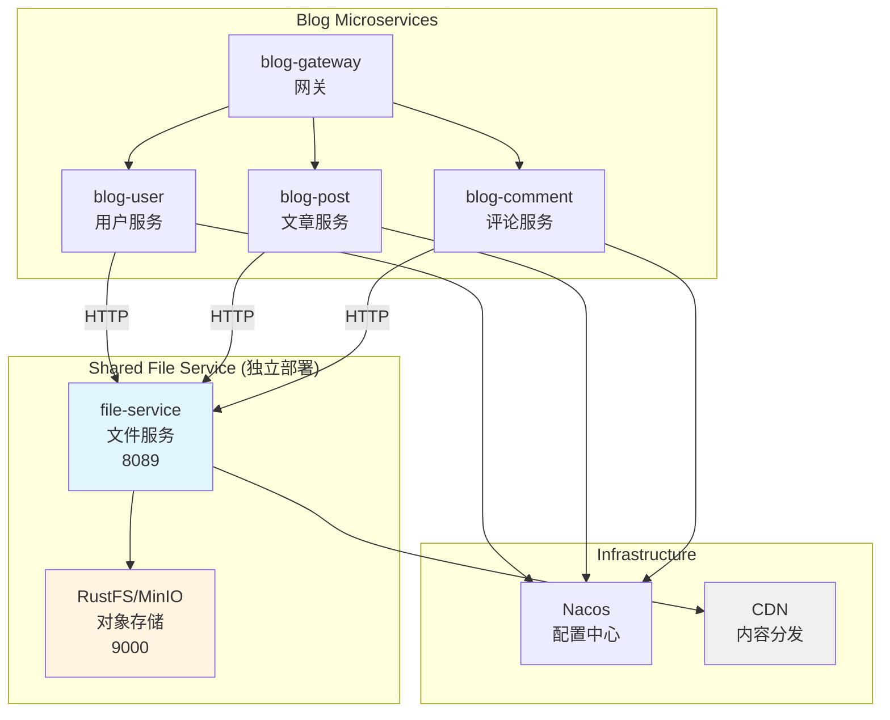
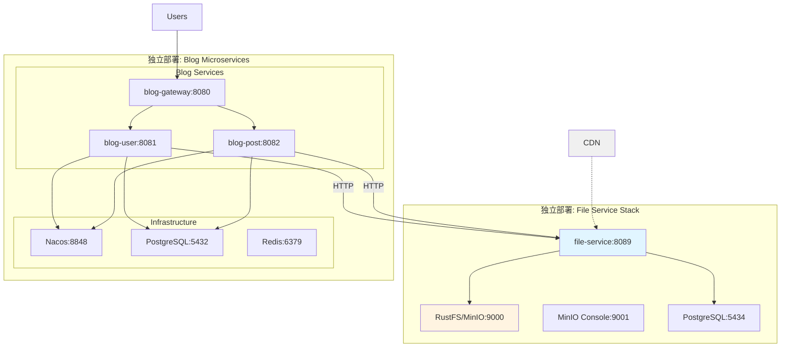
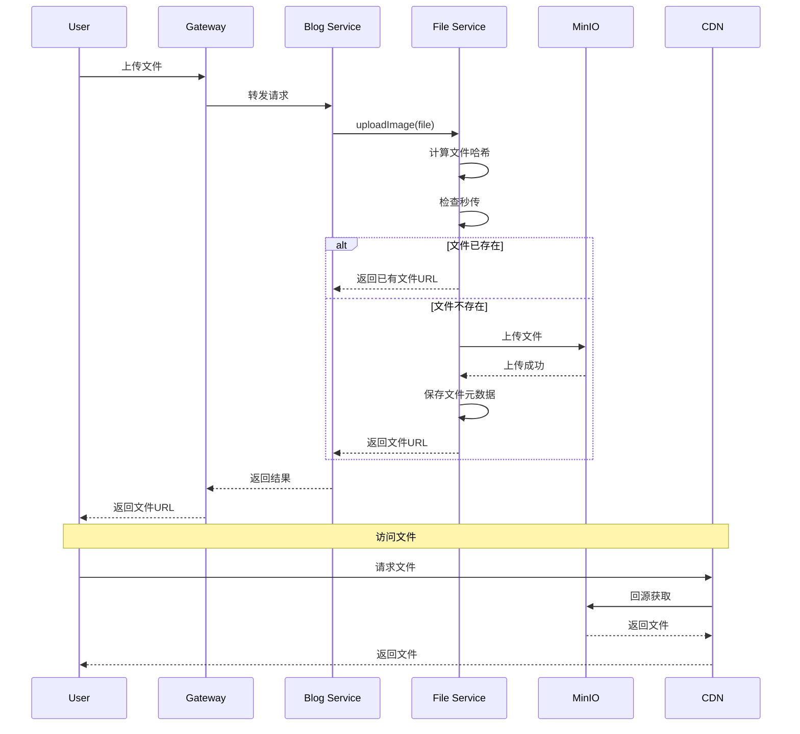

# Design Document

## Overview

本设计文档描述了如何将独立的 file-service 集成到 blog-microservice 系统中，实现统一的文件管理、多种上传方式支持、CDN 加速和更好的服务解耦。

### 集成策略

1. **架构文档更新**: 更新系统架构图，说明 File Service 的定位和交互关系
2. **依赖集成**: 在父 pom.xml 中添加 file-service-spring-boot-starter 依赖
3. **配置管理**: 配置 File Service 连接信息和认证方式
4. **功能实现**: 实现用户头像、文章封面图、文章内容图片的上传功能
5. **连接配置**: 配置 Blog 服务连接到独立部署的 File Service
6. **测试验证**: 确保所有文件操作功能正常工作

**重要说明:** File Service 作为独立的共享服务部署，可被多个系统（Blog、IM 等）共同使用。Blog 系统通过 HTTP 调用 File Service API，不需要在自己的 docker-compose 中部署对象存储或 File Service。

### 参考实现

参考 file-service-example 的实现方式：
- 使用 `file-service-spring-boot-starter` 简化集成
- 通过 `FileServiceClient` 调用文件服务
- 支持多种上传方式：直接上传、分片上传、秒传

## Architecture

### 系统架构图



### 部署架构图



**说明:**
- File Service 作为独立服务部署,可被多个系统共享使用
- Blog 服务通过 HTTP 调用 File Service API
- File Service 自带 RustFS/MinIO 作为存储后端
- Blog 不需要部署自己的对象存储

### 数据流图



## Components and Interfaces

### 1. Maven 依赖配置

#### 父 POM 配置

在 `blog-microservice/pom.xml` 的 `<properties>` 中添加版本号：

```xml
<properties>
    <!-- File Service -->
    <file-service.version>1.0.0-SNAPSHOT</file-service.version>
</properties>
```

在 `<dependencyManagement>` 中添加：

```xml
<!-- File Service Client -->
<dependency>
    <groupId>com.platform</groupId>
    <artifactId>file-service-spring-boot-starter</artifactId>
    <version>${file-service.version}</version>
</dependency>
```

#### 服务模块 POM 配置

在需要文件上传功能的服务模块（blog-user、blog-post）的 pom.xml 中添加：

```xml
<dependencies>
    <!-- File Service Starter -->
    <dependency>
        <groupId>com.platform</groupId>
        <artifactId>file-service-spring-boot-starter</artifactId>
    </dependency>
</dependencies>
```

### 2. 配置文件

#### application.yml 配置

在各服务模块的 `application.yml` 中添加：

```yaml
# 文件服务客户端配置
file-service:
  client:
    server-url: ${FILE_SERVICE_URL:http://localhost:8089}
    tenant-id: ${FILE_SERVICE_TENANT_ID:blog}
    # token 可选，会自动从 Spring Security Context 获取
    # token: ${FILE_SERVICE_TOKEN}
    
    # 连接设置
    connect-timeout: 10000
    read-timeout: 30000
    max-connections: 50
    
    # 域名设置
    custom-domain: ${FILE_SERVICE_CUSTOM_DOMAIN:}
    cdn-domain: ${FILE_SERVICE_CDN_DOMAIN:}
    
    # 重试设置
    max-retries: 3
    retry-delay-ms: 1000
```

#### Nacos 配置中心

在 Nacos 配置中心创建共享配置 `file-service-config.yml`:

```yaml
file-service:
  client:
    server-url: http://file-service:8089
    tenant-id: blog
    connect-timeout: 15000
    read-timeout: 60000
    max-connections: 100
    cdn-domain: https://cdn.example.com
    max-retries: 5
    retry-delay-ms: 2000
```

### 3. 代码实现

#### FileUploadService 接口

在 `blog-common` 模块中创建统一的文件上传服务接口：

```java
package com.blog.common.service;

import org.springframework.web.multipart.MultipartFile;

/**
 * 文件上传服务接口
 * 
 * 提供统一的文件上传能力，用于：
 * - 用户头像上传
 * - 文章封面图上传
 * - 文章内容图片上传
 */
public interface FileUploadService {
    
    /**
     * 上传图片文件
     * 
     * @param file 图片文件
     * @return 文件访问URL
     */
    String uploadImage(MultipartFile file);
    
    /**
     * 上传图片文件（指定访问级别）
     * 
     * @param file 图片文件
     * @param isPublic 是否公开访问
     * @return 文件访问URL
     */
    String uploadImage(MultipartFile file, boolean isPublic);
    
    /**
     * 删除文件
     * 
     * @param fileId 文件ID
     */
    void deleteFile(String fileId);
    
    /**
     * 从URL中提取文件ID
     * 
     * @param fileUrl 文件URL
     * @return 文件ID
     */
    String extractFileId(String fileUrl);
}
```

#### FileUploadServiceImpl 实现

```java
package com.blog.common.service.impl;

import com.blog.common.exception.FileUploadException;
import com.blog.common.service.FileUploadService;
import com.platform.fileservice.client.FileServiceClient;
import com.platform.fileservice.client.exception.FileServiceException;
import com.platform.fileservice.client.model.AccessLevel;
import com.platform.fileservice.client.model.FileUploadResponse;
import lombok.RequiredArgsConstructor;
import lombok.extern.slf4j.Slf4j;
import org.springframework.stereotype.Service;
import org.springframework.web.multipart.MultipartFile;

import java.io.File;
import java.io.IOException;

/**
 * 文件上传服务实现
 */
@Slf4j
@Service
@RequiredArgsConstructor
public class FileUploadServiceImpl implements FileUploadService {
    
    private final FileServiceClient fileServiceClient;
    
    private static final long MAX_IMAGE_SIZE = 10 * 1024 * 1024; // 10MB
    private static final String[] ALLOWED_IMAGE_TYPES = {
        "image/jpeg", "image/jpg", "image/png", "image/gif", "image/webp"
    };
    
    @Override
    public String uploadImage(MultipartFile file) {
        return uploadImage(file, true);
    }
    
    @Override
    public String uploadImage(MultipartFile file, boolean isPublic) {
        try {
            // 验证文件
            validateImageFile(file);
            
            // 转换为临时文件
            File tempFile = convertToTempFile(file);
            
            try {
                // 上传文件
                AccessLevel accessLevel = isPublic ? AccessLevel.PUBLIC : AccessLevel.PRIVATE;
                FileUploadResponse response = fileServiceClient.uploadFile(tempFile, accessLevel);
                
                log.info("文件上传成功: fileId={}, url={}, size={}", 
                    response.getFileId(), response.getUrl(), file.getSize());
                
                return response.getUrl();
            } finally {
                // 清理临时文件
                if (tempFile.exists()) {
                    tempFile.delete();
                }
            }
        } catch (FileServiceException e) {
            log.error("文件上传失败: {}", e.getMessage(), e);
            throw new FileUploadException("文件上传失败: " + e.getMessage(), e);
        } catch (IOException e) {
            log.error("文件处理失败: {}", e.getMessage(), e);
            throw new FileUploadException("文件处理失败", e);
        }
    }
    
    @Override
    public void deleteFile(String fileId) {
        try {
            fileServiceClient.deleteFile(fileId);
            log.info("文件删除成功: fileId={}", fileId);
        } catch (FileServiceException e) {
            log.error("文件删除失败: fileId={}, error={}", fileId, e.getMessage(), e);
            throw new FileUploadException("文件删除失败: " + e.getMessage(), e);
        }
    }
    
    @Override
    public String extractFileId(String fileUrl) {
        if (fileUrl == null || fileUrl.isEmpty()) {
            return null;
        }
        // 从URL中提取文件ID
        // 假设URL格式: http://domain/files/{fileId}
        int lastSlash = fileUrl.lastIndexOf('/');
        if (lastSlash > 0 && lastSlash < fileUrl.length() - 1) {
            return fileUrl.substring(lastSlash + 1);
        }
        return null;
    }
    
    private void validateImageFile(MultipartFile file) {
        if (file == null || file.isEmpty()) {
            throw new FileUploadException("文件不能为空");
        }
        
        // 检查文件大小
        if (file.getSize() > MAX_IMAGE_SIZE) {
            throw new FileUploadException("文件大小超过限制: " + MAX_IMAGE_SIZE / 1024 / 1024 + "MB");
        }
        
        // 检查文件类型
        String contentType = file.getContentType();
        boolean isAllowedType = false;
        for (String allowedType : ALLOWED_IMAGE_TYPES) {
            if (allowedType.equals(contentType)) {
                isAllowedType = true;
                break;
            }
        }
        
        if (!isAllowedType) {
            throw new FileUploadException("不支持的文件类型: " + contentType);
        }
    }
    
    private File convertToTempFile(MultipartFile multipartFile) throws IOException {
        File tempFile = File.createTempFile("upload-", "-" + multipartFile.getOriginalFilename());
        multipartFile.transferTo(tempFile);
        return tempFile;
    }
}
```

### 4. Controller 实现

#### 用户头像上传 (blog-user)

```java
package com.blog.user.controller;

import com.blog.common.response.ApiResponse;
import com.blog.common.service.FileUploadService;
import com.blog.user.service.UserService;
import lombok.RequiredArgsConstructor;
import lombok.extern.slf4j.Slf4j;
import org.springframework.web.bind.annotation.*;
import org.springframework.web.multipart.MultipartFile;

/**
 * 用户头像管理接口
 */
@Slf4j
@RestController
@RequestMapping("/api/user/avatar")
@RequiredArgsConstructor
public class UserAvatarController {
    
    private final FileUploadService fileUploadService;
    private final UserService userService;
    
    /**
     * 上传用户头像
     */
    @PostMapping("/upload")
    public ApiResponse<String> uploadAvatar(@RequestParam("file") MultipartFile file) {
        log.info("上传用户头像: filename={}, size={}", file.getOriginalFilename(), file.getSize());
        
        // 上传文件
        String avatarUrl = fileUploadService.uploadImage(file, true);
        
        // 更新用户头像URL
        userService.updateAvatar(avatarUrl);
        
        return ApiResponse.success(avatarUrl);
    }
    
    /**
     * 删除用户头像
     */
    @DeleteMapping
    public ApiResponse<Void> deleteAvatar() {
        userService.deleteAvatar();
        return ApiResponse.success();
    }
}
```

#### 文章封面图上传 (blog-post)

```java
package com.blog.post.controller;

import com.blog.common.response.ApiResponse;
import com.blog.common.service.FileUploadService;
import lombok.RequiredArgsConstructor;
import lombok.extern.slf4j.Slf4j;
import org.springframework.web.bind.annotation.*;
import org.springframework.web.multipart.MultipartFile;

/**
 * 文章图片管理接口
 */
@Slf4j
@RestController
@RequestMapping("/api/post/image")
@RequiredArgsConstructor
public class PostImageController {
    
    private final FileUploadService fileUploadService;
    
    /**
     * 上传文章封面图
     */
    @PostMapping("/cover")
    public ApiResponse<String> uploadCoverImage(@RequestParam("file") MultipartFile file) {
        log.info("上传文章封面图: filename={}, size={}", file.getOriginalFilename(), file.getSize());
        
        String imageUrl = fileUploadService.uploadImage(file, true);
        
        return ApiResponse.success(imageUrl);
    }
    
    /**
     * 上传文章内容图片
     */
    @PostMapping("/content")
    public ApiResponse<String> uploadContentImage(@RequestParam("file") MultipartFile file) {
        log.info("上传文章内容图片: filename={}, size={}", file.getOriginalFilename(), file.getSize());
        
        String imageUrl = fileUploadService.uploadImage(file, true);
        
        // 返回Markdown格式的图片链接
        String markdownLink = String.format("", file.getOriginalFilename(), imageUrl);
        
        return ApiResponse.success(markdownLink);
    }
}
```

### 5. 认证集成

File Service Starter 会自动从 Spring Security Context 获取 JWT 令牌。如果需要自定义令牌提供者：

```java
package com.blog.common.config;

import com.platform.fileservice.client.config.TokenProvider;
import org.springframework.context.annotation.Bean;
import org.springframework.context.annotation.Configuration;
import org.springframework.security.core.Authentication;
import org.springframework.security.core.context.SecurityContextHolder;

/**
 * File Service 配置
 */
@Configuration
public class FileServiceConfig {
    
    /**
     * 自定义令牌提供者
     */
    @Bean
    public TokenProvider fileServiceTokenProvider() {
        return () -> {
            Authentication authentication = SecurityContextHolder.getContext().getAuthentication();
            if (authentication != null && authentication.getCredentials() != null) {
                return authentication.getCredentials().toString();
            }
            return null;
        };
    }
}
```

## Data Models

### 文件元数据

```java
@Data
public class FileMetadata {
    /**
     * 文件ID
     */
    private String fileId;
    
    /**
     * 原始文件名
     */
    private String originalName;
    
    /**
     * 文件大小（字节）
     */
    private Long fileSize;
    
    /**
     * 内容类型
     */
    private String contentType;
    
    /**
     * 访问URL
     */
    private String url;
    
    /**
     * 访问级别
     */
    private AccessLevel accessLevel;
    
    /**
     * 创建时间
     */
    private LocalDateTime createdAt;
}
```

### 配置模型

```java
@Data
@ConfigurationProperties(prefix = "file-service.client")
public class FileServiceProperties {
    /**
     * File Service 服务地址
     */
    private String serverUrl = "http://localhost:8089";
    
    /**
     * 租户ID
     */
    private String tenantId = "blog";
    
    /**
     * 静态令牌（可选）
     */
    private String token;
    
    /**
     * 连接超时（毫秒）
     */
    private int connectTimeout = 10000;
    
    /**
     * 读取超时（毫秒）
     */
    private int readTimeout = 30000;
    
    /**
     * 最大连接数
     */
    private int maxConnections = 50;
    
    /**
     * 自定义域名
     */
    private String customDomain;
    
    /**
     * CDN域名
     */
    private String cdnDomain;
    
    /**
     * 最大重试次数
     */
    private int maxRetries = 3;
    
    /**
     * 重试延迟（毫秒）
     */
    private long retryDelayMs = 1000;
}
```

## Correctness Properties

*A property is a characteristic or behavior that should hold true across all valid executions of a system-essentially, a formal statement about what the system should do. Properties serve as the bridge between human-readable specifications and machine-verifiable correctness guarantees.*


### Property 1: 文件上传成功后返回有效URL

*For any* 成功上传的文件，返回的URL必须是有效的且可访问的

**Validates: Requirements 3.1, 4.1, 5.1**

### Property 2: 文件类型验证

*For any* 上传的文件，如果不是允许的图片格式，系统必须拒绝上传并返回错误信息

**Validates: Requirements 3.2**

### Property 3: 文件大小限制

*For any* 上传的文件，如果超过大小限制，系统必须拒绝上传并返回错误信息

**Validates: Requirements 3.3**

### Property 4: 头像更新一致性

*For any* 用户头像更新操作，旧头像文件必须被删除（如果存在）

**Validates: Requirements 3.5**

### Property 5: 文章删除时清理文件

*For any* 文章删除操作，关联的封面图和内容图片必须被删除

**Validates: Requirements 4.3, 5.3**

### Property 6: 访问级别正确性

*For any* 上传的用户头像和文章图片，访问级别必须设置为PUBLIC

**Validates: Requirements 6.1**

### Property 7: 认证令牌自动获取

*For any* 已登录用户的文件操作，File Service Client必须自动从Security Context获取JWT令牌

**Validates: Requirements 8.1**

### Property 8: 错误异常明确性

*For any* 文件操作失败，系统必须抛出包含详细信息的异常并记录日志

**Validates: Requirements 9.1, 9.2, 9.4**

### Property 9: 大文件分片上传

*For any* 大于10MB的文件，系统必须使用分片上传方式

**Validates: Requirements 10.1**

### Property 10: 秒传哈希一致性

*For any* 文件，计算的哈希值必须在多次计算中保持一致

**Validates: Requirements 11.1**

## Error Handling

### 异常类型

```java
package com.blog.common.exception;

/**
 * 文件上传异常
 */
public class FileUploadException extends RuntimeException {
    public FileUploadException(String message) {
        super(message);
    }
    
    public FileUploadException(String message, Throwable cause) {
        super(message, cause);
    }
}

/**
 * 文件不存在异常
 */
public class FileNotFoundException extends RuntimeException {
    public FileNotFoundException(String fileId) {
        super("文件不存在: " + fileId);
    }
}

/**
 * 文件访问被拒绝异常
 */
public class FileAccessDeniedException extends RuntimeException {
    public FileAccessDeniedException(String message) {
        super(message);
    }
}
```

### 全局异常处理

```java
package com.blog.common.handler;

import com.blog.common.exception.FileUploadException;
import com.blog.common.exception.FileNotFoundException;
import com.blog.common.exception.FileAccessDeniedException;
import com.blog.common.response.ApiResponse;
import com.platform.fileservice.client.exception.*;
import lombok.extern.slf4j.Slf4j;
import org.springframework.http.HttpStatus;
import org.springframework.web.bind.annotation.ExceptionHandler;
import org.springframework.web.bind.annotation.ResponseStatus;
import org.springframework.web.bind.annotation.RestControllerAdvice;

/**
 * 文件服务异常处理器
 */
@Slf4j
@RestControllerAdvice
public class FileServiceExceptionHandler {
    
    @ExceptionHandler(FileUploadException.class)
    @ResponseStatus(HttpStatus.BAD_REQUEST)
    public ApiResponse<Void> handleFileUploadException(FileUploadException e) {
        log.error("文件上传失败: {}", e.getMessage(), e);
        return ApiResponse.error(400, e.getMessage());
    }
    
    @ExceptionHandler(InvalidRequestException.class)
    @ResponseStatus(HttpStatus.BAD_REQUEST)
    public ApiResponse<Void> handleInvalidRequestException(InvalidRequestException e) {
        log.error("无效的请求: {}", e.getMessage(), e);
        return ApiResponse.error(400, "无效的请求参数");
    }
    
    @ExceptionHandler(AuthenticationException.class)
    @ResponseStatus(HttpStatus.UNAUTHORIZED)
    public ApiResponse<Void> handleAuthenticationException(AuthenticationException e) {
        log.error("认证失败: {}", e.getMessage(), e);
        return ApiResponse.error(401, "认证失败，请重新登录");
    }
    
    @ExceptionHandler(FileAccessDeniedException.class)
    @ResponseStatus(HttpStatus.FORBIDDEN)
    public ApiResponse<Void> handleFileAccessDeniedException(FileAccessDeniedException e) {
        log.error("文件访问被拒绝: {}", e.getMessage(), e);
        return ApiResponse.error(403, "无权访问该文件");
    }
    
    @ExceptionHandler(FileNotFoundException.class)
    @ResponseStatus(HttpStatus.NOT_FOUND)
    public ApiResponse<Void> handleFileNotFoundException(FileNotFoundException e) {
        log.error("文件不存在: {}", e.getMessage(), e);
        return ApiResponse.error(404, "文件不存在");
    }
    
    @ExceptionHandler(QuotaExceededException.class)
    @ResponseStatus(HttpStatus.PAYLOAD_TOO_LARGE)
    public ApiResponse<Void> handleQuotaExceededException(QuotaExceededException e) {
        log.error("文件大小超过限制: {}", e.getMessage(), e);
        return ApiResponse.error(413, "文件大小超过限制");
    }
    
    @ExceptionHandler(NetworkException.class)
    @ResponseStatus(HttpStatus.SERVICE_UNAVAILABLE)
    public ApiResponse<Void> handleNetworkException(NetworkException e) {
        log.error("网络错误: {}", e.getMessage(), e);
        return ApiResponse.error(503, "文件服务暂时不可用，请稍后重试");
    }
    
    @ExceptionHandler(FileServiceException.class)
    @ResponseStatus(HttpStatus.INTERNAL_SERVER_ERROR)
    public ApiResponse<Void> handleFileServiceException(FileServiceException e) {
        log.error("文件服务错误: {}", e.getMessage(), e);
        return ApiResponse.error(500, "文件服务错误");
    }
}
```

### 降级策略

当 File Service 不可用时的降级方案：

```java
package com.blog.common.service.impl;

import com.blog.common.service.FileUploadService;
import io.github.resilience4j.circuitbreaker.annotation.CircuitBreaker;
import lombok.extern.slf4j.Slf4j;
import org.springframework.stereotype.Service;
import org.springframework.web.multipart.MultipartFile;

/**
 * 带熔断的文件上传服务
 */
@Slf4j
@Service
public class ResilientFileUploadService implements FileUploadService {
    
    private final FileUploadService delegate;
    
    public ResilientFileUploadService(FileUploadService delegate) {
        this.delegate = delegate;
    }
    
    @Override
    @CircuitBreaker(name = "fileService", fallbackMethod = "uploadImageFallback")
    public String uploadImage(MultipartFile file) {
        return delegate.uploadImage(file);
    }
    
    /**
     * 降级方法：返回默认头像或占位图
     */
    public String uploadImageFallback(MultipartFile file, Exception e) {
        log.error("文件上传失败，使用降级方案: {}", e.getMessage());
        // 返回默认图片URL
        return "https://cdn.example.com/default-avatar.png";
    }
    
    @Override
    public String uploadImage(MultipartFile file, boolean isPublic) {
        return delegate.uploadImage(file, isPublic);
    }
    
    @Override
    public void deleteFile(String fileId) {
        delegate.deleteFile(fileId);
    }
    
    @Override
    public String extractFileId(String fileUrl) {
        return delegate.extractFileId(fileUrl);
    }
}
```

## Testing Strategy

### 单元测试

使用 JUnit 5 和 Mockito 进行单元测试：

```java
@ExtendWith(MockitoExtension.class)
class FileUploadServiceImplTest {
    
    @Mock
    private FileServiceClient fileServiceClient;
    
    @InjectMocks
    private FileUploadServiceImpl fileUploadService;
    
    @Test
    @DisplayName("Should upload image successfully")
    void shouldUploadImageSuccessfully() throws IOException {
        // Given
        MultipartFile file = createMockImageFile();
        FileUploadResponse expectedResponse = FileUploadResponse.builder()
            .fileId("file123")
            .url("https://cdn.example.com/file123.jpg")
            .build();
        
        when(fileServiceClient.uploadFile(any(File.class), eq(AccessLevel.PUBLIC)))
            .thenReturn(expectedResponse);
        
        // When
        String actualUrl = fileUploadService.uploadImage(file);
        
        // Then
        assertEquals(expectedResponse.getUrl(), actualUrl);
        verify(fileServiceClient, times(1)).uploadFile(any(File.class), eq(AccessLevel.PUBLIC));
    }
    
    @Test
    @DisplayName("Should reject non-image file")
    void shouldRejectNonImageFile() {
        // Given
        MultipartFile file = createMockPdfFile();
        
        // When & Then
        assertThrows(FileUploadException.class, 
            () -> fileUploadService.uploadImage(file));
    }
    
    @Test
    @DisplayName("Should reject oversized file")
    void shouldRejectOversizedFile() {
        // Given
        MultipartFile file = createMockOversizedFile();
        
        // When & Then
        assertThrows(FileUploadException.class, 
            () -> fileUploadService.uploadImage(file));
    }
    
    private MultipartFile createMockImageFile() {
        MultipartFile file = mock(MultipartFile.class);
        when(file.isEmpty()).thenReturn(false);
        when(file.getSize()).thenReturn(1024L * 1024L); // 1MB
        when(file.getContentType()).thenReturn("image/jpeg");
        when(file.getOriginalFilename()).thenReturn("test.jpg");
        return file;
    }
}
```

### 集成测试

使用 Spring Boot Test 进行集成测试：

```java
@SpringBootTest
@TestPropertySource(properties = {
    "file-service.client.server-url=http://localhost:8089",
    "file-service.client.tenant-id=blog-test"
})
class FileUploadIntegrationTest {
    
    @Autowired
    private FileUploadService fileUploadService;
    
    @Test
    @DisplayName("Should upload and delete file")
    void shouldUploadAndDeleteFile() throws IOException {
        // Given
        MultipartFile file = createTestImageFile();
        
        // When - Upload
        String fileUrl = fileUploadService.uploadImage(file);
        
        // Then - Verify upload
        assertNotNull(fileUrl);
        assertTrue(fileUrl.startsWith("http"));
        
        // When - Delete
        String fileId = fileUploadService.extractFileId(fileUrl);
        fileUploadService.deleteFile(fileId);
        
        // Then - Verify deletion (should throw exception)
        assertThrows(FileNotFoundException.class, 
            () -> fileServiceClient.getFileDetail(fileId));
    }
}
```

### 属性测试

使用 jqwik 进行属性测试：

```java
class FileUploadPropertyTest {
    
    @Property
    @Label("Property 1: Uploaded files must return valid URLs")
    void uploadedFilesMustReturnValidUrls(@ForAll("validImageFiles") MultipartFile file) {
        // Given
        FileUploadService service = createService();
        
        // When
        String url = service.uploadImage(file);
        
        // Then
        assertNotNull(url, "URL must not be null");
        assertTrue(url.startsWith("http"), "URL must start with http");
        assertTrue(url.contains("/"), "URL must contain path separator");
    }
    
    @Property
    @Label("Property 2: Invalid file types must be rejected")
    void invalidFileTypesMustBeRejected(@ForAll("invalidFileTypes") String contentType) {
        // Given
        FileUploadService service = createService();
        MultipartFile file = createMockFile(contentType);
        
        // When & Then
        assertThrows(FileUploadException.class, 
            () -> service.uploadImage(file),
            "Invalid file type must be rejected");
    }
    
    @Property
    @Label("Property 3: Oversized files must be rejected")
    void oversizedFilesMustBeRejected(@ForAll @LongRange(min = 11_000_000) long fileSize) {
        // Given
        FileUploadService service = createService();
        MultipartFile file = createMockFile("image/jpeg", fileSize);
        
        // When & Then
        assertThrows(FileUploadException.class, 
            () -> service.uploadImage(file),
            "Oversized file must be rejected");
    }
    
    @Provide
    Arbitrary<MultipartFile> validImageFiles() {
        return Arbitraries.of("image/jpeg", "image/png", "image/gif")
            .map(contentType -> createMockFile(contentType, 1024 * 1024));
    }
    
    @Provide
    Arbitrary<String> invalidFileTypes() {
        return Arbitraries.of("application/pdf", "text/plain", "video/mp4");
    }
}
```

### 端到端测试

```java
@SpringBootTest(webEnvironment = SpringBootTest.WebEnvironment.RANDOM_PORT)
@AutoConfigureMockMvc
class FileUploadE2ETest {
    
    @Autowired
    private MockMvc mockMvc;
    
    @Test
    @DisplayName("Should upload avatar through API")
    void shouldUploadAvatarThroughApi() throws Exception {
        // Given
        MockMultipartFile file = new MockMultipartFile(
            "file",
            "avatar.jpg",
            "image/jpeg",
            "test image content".getBytes()
        );
        
        // When & Then
        mockMvc.perform(multipart("/api/user/avatar/upload")
                .file(file)
                .header("Authorization", "Bearer " + getTestToken()))
            .andExpect(status().isOk())
            .andExpect(jsonPath("$.success").value(true))
            .andExpect(jsonPath("$.data").isString())
            .andExpect(jsonPath("$.data").value(containsString("http")));
    }
}
```

### 测试覆盖率目标

- 单元测试覆盖率: ≥ 80%
- 集成测试覆盖核心流程
- 属性测试验证正确性属性
- 端到端测试验证完整用户流程

## Docker Deployment

### 架构说明

File Service 作为独立的共享服务部署,可以被多个系统（Blog、IM 等）共同使用。Blog 系统通过 HTTP 调用 File Service API,不需要在自己的 docker-compose 中部署对象存储。

### 部署步骤

#### 1. 部署 File Service（独立部署）

```bash
# 进入 file-service 目录
cd file-service/docker

# 启动 File Service 及其依赖
docker-compose up -d

# 验证服务状态
docker-compose ps
curl http://localhost:8089/actuator/health
```

这会启动:
- file-service (8089)
- rustfs/minio (9000, 9001)
- postgres (5434)

#### 2. 配置 Blog 连接到 File Service

在 Nacos 配置中心创建/更新 `file-service-config.yml`:

```yaml
file-service:
  client:
    # 指向独立部署的 File Service
    server-url: http://host.docker.internal:8089  # Docker Desktop
    # 或使用宿主机 IP: http://192.168.1.100:8089
    tenant-id: blog
    connect-timeout: 15000
    read-timeout: 60000
    max-connections: 100
    cdn-domain: https://cdn.example.com
    max-retries: 5
    retry-delay-ms: 2000
```

#### 3. 配置 Blog Docker 网络访问

**方案 A: 使用 host.docker.internal (推荐用于开发)**

```yaml
# blog-microservice/docker/docker-compose.yml
services:
  blog-user:
    environment:
      FILE_SERVICE_URL: http://host.docker.internal:8089
    extra_hosts:
      - "host.docker.internal:host-gateway"
```

**方案 B: 使用宿主机 IP (推荐用于生产)**

```yaml
# blog-microservice/docker/docker-compose.yml
services:
  blog-user:
    environment:
      FILE_SERVICE_URL: http://192.168.1.100:8089  # 替换为实际 IP
```

**方案 C: 使用共享 Docker 网络**

```bash
# 1. 创建共享网络
docker network create shared-services-network

# 2. File Service 连接到共享网络
cd file-service/docker
docker-compose up -d
docker network connect shared-services-network file-service

# 3. Blog 服务使用共享网络
cd blog-microservice/docker
# 在 docker-compose.yml 中添加:
networks:
  default:
    external:
      name: shared-services-network

# 然后在服务配置中使用 file-service 作为主机名
services:
  blog-user:
    environment:
      FILE_SERVICE_URL: http://file-service:8089
```

#### 4. 启动 Blog 服务

```bash
cd blog-microservice/docker
docker-compose up -d

# 验证服务连接
docker-compose exec blog-user curl http://host.docker.internal:8089/actuator/health
```

### 重要说明

**Blog 的 docker-compose.yml 不需要包含 MinIO 或 File Service 容器**。这些服务已经在 file-service 项目中独立部署。Blog 只需要配置连接参数即可。

### 网络连接验证

```bash
# 验证 File Service 可访问性
curl http://localhost:8089/actuator/health

# 从 Blog 容器内部测试连接
docker-compose exec blog-user curl http://host.docker.internal:8089/actuator/health
```

## Monitoring and Logging

### 日志配置

在 `logback-spring.xml` 中添加 File Service 日志配置：

```xml
<!-- File Service Client 日志 -->
<logger name="com.platform.fileservice.client" level="DEBUG"/>
<logger name="com.platform.fileservice.starter" level="DEBUG"/>
<logger name="com.blog.common.service.impl.FileUploadServiceImpl" level="INFO"/>
```

### 监控指标

使用 Micrometer 收集监控指标：

```java
@Component
public class FileServiceMetrics {
    
    private final Counter uploadSuccessCounter;
    private final Counter uploadFailureCounter;
    private final Timer uploadTimer;
    
    public FileServiceMetrics(MeterRegistry registry) {
        this.uploadSuccessCounter = Counter.builder("file.upload.success")
            .description("成功上传的文件数")
            .register(registry);
        
        this.uploadFailureCounter = Counter.builder("file.upload.failure")
            .description("上传失败的文件数")
            .register(registry);
        
        this.uploadTimer = Timer.builder("file.upload.duration")
            .description("文件上传耗时")
            .register(registry);
    }
    
    public void recordUploadSuccess() {
        uploadSuccessCounter.increment();
    }
    
    public void recordUploadFailure() {
        uploadFailureCounter.increment();
    }
    
    public Timer.Sample startUploadTimer() {
        return Timer.start();
    }
    
    public void recordUploadDuration(Timer.Sample sample) {
        sample.stop(uploadTimer);
    }
}
```

### 健康检查

```java
@Component
public class FileServiceHealthIndicator implements HealthIndicator {
    
    private final FileServiceClient fileServiceClient;
    
    public FileServiceHealthIndicator(FileServiceClient fileServiceClient) {
        this.fileServiceClient = fileServiceClient;
    }
    
    @Override
    public Health health() {
        try {
            // 简单的健康检查：尝试获取服务信息
            // 实际实现可能需要调用 File Service 的健康检查端点
            return Health.up()
                .withDetail("service", "File Service")
                .withDetail("status", "UP")
                .build();
        } catch (Exception e) {
            return Health.down()
                .withDetail("service", "File Service")
                .withDetail("error", e.getMessage())
                .build();
        }
    }
}
```

## Documentation Updates

### 架构文档更新

需要更新以下文档：

1. **系统架构图** (`docs/architecture/system-architecture.md`)
   - 添加 File Service 和 MinIO 组件
   - 说明文件服务的定位和职责
   - 展示与各微服务的交互关系

2. **部署架构图** (`docs/deployment/deployment-architecture.md`)
   - 更新 docker-compose 架构图
   - 说明 File Service、MinIO 和 CDN 的部署关系
   - 添加端口分配和网络配置

3. **API 文档** (`docs/api/file-upload-api.md`)
   - 添加文件上传相关接口文档
   - 说明请求参数、响应格式和错误码
   - 提供示例请求和响应

4. **配置文档** (`docs/configuration/file-service-config.md`)
   - 列出所有 File Service 相关配置项
   - 说明各配置项的作用和默认值
   - 提供不同环境的配置示例

5. **快速开始指南** (`docs/quickstart/file-upload-guide.md`)
   - 说明如何使用文件上传功能
   - 提供代码示例和最佳实践
   - 说明常见问题和解决方案

## Migration Strategy

### 数据迁移

如果系统中已有文件存储方式，需要进行数据迁移：

```java
@Service
@Slf4j
public class FileMigrationService {
    
    private final FileServiceClient fileServiceClient;
    private final UserRepository userRepository;
    private final PostRepository postRepository;
    
    /**
     * 迁移用户头像
     */
    public void migrateUserAvatars() {
        log.info("开始迁移用户头像...");
        
        List<User> users = userRepository.findAll();
        int successCount = 0;
        int failureCount = 0;
        
        for (User user : users) {
            try {
                if (user.getAvatarUrl() != null && !user.getAvatarUrl().isEmpty()) {
                    // 下载旧头像
                    File oldAvatar = downloadFile(user.getAvatarUrl());
                    
                    // 上传到 File Service
                    FileUploadResponse response = fileServiceClient.uploadFile(oldAvatar, AccessLevel.PUBLIC);
                    
                    // 更新用户头像URL
                    user.setAvatarUrl(response.getUrl());
                    userRepository.save(user);
                    
                    successCount++;
                    log.info("用户头像迁移成功: userId={}, newUrl={}", user.getId(), response.getUrl());
                }
            } catch (Exception e) {
                failureCount++;
                log.error("用户头像迁移失败: userId={}, error={}", user.getId(), e.getMessage(), e);
            }
        }
        
        log.info("用户头像迁移完成: 成功={}, 失败={}", successCount, failureCount);
    }
    
    /**
     * 迁移文章封面图
     */
    public void migratePostCoverImages() {
        log.info("开始迁移文章封面图...");
        // 类似实现...
    }
    
    private File downloadFile(String url) throws IOException {
        // 实现文件下载逻辑
        return null;
    }
}
```

### 迁移脚本

```bash
#!/bin/bash
# migrate-files.sh

echo "开始文件迁移..."

# 1. 备份数据库
echo "备份数据库..."
pg_dump -h localhost -U postgres blog > backup_$(date +%Y%m%d_%H%M%S).sql

# 2. 启动 File Service
echo "启动 File Service..."
docker-compose up -d file-service minio

# 3. 执行迁移
echo "执行文件迁移..."
curl -X POST http://localhost:8080/api/admin/migrate/files \
  -H "Authorization: Bearer $ADMIN_TOKEN"

# 4. 验证迁移结果
echo "验证迁移结果..."
curl http://localhost:8080/api/admin/migrate/status

echo "文件迁移完成！"
```

## Deployment Strategy

### 部署步骤

1. **准备环境**
   ```bash
   # 拉取最新代码
   git pull origin main
   
   # 构建 File Service 镜像
   cd file-service
   docker build -t file-service:latest .
   ```

2. **更新配置**
   - 在 Nacos 配置中心添加 file-service 配置
   - 更新各服务模块的配置文件

3. **启动服务**
   ```bash
   # 启动 MinIO 和 File Service
   docker-compose up -d minio file-service
   
   # 等待服务就绪
   sleep 10
   
   # 启动 Blog 服务
   docker-compose up -d blog-user blog-post
   ```

4. **验证功能**
   ```bash
   # 测试文件上传
   curl -X POST http://localhost:8080/api/user/avatar/upload \
     -H "Authorization: Bearer $TOKEN" \
     -F "file=@test-avatar.jpg"
   ```

5. **监控服务**
   - 检查服务健康状态
   - 监控文件上传成功率
   - 查看错误日志

### 回滚方案

如果出现问题，可以快速回滚：

1. **停止新服务**
   ```bash
   docker-compose stop file-service
   ```

2. **恢复配置**
   - 在 Nacos 中禁用 file-service 配置
   - 恢复旧的配置

3. **重启服务**
   ```bash
   docker-compose restart blog-user blog-post
   ```

### 监控指标

- File Service 可用性
- 文件上传成功率
- 文件上传响应时间（P50, P95, P99）
- MinIO 存储使用率
- CDN 命中率
- 错误率和异常类型分布
