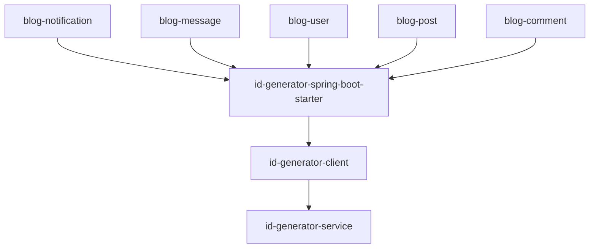

# Design Document

## Overview

本设计文档描述了如何将 blog-microservice 的 ID 生成功能从内置的 blog-leaf 服务迁移到独立的 id-generator 服务。迁移将采用渐进式方式，确保系统的稳定性和向后兼容性。

### 迁移策略

1. **依赖集成**: 在父 pom.xml 中添加 id-generator-spring-boot-starter 依赖
2. **服务替换**: 逐个服务模块替换 Leaf Feign Client 为 ID Generator Client
3. **配置迁移**: 将 Leaf 服务配置迁移到 ID Generator 配置
4. **测试验证**: 确保所有功能正常工作
5. **清理代码**: 移除 blog-leaf 模块及相关依赖

### 参考实现

参考 im-system 的实现方式：
- 使用 `id-generator-spring-boot-starter` 简化集成
- 通过 `IdGeneratorClient` 调用 ID 生成服务
- 封装 `IdGeneratorService` 接口提供统一的 ID 生成能力

## Architecture

### 当前架构

```
blog-microservice
├── blog-leaf (内置ID生成服务)
│   ├── LeafIdGenerator (Snowflake实现)
│   └── LeafController (REST API)
├── blog-notification
│   └── LeafServiceClient (Feign)
├── blog-message
│   └── LeafServiceClient (Feign)
└── 其他服务模块
```

### 目标架构

```
blog-microservice
├── blog-common
│   └── IdGeneratorService (接口)
├── blog-notification
│   └── IdGeneratorService (使用ID Generator Client)
├── blog-message
│   └── IdGeneratorService (使用ID Generator Client)
└── 其他服务模块

外部服务:
id-generator-service (独立部署)
```

### 依赖关系



## Components and Interfaces

### 1. Maven 依赖配置

#### 父 POM 配置

在 `blog-microservice/pom.xml` 的 `<dependencyManagement>` 中添加：

```xml
<!-- ID Generator Client -->
<dependency>
    <groupId>com.architectcgz</groupId>
    <artifactId>id-generator-spring-boot-starter</artifactId>
    <version>1.0.0</version>
</dependency>
```

#### 服务模块 POM 配置

在需要 ID 生成的服务模块（如 blog-notification、blog-message）的 pom.xml 中添加：

```xml
<dependencies>
    <!-- ID Generator Starter -->
    <dependency>
        <groupId>com.architectcgz</groupId>
        <artifactId>id-generator-spring-boot-starter</artifactId>
    </dependency>
</dependencies>
```

### 2. 配置文件

#### application.yml 配置

在各服务模块的 `application.yml` 中添加：

```yaml
# ID生成器客户端配置
id-generator:
  client:
    server-url: ${ID_GENERATOR_SERVER_URL:http://localhost:8011}
    timeout: ${ID_GENERATOR_TIMEOUT:3000}
    retry-times: ${ID_GENERATOR_RETRY_TIMES:3}
    mode: ${ID_GENERATOR_MODE:snowflake}
```

#### Nacos 配置中心

在 Nacos 配置中心创建共享配置 `id-generator-config.yml`:

```yaml
id-generator:
  client:
    server-url: http://id-generator-service:8011
    timeout: 3000
    retry-times: 3
    mode: snowflake
```

### 3. 代码实现

#### IdGeneratorService 接口

在 `blog-common` 模块中创建统一的 ID 生成服务接口：

```java
package com.blog.common.service;

import java.util.List;

/**
 * ID生成服务接口
 * 
 * 提供全局唯一ID生成能力，用于生成：
 * - 通知ID
 * - 消息ID
 * - 用户ID
 * - 文章ID
 * - 评论ID
 * 等各种业务实体的唯一标识符
 */
public interface IdGeneratorService {
    
    /**
     * 生成Snowflake ID
     * 
     * @return 全局唯一的Snowflake ID
     */
    Long nextSnowflakeId();
    
    /**
     * 生成Segment ID
     * 
     * @param bizTag 业务标签（如 "user", "post", "comment"）
     * @return 全局唯一的Segment ID
     */
    Long nextSegmentId(String bizTag);
    
    /**
     * 批量生成Snowflake ID
     * 
     * @param count 生成数量
     * @return ID列表
     */
    List<Long> nextBatchIds(int count);
}
```

#### IdGeneratorServiceImpl 实现

在各服务模块中创建实现类（或在 blog-common 中创建通用实现）：

```java
package com.blog.common.service.impl;

import com.blog.common.service.IdGeneratorService;
import com.platform.idgen.client.IdGeneratorClient;
import lombok.RequiredArgsConstructor;
import lombok.extern.slf4j.Slf4j;
import org.springframework.stereotype.Service;

import java.util.ArrayList;
import java.util.List;

/**
 * ID生成服务实现
 * 
 * 封装IdGeneratorClient，提供全局唯一ID生成服务
 */
@Slf4j
@Service
@RequiredArgsConstructor
public class IdGeneratorServiceImpl implements IdGeneratorService {
    
    private final IdGeneratorClient idGeneratorClient;
    
    @Override
    public Long nextSnowflakeId() {
        Long id = idGeneratorClient.nextSnowflakeId();
        log.debug("生成Snowflake ID: {}", id);
        return id;
    }
    
    @Override
    public Long nextSegmentId(String bizTag) {
        Long id = idGeneratorClient.nextSegmentId(bizTag);
        log.debug("生成Segment ID, bizTag={}, id={}", bizTag, id);
        return id;
    }
    
    @Override
    public List<Long> nextBatchIds(int count) {
        List<Long> ids = new ArrayList<>(count);
        for (int i = 0; i < count; i++) {
            ids.add(nextSnowflakeId());
        }
        log.debug("批量生成{}个Snowflake ID", count);
        return ids;
    }
}
```

### 4. 服务调用替换

#### blog-notification 服务

**修改前**:
```java
private String generateId() {
    return leafServiceClient.nextId().getData().toString();
}
```

**修改后**:
```java
private Long generateId() {
    return idGeneratorService.nextSnowflakeId();
}
```

#### blog-message 服务

**修改前**:
```java
private String generateId() {
    ApiResponse<String> response = leafServiceClient.nextId();
    if (!response.isSuccess() || response.getData() == null) {
        throw new RuntimeException("Failed to generate ID");
    }
    return response.getData();
}
```

**修改后**:
```java
private Long generateId() {
    return idGeneratorService.nextSnowflakeId();
}
```

### 5. 数据类型迁移

由于 ID 类型从 String 变更为 Long，需要更新相关代码：

#### 实体类

```java
// 修改前
private String id;

// 修改后
private Long id;
```

#### 数据库字段

如果数据库字段类型为 VARCHAR，需要迁移到 BIGINT：

```sql
-- 创建新字段
ALTER TABLE notifications ADD COLUMN id_new BIGINT;

-- 数据迁移
UPDATE notifications SET id_new = CAST(id AS BIGINT);

-- 删除旧字段，重命名新字段
ALTER TABLE notifications DROP COLUMN id;
ALTER TABLE notifications RENAME COLUMN id_new TO id;
```

## Data Models

### ID 格式

Snowflake ID 格式（64位）：
```
+----------+----------+----------+----------+
| 1位符号位 | 41位时间戳 | 10位机器ID | 12位序列号 |
+----------+----------+----------+----------+
```

- **符号位**: 1位，始终为0
- **时间戳**: 41位，精确到毫秒，可使用约69年
- **机器ID**: 10位，支持1024个节点
- **序列号**: 12位，每毫秒可生成4096个ID

### 配置模型

```java
@Data
@ConfigurationProperties(prefix = "id-generator.client")
public class IdGeneratorProperties {
    /**
     * ID生成器服务地址
     */
    private String serverUrl = "http://localhost:8011";
    
    /**
     * 请求超时时间（毫秒）
     */
    private int timeout = 3000;
    
    /**
     * 重试次数
     */
    private int retryTimes = 3;
    
    /**
     * ID生成模式：snowflake 或 segment
     */
    private String mode = "snowflake";
}
```

## Correctness Properties

*A property is a characteristic or behavior that should hold true across all valid executions of a system-essentially, a formal statement about what the system should do. Properties serve as the bridge between human-readable specifications and machine-verifiable correctness guarantees.*

### Property 1: ID 唯一性

*For any* 两次 ID 生成调用，生成的 ID 必须不同

**Validates: Requirements 1.1, 2.1, 2.2, 2.3**

### Property 2: ID 递增性

*For any* 连续的两次 ID 生成调用，后生成的 ID 必须大于先生成的 ID

**Validates: Requirements 5.3**

### Property 3: 配置有效性

*For any* 有效的配置参数，ID Generator Client 必须能够成功初始化并连接到服务

**Validates: Requirements 4.1, 4.2**

### Property 4: 错误处理

*For any* ID 生成失败的情况，系统必须抛出明确的异常并记录日志

**Validates: Requirements 6.1, 6.2, 6.3, 6.4**

### Property 5: 批量生成一致性

*For any* 批量生成请求，返回的 ID 数量必须等于请求的数量，且所有 ID 必须唯一

**Validates: Requirements 2.5**

### Property 6: 超时处理

*For any* 超过配置超时时间的请求，客户端必须抛出超时异常

**Validates: Requirements 4.3, 6.3**

### Property 7: 重试机制

*For any* 可重试的失败情况，客户端必须按照配置的重试次数进行重试

**Validates: Requirements 4.4**

### Property 8: 向后兼容性

*For any* 已存在的 Leaf Service 生成的 ID，新系统必须能够正确解析其时间戳、机器ID和序列号

**Validates: Requirements 5.1, 5.2**

## Error Handling

### 异常类型

1. **IdGenerationException**: ID 生成失败
2. **IdGeneratorConnectionException**: 连接 ID Generator Service 失败
3. **IdGeneratorTimeoutException**: 请求超时
4. **IdGeneratorConfigurationException**: 配置错误

### 异常处理策略

```java
@Slf4j
public class IdGeneratorServiceImpl implements IdGeneratorService {
    
    @Override
    public Long nextSnowflakeId() {
        try {
            Long id = idGeneratorClient.nextSnowflakeId();
            if (id == null) {
                throw new IdGenerationException("Generated ID is null");
            }
            return id;
        } catch (Exception e) {
            log.error("Failed to generate Snowflake ID", e);
            throw new IdGenerationException("Failed to generate ID", e);
        }
    }
}
```

### 降级策略

当 ID Generator Service 不可用时，可以考虑以下降级方案：

1. **本地缓存**: 预先获取一批 ID 缓存在本地
2. **UUID 降级**: 临时使用 UUID 作为 ID（需要业务支持）
3. **熔断机制**: 使用 Resilience4j 实现熔断和降级

## Testing Strategy

### 单元测试

使用 JUnit 5 和 Mockito 进行单元测试：

```java
@ExtendWith(MockitoExtension.class)
class IdGeneratorServiceImplTest {
    
    @Mock
    private IdGeneratorClient idGeneratorClient;
    
    @InjectMocks
    private IdGeneratorServiceImpl idGeneratorService;
    
    @Test
    @DisplayName("Should generate unique Snowflake ID")
    void shouldGenerateUniqueSnowflakeId() {
        // Given
        Long expectedId = 123456789L;
        when(idGeneratorClient.nextSnowflakeId()).thenReturn(expectedId);
        
        // When
        Long actualId = idGeneratorService.nextSnowflakeId();
        
        // Then
        assertEquals(expectedId, actualId);
        verify(idGeneratorClient, times(1)).nextSnowflakeId();
    }
    
    @Test
    @DisplayName("Should throw exception when ID generation fails")
    void shouldThrowExceptionWhenIdGenerationFails() {
        // Given
        when(idGeneratorClient.nextSnowflakeId())
            .thenThrow(new RuntimeException("Service unavailable"));
        
        // When & Then
        assertThrows(IdGenerationException.class, 
            () -> idGeneratorService.nextSnowflakeId());
    }
}
```

### 集成测试

使用 Spring Boot Test 进行集成测试：

```java
@SpringBootTest
@TestPropertySource(properties = {
    "id-generator.client.server-url=http://localhost:8011",
    "id-generator.client.timeout=3000"
})
class IdGeneratorIntegrationTest {
    
    @Autowired
    private IdGeneratorService idGeneratorService;
    
    @Test
    @DisplayName("Should generate ID from real service")
    void shouldGenerateIdFromRealService() {
        // When
        Long id = idGeneratorService.nextSnowflakeId();
        
        // Then
        assertNotNull(id);
        assertTrue(id > 0);
    }
}
```

### 属性测试

使用 jqwik 进行属性测试：

```java
class IdGeneratorPropertyTest {
    
    @Property
    @Label("Property 1: Generated IDs must be unique")
    void generatedIdsMustBeUnique(@ForAll @IntRange(min = 10, max = 100) int count) {
        // Given
        IdGeneratorService service = createService();
        
        // When
        Set<Long> ids = new HashSet<>();
        for (int i = 0; i < count; i++) {
            ids.add(service.nextSnowflakeId());
        }
        
        // Then
        assertEquals(count, ids.size(), "All generated IDs must be unique");
    }
    
    @Property
    @Label("Property 2: IDs must be monotonically increasing")
    void idsMustBeMonotonicallyIncreasing() {
        // Given
        IdGeneratorService service = createService();
        
        // When
        Long id1 = service.nextSnowflakeId();
        Long id2 = service.nextSnowflakeId();
        
        // Then
        assertTrue(id2 > id1, "Second ID must be greater than first ID");
    }
}
```

### 性能测试

使用 JMH 进行性能测试：

```java
@State(Scope.Benchmark)
@BenchmarkMode(Mode.Throughput)
@OutputTimeUnit(TimeUnit.SECONDS)
public class IdGeneratorBenchmark {
    
    private IdGeneratorService idGeneratorService;
    
    @Setup
    public void setup() {
        // Initialize service
    }
    
    @Benchmark
    public Long benchmarkSnowflakeIdGeneration() {
        return idGeneratorService.nextSnowflakeId();
    }
}
```

### 测试覆盖率

- 单元测试覆盖率目标: ≥ 80%
- 集成测试覆盖核心流程
- 属性测试验证正确性属性
- 性能测试确保满足性能要求

## Deployment Strategy

### 部署步骤

1. **部署 ID Generator Service**
   ```bash
   # 启动 id-generator 服务
   cd id-generator/deploy
   docker-compose up -d
   ```

2. **更新配置**
   - 在 Nacos 配置中心添加 id-generator 配置
   - 更新各服务模块的配置文件

3. **灰度发布**
   - 先更新 blog-notification 服务
   - 验证功能正常后，逐步更新其他服务

4. **监控验证**
   - 监控 ID 生成成功率
   - 监控响应时间
   - 检查错误日志

5. **清理旧代码**
   - 移除 blog-leaf 模块
   - 移除 Leaf Feign Client
   - 清理相关配置

### 回滚方案

如果出现问题，可以快速回滚：

1. **配置回滚**: 恢复使用 Leaf Service 的配置
2. **代码回滚**: 回滚到使用 Leaf Feign Client 的版本
3. **服务回滚**: 重新启动 blog-leaf 服务

### 监控指标

- ID 生成成功率
- ID 生成响应时间（P50, P95, P99）
- ID Generator Service 可用性
- 错误率和异常类型分布
