# ZhiCore 微服务系统概述

## 文档版本

| 版本 | 日期 | 作者 | 说明 |
|------|------|------|------|
| 1.0 | 2026-02-11 | System | 初始版本 - 系统概述文档 |

---

## 系统定位

ZhiCore 微服务系统是一个基于 Spring Cloud Alibaba 的现代化博客平台，采用领域驱动设计（DDD）和微服务架构，提供完整的博客内容创作、社交互动、消息通知和内容搜索功能。

### 核心价值

- **高可用性**: 微服务架构支持独立部署和扩展，提高系统可用性
- **高性能**: 多级缓存策略、异步消息处理、搜索引擎优化
- **可维护性**: DDD 分层架构、清晰的服务边界、统一的开发规范
- **可扩展性**: 松耦合的服务设计、事件驱动架构、插件化扩展

---

## 核心功能

### 用户管理
- 用户注册、登录、认证（JWT）
- 用户资料管理（头像、个人信息）
- 用户关系管理（关注、粉丝）
- 多设备登录支持

### 内容创作
- 文章创建、编辑、发布
- Markdown 编辑器支持
- 文章分类和标签
- 文章草稿保存
- 富媒体内容（图片、音频）

### 社交互动
- 文章点赞、收藏
- 评论系统（支持多媒体评论）
- 评论点赞、回复
- 用户互动通知

### 消息通知
- 系统通知（点赞、评论、关注）
- 私信功能（集成 IM 系统）
- 通知聚合和分类
- 实时消息推送

### 内容发现
- 全文搜索（Elasticsearch）
- 热门文章排行
- 推荐算法
- 标签云

### 系统管理
- 内容审核
- 用户管理
- 系统监控
- 运维工具

---

## 技术栈

### 核心框架

| 技术 | 版本 | 用途 |
|------|------|------|
| Java | 17 | 编程语言 |
| Spring Boot | 3.2.4 | 应用框架 |
| Spring Cloud | 2023.0.1 | 微服务框架 |
| Spring Cloud Alibaba | 2023.0.1.0 | 微服务组件 |

### 服务治理

| 技术 | 版本 | 用途 |
|------|------|------|
| Nacos | 2.3.x | 服务注册与配置中心 |
| Spring Cloud Gateway | 2023.0.1 | API 网关 |
| OpenFeign | 2023.0.1 | 服务间调用 |
| Sentinel | 2023.0.1.0 | 流量控制与熔断降级 |

### 数据存储

| 技术 | 版本 | 用途 |
|------|------|------|
| PostgreSQL | 42.7.1 | 关系型数据库 |
| MongoDB | 27017 | 文档数据库（文章内容） |
| Redis | 3.25.2 (Redisson) | 缓存与分布式锁 |
| Elasticsearch | 8.11.3 | 全文搜索引擎 |

### 消息队列

| 技术 | 版本 | 用途 |
|------|------|------|
| RocketMQ | 2.2.3 | 异步消息处理 |

### 数据访问

| 技术 | 版本 | 用途 |
|------|------|------|
| MyBatis Plus | 3.5.5 | ORM 框架 |
| MyBatis | 3.0.3 | SQL 映射 |

### 安全认证

| 技术 | 版本 | 用途 |
|------|------|------|
| JWT (JJWT) | 0.12.3 | 令牌认证 |
| Spring Security | 3.2.4 | 安全框架 |

### 工具库

| 技术 | 版本 | 用途 |
|------|------|------|
| Lombok | 1.18.30 | 代码简化 |
| MapStruct | 1.5.5.Final | 对象映射 |
| Hutool | 5.8.24 | 工具类库 |
| Knife4j | 4.4.0 | API 文档 |

### 监控与可观测性

| 技术 | 版本 | 用途 |
|------|------|------|
| Prometheus | - | 指标收集 |
| Grafana | - | 监控仪表板 |
| SkyWalking | - | 分布式追踪 |

### 外部服务

| 服务 | 版本 | 用途 |
|------|------|------|
| ID Generator | 1.0.0 | 分布式 ID 生成 |
| File Service | 1.0.0-SNAPSHOT | 文件管理服务 |

---

## 系统架构

### 整体架构图

```mermaid
graph TB
    subgraph "客户端层"
        WebApp[Web 应用]
        MobileApp[移动应用]
    end

    subgraph "网关层"
        Gateway[API Gateway<br/>ZhiCore-gateway:8000]
    end

    subgraph "业务服务层"
        User[用户服务<br/>ZhiCore-user:8081]
        Post[文章服务<br/>ZhiCore-post:8082]
        Comment[评论服务<br/>ZhiCore-comment:8083]
        Message[消息服务<br/>ZhiCore-message:8084]
        Notification[通知服务<br/>ZhiCore-notification:8085]
        Search[搜索服务<br/>ZhiCore-search:8086]
        Ranking[排行服务<br/>ZhiCore-ranking:8087]
        Upload[上传服务<br/>ZhiCore-upload]
    end

    subgraph "管理服务层"
        Admin[管理服务<br/>ZhiCore-admin:8090]
        Ops[运维服务<br/>ZhiCore-ops]
    end

    subgraph "共享模块"
        API[ZhiCore-api<br/>共享接口]
        Common[ZhiCore-common<br/>公共组件]
    end

    subgraph "基础设施层"
        Nacos[Nacos<br/>服务注册与配置]
        RocketMQ[RocketMQ<br/>消息队列]
        PostgreSQL[(PostgreSQL<br/>关系数据库)]
        MongoDB[(MongoDB<br/>文档数据库)]
        Redis[(Redis<br/>缓存)]
        ES[(Elasticsearch<br/>搜索引擎)]
    end

    subgraph "外部服务"
        IDGen[ID Generator<br/>分布式ID]
        FileService[File Service<br/>文件管理]
        IMSystem[IM System<br/>即时通讯]
    end

    subgraph "监控层"
        Prometheus[Prometheus<br/>指标收集]
        Grafana[Grafana<br/>监控面板]
        SkyWalking[SkyWalking<br/>链路追踪]
    end

    WebApp --> Gateway
    MobileApp --> Gateway
    
    Gateway --> User
    Gateway --> Post
    Gateway --> Comment
    Gateway --> Message
    Gateway --> Notification
    Gateway --> Search
    Gateway --> Ranking
    Gateway --> Upload
    Gateway --> Admin
    Gateway --> Ops

    User --> API
    Post --> API
    Comment --> API
    Message --> API
    Notification --> API
    Search --> API
    Ranking --> API
    Upload --> API
    Admin --> API
    Ops --> API

    User --> Common
    Post --> Common
    Comment --> Common
    Message --> Common
    Notification --> Common
    Search --> Common
    Ranking --> Common
    Upload --> Common
    Admin --> Common
    Ops --> Common

    User --> Nacos
    Post --> Nacos
    Comment --> Nacos
    Message --> Nacos
    Notification --> Nacos
    Search --> Nacos
    Ranking --> Nacos
    Upload --> Nacos
    Admin --> Nacos
    Ops --> Nacos

    User --> PostgreSQL
    Post --> PostgreSQL
    Post --> MongoDB
    Comment --> PostgreSQL
    Message --> PostgreSQL
    Notification --> PostgreSQL
    Search --> ES
    Ranking --> Redis
    Upload --> PostgreSQL

    User --> Redis
    Post --> Redis
    Comment --> Redis
    Message --> Redis
    Notification --> Redis

    Post --> RocketMQ
    Comment --> RocketMQ
    Message --> RocketMQ
    Notification --> RocketMQ
    User --> RocketMQ

    User --> IDGen
    Post --> IDGen
    Comment --> IDGen
    Message --> IDGen

    Upload --> FileService
    Post --> Upload
    Comment --> Upload
    User --> Upload

    Message --> IMSystem

    User -.-> Prometheus
    Post -.-> Prometheus
    Comment -.-> Prometheus
    Message -.-> Prometheus
    Notification -.-> Prometheus
    Search -.-> Prometheus
    Ranking -.-> Prometheus
    Upload -.-> Prometheus

    Prometheus --> Grafana
    
    User -.-> SkyWalking
    Post -.-> SkyWalking
    Comment -.-> SkyWalking
    Message -.-> SkyWalking
    Notification -.-> SkyWalking

    style Gateway fill:#e1f5ff
    style User fill:#fff4e6
    style Post fill:#fff4e6
    style Comment fill:#fff4e6
    style Message fill:#fff4e6
    style Notification fill:#fff4e6
    style Search fill:#fff4e6
    style Ranking fill:#fff4e6
    style Upload fill:#fff4e6
    style Admin fill:#f3e5f5
    style Ops fill:#f3e5f5
    style API fill:#e8f5e9
    style Common fill:#e8f5e9
```



### 架构分层

#### 1. 客户端层
- Web 应用（Vue.js）
- 移动应用（Flutter）
- 第三方应用（通过 API）

#### 2. 网关层
- **API Gateway**: 统一入口、路由转发、认证鉴权、限流熔断
- **负载均衡**: 基于 Nacos 的客户端负载均衡
- **API 文档**: Knife4j 聚合文档

#### 3. 业务服务层
- **用户服务**: 用户管理、认证授权、用户关系
- **文章服务**: 文章 CRUD、分类标签、点赞收藏
- **评论服务**: 评论管理、评论点赞、评论回复
- **消息服务**: 私信功能、消息推送
- **通知服务**: 系统通知、通知聚合
- **搜索服务**: 全文搜索、搜索建议
- **排行服务**: 热门排行、推荐算法
- **上传服务**: 文件上传、文件管理

#### 4. 管理服务层
- **管理服务**: 内容审核、用户管理
- **运维服务**: 系统监控、运维工具

#### 5. 共享模块
- **ZhiCore-api**: Feign Client 接口、DTO、事件定义
- **ZhiCore-common**: 公共工具类、常量、异常、配置

#### 6. 基础设施层
- **服务注册**: Nacos 服务发现
- **配置中心**: Nacos 配置管理
- **消息队列**: RocketMQ 异步处理
- **数据存储**: PostgreSQL、MongoDB、Redis、Elasticsearch
- **监控追踪**: Prometheus、Grafana、SkyWalking

#### 7. 外部服务
- **ID Generator**: 分布式 ID 生成（UUIDv7）
- **File Service**: 文件存储管理（S3 兼容）
- **IM System**: 即时通讯系统

---

## 系统统计信息

### 服务规模

| 类型 | 数量 | 说明 |
|------|------|------|
| 业务服务 | 8 个 | user, post, comment, message, notification, search, ranking, upload |
| 管理服务 | 2 个 | admin, ops |
| 共享模块 | 2 个 | api, common |
| 网关服务 | 1 个 | gateway |
| **总计** | **13 个模块** | - |

### 端口分配

| 服务 | 端口 | 说明 |
|------|------|------|
| ZhiCore-gateway | 8000 | API 网关 |
| ZhiCore-user | 8081 | 用户服务 |
| ZhiCore-post | 8082 | 文章服务 |
| ZhiCore-comment | 8083 | 评论服务 |
| ZhiCore-message | 8084 | 消息服务 |
| ZhiCore-notification | 8085 | 通知服务 |
| ZhiCore-search | 8086 | 搜索服务 |
| ZhiCore-ranking | 8087 | 排行服务 |
| ZhiCore-admin | 8090 | 管理服务 |

详细端口分配请参考 [端口分配文档](../../../.kiro/steering/port-allocation.md)。

### 基础设施

| 组件 | 端口 | 说明 |
|------|------|------|
| Nacos | 8848 | 服务注册与配置中心 |
| PostgreSQL | 5432 | 关系型数据库 |
| MongoDB | 27017 | 文档数据库 |
| Redis | 6379 | 缓存 |
| Elasticsearch | 9200 | 搜索引擎 |
| RocketMQ NameServer | 9876 | 消息队列名称服务器 |
| RocketMQ Broker | 10909-10912 | 消息队列代理 |
| Prometheus | 9090 | 指标收集 |
| Grafana | 3100 | 监控面板 |
| SkyWalking OAP | 11800, 12800 | 链路追踪后端 |
| SkyWalking UI | 8088 | 链路追踪界面 |

### 技术栈统计

| 类别 | 技术数量 |
|------|---------|
| 核心框架 | 4 个 |
| 服务治理 | 4 个 |
| 数据存储 | 4 个 |
| 消息队列 | 1 个 |
| 工具库 | 4 个 |
| 监控工具 | 3 个 |
| 外部服务 | 3 个 |

---

## 核心特性

### 1. 微服务架构

**服务自治**
- 每个服务独立部署、独立扩展
- 服务间通过 API 通信，松耦合
- 服务故障隔离，不影响其他服务

**服务治理**
- Nacos 服务注册与发现
- OpenFeign 声明式服务调用
- Sentinel 流量控制与熔断降级
- 服务健康检查与自动恢复

### 2. 领域驱动设计（DDD）

**分层架构**
- **接口层（interfaces）**: 对外提供 REST API
- **应用层（application）**: 业务流程编排
- **领域层（domain）**: 核心业务逻辑
- **基础设施层（infrastructure）**: 技术实现

**领域模型**
- 聚合根、实体、值对象
- 仓储模式
- 领域事件
- 领域服务

详细说明请参考 [DDD 分层架构文档](./05-ddd-layered-architecture.md)。

### 3. 事件驱动架构

**异步消息处理**
- RocketMQ 消息队列
- 领域事件发布与订阅
- 最终一致性保证
- 消息重试与死信队列

**事件类型**
- 用户事件（注册、登录、关注）
- 文章事件（发布、点赞、收藏）
- 评论事件（评论、点赞、回复）
- 通知事件（系统通知、私信）

详细说明请参考 [服务间通信文档](./04-service-communication.md)。

### 4. 多级缓存策略

**缓存层次**
- **本地缓存**: Caffeine 缓存热点数据
- **分布式缓存**: Redis 缓存共享数据
- **数据库缓存**: MyBatis 二级缓存

**缓存模式**
- Cache-Aside（旁路缓存）
- Read-Through（穿透读）
- Write-Through（穿透写）
- Write-Behind（异步写）

**缓存一致性**
- 缓存更新策略
- 缓存失效策略
- 分布式锁保证一致性

详细说明请参考 [数据架构文档](./06-data-architecture.md) 和 [缓存规范](../../../.kiro/steering/16-cache.md)。

### 5. 全文搜索

**Elasticsearch 集成**
- 文章全文索引
- 分词与高亮
- 搜索建议
- 聚合统计

**搜索功能**
- 关键词搜索
- 标签搜索
- 作者搜索
- 高级搜索（时间范围、分类筛选）

### 6. 文件管理

**统一文件上传**
- ZhiCore-upload 服务统一处理文件上传
- 支持图片、音频等多媒体文件
- 文件类型验证、大小限制
- 文件存储到 File Service（S3 兼容）

**文件删除**
- 后端服务通过 ZhiCoreUploadClient 删除文件
- 级联删除（删除文章/评论时自动删除关联文件）
- 文件引用计数

详细说明请参考 [文件上传架构文档](./03-file-upload-architecture.md)。

### 7. 安全认证

**JWT 认证**
- 无状态认证
- Token 刷新机制
- 多设备登录支持

**权限控制**
- 基于角色的访问控制（RBAC）
- 接口级权限控制
- 数据级权限控制

### 8. 监控与可观测性

**指标监控**
- Prometheus 采集指标
- Grafana 可视化展示
- 自定义业务指标

**链路追踪**
- SkyWalking 分布式追踪
- 调用链路分析
- 性能瓶颈定位

**日志管理**
- 统一日志格式
- 日志聚合与检索
- 日志告警

详细说明请参考 [可观测性与日志规范](../../../.kiro/steering/13-observability.md)。

---

## 系统优势

### 技术优势

1. **现代化技术栈**
   - Spring Boot 3.x、Java 17
   - 最新的 Spring Cloud Alibaba
   - 成熟的微服务生态

2. **高性能**
   - 多级缓存策略
   - 异步消息处理
   - 数据库索引优化
   - 连接池优化

3. **高可用**
   - 服务冗余部署
   - 熔断降级保护
   - 限流保护
   - 健康检查与自动恢复

4. **可扩展**
   - 水平扩展能力
   - 插件化设计
   - 事件驱动架构
   - 清晰的服务边界

### 架构优势

1. **DDD 分层架构**
   - 清晰的职责划分
   - 高内聚低耦合
   - 易于理解和维护

2. **微服务架构**
   - 服务独立部署
   - 技术栈灵活选择
   - 团队独立开发

3. **事件驱动**
   - 服务解耦
   - 异步处理
   - 最终一致性

### 开发优势

1. **统一规范**
   - 代码规范
   - 接口规范
   - 数据库规范
   - 测试规范

2. **完善文档**
   - 架构文档
   - API 文档
   - 开发指南
   - 运维手册

3. **自动化工具**
   - 代码生成
   - 自动化测试
   - CI/CD 流水线
   - 监控告警

---

## 系统演进

### 已完成的重大重构

1. **文件上传架构重构**（2026-02）
   - 移除 FileUploadService 接口
   - 统一使用 ZhiCore-upload 服务
   - 前端直接上传，后端通过 Client 删除
   - 详见 [文件上传架构文档](./03-file-upload-architecture.md)

2. **ID 生成器集成**（2026-01）
   - 集成分布式 ID 生成器
   - 使用 UUIDv7 格式
   - 支持多种 ID 类型

3. **缓存架构优化**（2025-12）
   - 多级缓存策略
   - 缓存一致性保证
   - 缓存穿透/击穿防护

### 未来规划

1. **性能优化**
   - 数据库分库分表
   - 读写分离
   - CDN 加速

2. **功能扩展**
   - AI 内容推荐
   - 内容审核自动化
   - 多语言支持

3. **架构演进**
   - 服务网格（Service Mesh）
   - Serverless 架构
   - 云原生改造

---

## 快速开始

### 环境要求

- **JDK**: 17+
- **Maven**: 3.8+
- **Docker**: 20.10+
- **Docker Compose**: 2.0+

### 启动步骤

1. **启动基础设施**
   ```powershell
   cd ZhiCore-microservice/docker
   docker-compose up -d
   ```

2. **启动所有服务**
   ```powershell
   cd ZhiCore-microservice/scripts
   .\start-all-services.ps1
   ```

3. **访问服务**
   - API 网关: http://localhost:8000
   - API 文档: http://localhost:8000/doc.html
   - Nacos 控制台: http://localhost:8848/nacos
   - RocketMQ 控制台: http://localhost:8180
   - Grafana: http://localhost:3100

详细部署说明请参考 [部署架构文档](./08-deployment-architecture.md)。

---

## 相关文档

### 架构文档
- [架构文档索引](./README.md)
- [微服务列表和职责](./02-microservices-list.md)
- [文件上传架构](./03-file-upload-architecture.md)
- [服务间通信](./04-service-communication.md)
- [DDD 分层架构](./05-ddd-layered-architecture.md)
- [数据架构](./06-data-architecture.md)
- [基础设施](./07-infrastructure.md)
- [部署架构](./08-deployment-architecture.md)

### 开发规范
- [核心开发策略](../../../.kiro/steering/01-core-policies.md)
- [代码规范](../../../.kiro/steering/02-code-standards.md)
- [Java 编码标准](../../../.kiro/steering/04-java-standards.md)
- [接口设计规范](../../../.kiro/steering/14-api-design.md)
- [数据库规范](../../../.kiro/steering/15-database.md)

### 基础设施
- [基础设施与端口规范](../../../.kiro/steering/07-infrastructure.md)
- [Docker 使用规范](../../../.kiro/steering/08-docker.md)
- [端口分配文档](../../../.kiro/steering/port-allocation.md)

---

## 联系方式

- **项目仓库**: [GitHub/GitLab 链接]
- **问题反馈**: 通过 Issue 提交
- **技术支持**: 联系架构团队

---

**最后更新**: 2026-02-11  
**维护者**: 架构团队  
**文档状态**: ✅ 已完成
