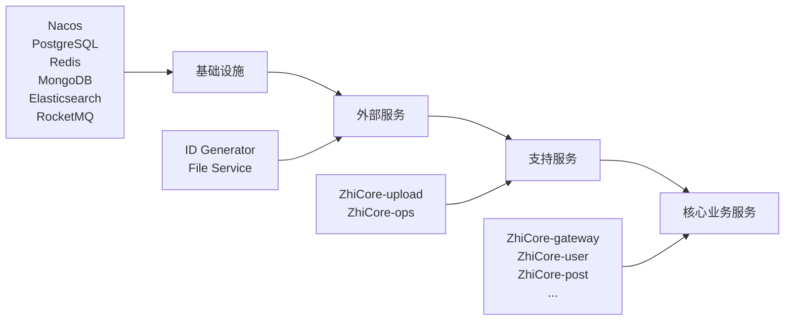

# ZhiCore 微服务列表和职责

## 文档版本

| 版本 | 日期 | 作者 | 说明 |
|------|------|------|------|
| 1.0 | 2026-02-11 | System | 初始版本 - 定义 14 个微服务的职责和端口分配 |

---

## 概述

ZhiCore 微服务系统采用 Spring Cloud Alibaba 微服务架构，共包含 **13 个模块**（9 个业务服务 + 2 个支持服务 + 2 个共享模块）。每个服务职责单一，通过 Nacos 进行服务注册与发现，通过 Feign Client 和 RocketMQ 进行服务间通信。

### 系统特点

- **服务自治**: 每个服务独立部署、独立数据库、独立扩展
- **领域驱动**: 基于 DDD 分层架构设计
- **事件驱动**: 使用 RocketMQ 实现异步解耦
- **统一网关**: 通过 ZhiCore-gateway 统一对外提供服务
- **共享模块**: ZhiCore-api 和 ZhiCore-common 提供共享接口和工具

---

## 微服务列表

### 业务服务（9 个）

| 服务名称 | 端口 | 职责 | 数据库 | 依赖服务 |
|---------|------|------|--------|---------|
| ZhiCore-gateway | 8000 | API 网关 | - | Nacos, Redis |
| ZhiCore-user | 8081 | 用户服务 | PostgreSQL | Nacos, Redis, RocketMQ, ZhiCore-upload |
| ZhiCore-post | 8082 | 文章服务 | PostgreSQL | Nacos, Redis, RocketMQ, ZhiCore-upload |
| ZhiCore-comment | 8083 | 评论服务 | PostgreSQL | Nacos, Redis, RocketMQ, ZhiCore-upload |
| ZhiCore-message | 8084 | 消息服务 | PostgreSQL | Nacos, Redis, RocketMQ, ID Generator |
| ZhiCore-notification | 8085 | 通知服务 | PostgreSQL | Nacos, Redis, RocketMQ, ID Generator |
| ZhiCore-search | 8086 | 搜索服务 | Elasticsearch | Nacos, Redis, RocketMQ |
| ZhiCore-ranking | 8087 | 排行服务 | Redis | Nacos, Redis, RocketMQ |
| ZhiCore-admin | 8090 | 管理服务 | PostgreSQL | Nacos |

### 支持服务（2 个）

| 服务名称 | 端口 | 职责 | 数据库 | 依赖服务 |
|---------|------|------|--------|---------|
| ZhiCore-ops | - | 运维服务 | - | Nacos |
| ZhiCore-upload | - | 文件上传服务 | - | File Service |

### 共享模块（2 个）

| 模块名称 | 类型 | 职责 |
|---------|------|------|
| ZhiCore-api | Maven 模块 | 提供 Feign Client 接口、DTO、事件定义 |
| ZhiCore-common | Maven 模块 | 提供公共工具类、常量、异常定义 |

---

## 服务详细说明

### 1. ZhiCore-gateway (API 网关)

**端口**: 8000

**职责**:
- 统一入口：所有外部请求的统一入口
- 路由转发：根据请求路径将请求转发到对应的微服务
- 负载均衡：通过 Nacos 实现服务发现和负载均衡
- 认证鉴权：统一的 JWT Token 验证
- 限流熔断：使用 Sentinel 实现限流和熔断
- API 文档聚合：聚合所有服务的 Knife4j 文档

**技术栈**:
- Spring Cloud Gateway
- Spring Cloud Alibaba Nacos
- Spring Cloud Alibaba Sentinel
- Redis（Token 缓存）

**依赖服务**:
- Nacos（服务注册与发现）
- Redis（Token 缓存、限流计数）

**API 文档**: `http://localhost:8000/doc.html`

---

### 2. ZhiCore-user (用户服务)

**端口**: 8081

**职责**:
- 用户注册：用户注册、邮箱验证
- 用户登录：用户登录、JWT Token 生成
- 用户信息管理：用户资料修改、头像上传
- 用户关系：关注、粉丝、黑名单管理
- 用户认证：密码修改、找回密码

**数据库**:
- PostgreSQL（用户信息、关注关系）

**技术栈**:
- Spring Boot 3.2.4
- MyBatis Plus
- Redis（用户信息缓存、关注关系缓存）
- RocketMQ（用户事件发布）

**依赖服务**:
- Nacos（服务注册）
- PostgreSQL（数据存储）
- Redis（缓存）
- RocketMQ（事件发布）
- ZhiCore-upload（头像上传）

**领域事件**:
- UserRegisteredEvent（用户注册事件）
- UserProfileUpdatedEvent（用户资料更新事件）
- UserFollowedEvent（用户关注事件）

**API 文档**: `http://localhost:8081/doc.html`

---

### 3. ZhiCore-post (文章服务)

**端口**: 8082

**职责**:
- 文章管理：文章创建、编辑、删除、发布
- 文章查询：文章列表、文章详情、文章搜索
- 文章分类：分类管理、标签管理
- 文章点赞：点赞、取消点赞
- 文章收藏：收藏、取消收藏
- 文章统计：阅读量、点赞量、评论量统计

**数据库**:
- PostgreSQL（文章信息、分类、标签）
- MongoDB（文章内容、草稿）

**技术栈**:
- Spring Boot 3.2.4
- MyBatis Plus
- Redis（文章缓存、点赞缓存、阅读量缓存）
- RocketMQ（文章事件发布）
- MongoDB（文章内容存储）

**依赖服务**:
- Nacos（服务注册）
- PostgreSQL（数据存储）
- MongoDB（内容存储）
- Redis（缓存）
- RocketMQ（事件发布）
- ZhiCore-upload（文章图片上传）

**领域事件**:
- PostPublishedEvent（文章发布事件）
- PostUpdatedEvent（文章更新事件）
- PostDeletedEvent（文章删除事件）
- PostLikedEvent（文章点赞事件）

**API 文档**: `http://localhost:8082/doc.html`

---

### 4. ZhiCore-comment (评论服务)

**端口**: 8083

**职责**:
- 评论管理：评论创建、删除、回复
- 评论查询：评论列表、评论详情
- 评论点赞：点赞、取消点赞
- 评论审核：评论审核、敏感词过滤
- 评论统计：评论量统计

**数据库**:
- PostgreSQL（评论信息）

**技术栈**:
- Spring Boot 3.2.4
- MyBatis Plus
- Redis（评论缓存、点赞缓存）
- RocketMQ（评论事件发布）

**依赖服务**:
- Nacos（服务注册）
- PostgreSQL（数据存储）
- Redis（缓存）
- RocketMQ（事件发布）
- ZhiCore-upload（评论图片、音频上传）

**领域事件**:
- CommentCreatedEvent（评论创建事件）
- CommentDeletedEvent（评论删除事件）
- CommentLikedEvent（评论点赞事件）

**API 文档**: `http://localhost:8083/doc.html`

---

### 5. ZhiCore-message (消息服务)

**端口**: 8084

**职责**:
- 私信管理：私信发送、接收、删除
- 会话管理：会话列表、会话详情
- 消息推送：实时消息推送（通过 im-system）
- 消息统计：未读消息统计

**数据库**:
- PostgreSQL（消息信息、会话信息）

**技术栈**:
- Spring Boot 3.2.4
- MyBatis Plus
- Redis（消息缓存、未读计数）
- RocketMQ（消息事件发布）
- ID Generator（消息 ID 生成）

**依赖服务**:
- Nacos（服务注册）
- PostgreSQL（数据存储）
- Redis（缓存）
- RocketMQ（事件发布）
- ID Generator（分布式 ID 生成）
- im-system（实时消息推送）

**集成说明**:
- 与 im-system 集成，实现实时消息推送
- 参考文档：[ZhiCore-message 与 im-system 集成](./ZhiCore-message-im-integration.md)

**API 文档**: `http://localhost:8084/doc.html`

---

### 6. ZhiCore-notification (通知服务)

**端口**: 8085

**职责**:
- 通知管理：通知创建、删除、标记已读
- 通知查询：通知列表、通知详情
- 通知聚合：相同类型通知聚合显示
- 通知统计：未读通知统计
- 通知推送：实时通知推送

**数据库**:
- PostgreSQL（通知信息）

**技术栈**:
- Spring Boot 3.2.4
- MyBatis Plus
- Redis（通知缓存、未读计数）
- RocketMQ（通知事件订阅）
- ID Generator（通知 ID 生成）

**依赖服务**:
- Nacos（服务注册）
- PostgreSQL（数据存储）
- Redis（缓存）
- RocketMQ（事件订阅）
- ID Generator（分布式 ID 生成）

**订阅事件**:
- PostLikedEvent（文章点赞通知）
- CommentCreatedEvent（评论通知）
- UserFollowedEvent（关注通知）

**API 文档**: `http://localhost:8085/doc.html`

---

### 7. ZhiCore-search (搜索服务)

**端口**: 8086

**职责**:
- 文章搜索：全文搜索、关键词搜索
- 用户搜索：用户昵称搜索
- 搜索建议：搜索关键词建议
- 搜索统计：热门搜索词统计
- 索引管理：Elasticsearch 索引同步

**数据库**:
- Elasticsearch（搜索索引）

**技术栈**:
- Spring Boot 3.2.4
- Elasticsearch 8.11.3
- Redis（搜索结果缓存）
- RocketMQ（索引同步事件订阅）

**依赖服务**:
- Nacos（服务注册）
- Elasticsearch（搜索引擎）
- Redis（缓存）
- RocketMQ（事件订阅）

**订阅事件**:
- PostPublishedEvent（文章发布，同步索引）
- PostUpdatedEvent（文章更新，更新索引）
- PostDeletedEvent（文章删除，删除索引）

**API 文档**: `http://localhost:8086/doc.html`

---

### 8. ZhiCore-ranking (排行服务)

**端口**: 8087

**职责**:
- 热门文章排行：基于阅读量、点赞量、评论量的文章排行
- 热门用户排行：基于粉丝量、文章量的用户排行
- 热门标签排行：基于文章数量的标签排行
- 实时排行：使用 Redis ZSet 实现实时排行
- 排行缓存：排行榜缓存和定时更新

**数据库**:
- Redis（排行榜数据）

**技术栈**:
- Spring Boot 3.2.4
- Redis（ZSet 排行榜）
- RocketMQ（排行数据更新事件订阅）

**依赖服务**:
- Nacos（服务注册）
- Redis（排行榜存储）
- RocketMQ（事件订阅）

**订阅事件**:
- PostPublishedEvent（文章发布，更新排行）
- PostLikedEvent（文章点赞，更新排行）
- CommentCreatedEvent（评论创建，更新排行）

**API 文档**: `http://localhost:8087/doc.html`

---

### 9. ZhiCore-admin (管理服务)

**端口**: 8090

**职责**:
- 用户管理：用户查询、用户封禁、用户解封
- 内容管理：文章审核、评论审核、内容删除
- 系统配置：系统参数配置、敏感词管理
- 数据统计：用户统计、文章统计、评论统计
- 日志查询：操作日志查询

**数据库**:
- PostgreSQL（管理数据）

**技术栈**:
- Spring Boot 3.2.4
- MyBatis Plus

**依赖服务**:
- Nacos（服务注册）
- PostgreSQL（数据存储）

**API 文档**: `http://localhost:8090/doc.html`

---

### 10. ZhiCore-ops (运维服务)

**端口**: 无（内部服务）

**职责**:
- 健康检查：服务健康状态监控
- 性能监控：服务性能指标收集
- 日志收集：日志聚合和分析
- 告警通知：异常告警和通知

**技术栈**:
- Spring Boot 3.2.4
- Spring Boot Actuator
- Prometheus（指标收集）
- Grafana（监控面板）

**依赖服务**:
- Nacos（服务注册）
- Prometheus（指标存储）
- Grafana（可视化）

---

### 11. ZhiCore-upload (文件上传服务)

**端口**: 无（内部服务，通过 Feign Client 调用）

**职责**:
- 图片上传：支持 JPEG、PNG、GIF、WebP 格式
- 音频上传：支持 MP3、WAV、OGG 格式
- 批量上传：支持批量文件上传
- 文件删除：通过 ZhiCoreUploadClient 删除文件
- 文件管理：与 File Service 集成，统一文件管理

**技术栈**:
- Spring Boot 3.2.4
- File Service Client（文件存储）

**依赖服务**:
- Nacos（服务注册）
- File Service（外部文件服务，端口 8089）

**重要说明**:
- ⚠️ 前端直接调用 ZhiCore-upload 服务上传文件
- ⚠️ 后端通过 ZhiCoreUploadClient 删除文件
- ⚠️ 已移除 FileUploadService 接口，统一使用 ZhiCore-upload 服务

**详细文档**: [文件上传架构](./03-file-upload-architecture.md)

---

### 12. ZhiCore-api (API 模块)

**类型**: Maven 共享模块

**职责**:
- Feign Client 接口定义：定义服务间调用接口
- DTO 定义：定义数据传输对象
- 事件定义：定义领域事件
- 降级策略：定义 FallbackFactory 降级逻辑

**模块结构**:
```
ZhiCore-api/
├── client/          # Feign Client 接口
├── dto/             # 数据传输对象
├── event/           # 领域事件
└── fallback/        # 降级策略
```

**使用方式**:
```xml
<dependency>
    <groupId>com.ZhiCore</groupId>
    <artifactId>ZhiCore-api</artifactId>
    <version>${project.version}</version>
</dependency>
```

**详细文档**: [ZhiCore-api 模块说明](./ZhiCore-api-module-purpose.md)

---

### 13. ZhiCore-common (公共模块)

**类型**: Maven 共享模块

**职责**:
- 公共工具类：日期工具、字符串工具、加密工具
- 公共常量：系统常量、业务常量
- 公共异常：自定义异常类
- 公共配置：Redis 配置、RocketMQ 配置
- 公共注解：自定义注解

**模块结构**:
```
ZhiCore-common/
├── constant/        # 常量定义
├── exception/       # 异常定义
├── util/            # 工具类
├── config/          # 公共配置
└── annotation/      # 自定义注解
```

**使用方式**:
```xml
<dependency>
    <groupId>com.ZhiCore</groupId>
    <artifactId>ZhiCore-common</artifactId>
    <version>${project.version}</version>
</dependency>
```

---

## 服务依赖关系图

```mermaid
graph TB
    %% 外部客户端
    Client[前端客户端]
    
    %% API 网关
    Gateway[ZhiCore-gateway<br/>8000]
    
    %% 业务服务
    User[ZhiCore-user<br/>8081]
    Post[ZhiCore-post<br/>8082]
    Comment[ZhiCore-comment<br/>8083]
    Message[ZhiCore-message<br/>8084]
    Notification[ZhiCore-notification<br/>8085]
    Search[ZhiCore-search<br/>8086]
    Ranking[ZhiCore-ranking<br/>8087]
    Admin[ZhiCore-admin<br/>8090]
    
    %% 支持服务
    Upload[ZhiCore-upload<br/>内部服务]
    Ops[ZhiCore-ops<br/>内部服务]
    
    %% 共享模块
    API[ZhiCore-api<br/>共享模块]
    Common[ZhiCore-common<br/>共享模块]
    
    %% 基础设施
    Nacos[Nacos<br/>8848]
    Redis[Redis<br/>6379]
    PostgreSQL[PostgreSQL<br/>5432]
    MongoDB[MongoDB<br/>27017]
    Elasticsearch[Elasticsearch<br/>9200]
    RocketMQ[RocketMQ<br/>9876]
    
    %% 外部服务
    FileService[File Service<br/>8089]
    IDGenerator[ID Generator<br/>8011]
    IMSystem[IM System<br/>外部服务]
    
    %% 客户端到网关
    Client -->|HTTP| Gateway
    
    %% 网关到业务服务
    Gateway --> User
    Gateway --> Post
    Gateway --> Comment
    Gateway --> Message
    Gateway --> Notification
    Gateway --> Search
    Gateway --> Ranking
    Gateway --> Admin
    
    %% 业务服务依赖
    User --> Upload
    Post --> Upload
    Comment --> Upload
    Message --> IDGenerator
    Notification --> IDGenerator
    Message --> IMSystem
    
    %% 服务注册
    Gateway -.->|注册| Nacos
    User -.->|注册| Nacos
    Post -.->|注册| Nacos
    Comment -.->|注册| Nacos
    Message -.->|注册| Nacos
    Notification -.->|注册| Nacos
    Search -.->|注册| Nacos
    Ranking -.->|注册| Nacos
    Admin -.->|注册| Nacos
    Upload -.->|注册| Nacos
    Ops -.->|注册| Nacos
    
    %% 数据存储依赖
    User --> PostgreSQL
    Post --> PostgreSQL
    Post --> MongoDB
    Comment --> PostgreSQL
    Message --> PostgreSQL
    Notification --> PostgreSQL
    Admin --> PostgreSQL
    Search --> Elasticsearch
    
    %% 缓存依赖
    Gateway --> Redis
    User --> Redis
    Post --> Redis
    Comment --> Redis
    Message --> Redis
    Notification --> Redis
    Search --> Redis
    Ranking --> Redis
    
    %% 消息队列依赖
    User --> RocketMQ
    Post --> RocketMQ
    Comment --> RocketMQ
    Message --> RocketMQ
    Notification --> RocketMQ
    Search --> RocketMQ
    Ranking --> RocketMQ
    
    %% 文件服务依赖
    Upload --> FileService
    
    %% 共享模块依赖
    User -.->|依赖| API
    Post -.->|依赖| API
    Comment -.->|依赖| API
    Message -.->|依赖| API
    Notification -.->|依赖| API
    Search -.->|依赖| API
    Ranking -.->|依赖| API
    Admin -.->|依赖| API
    
    User -.->|依赖| Common
    Post -.->|依赖| Common
    Comment -.->|依赖| Common
    Message -.->|依赖| Common
    Notification -.->|依赖| Common
    Search -.->|依赖| Common
    Ranking -.->|依赖| Common
    Admin -.->|依赖| Common
    Gateway -.->|依赖| Common
    
    %% 样式定义
    classDef gateway fill:#ff9999,stroke:#ff0000,stroke-width:2px
    classDef business fill:#99ccff,stroke:#0066cc,stroke-width:2px
    classDef support fill:#99ff99,stroke:#00cc00,stroke-width:2px
    classDef shared fill:#ffcc99,stroke:#ff9900,stroke-width:2px
    classDef infra fill:#cc99ff,stroke:#9900cc,stroke-width:2px
    classDef external fill:#ffff99,stroke:#cccc00,stroke-width:2px
    
    class Gateway gateway
    class User,Post,Comment,Message,Notification,Search,Ranking,Admin business
    class Upload,Ops support
    class API,Common shared
    class Nacos,Redis,PostgreSQL,MongoDB,Elasticsearch,RocketMQ infra
    class FileService,IDGenerator,IMSystem external
```



**图例说明**:
- 🔴 红色：API 网关
- 🔵 蓝色：业务服务
- 🟢 绿色：支持服务
- 🟠 橙色：共享模块
- 🟣 紫色：基础设施
- 🟡 黄色：外部服务
- 实线箭头：直接调用
- 虚线箭头：依赖关系

---

## 服务启动顺序

### 第一阶段：基础设施启动

启动所有基础设施服务，确保服务注册、数据存储、消息队列等基础设施就绪。

```
1. Nacos (8848)              # 服务注册与配置中心
2. PostgreSQL (5432)         # 数据库
3. Redis (6379)              # 缓存
4. MongoDB (27017)           # 文档数据库
5. Elasticsearch (9200)      # 搜索引擎
6. RocketMQ (9876)           # 消息队列
7. Prometheus (9090)         # 监控
8. Grafana (3100)            # 监控面板
9. SkyWalking (11800)        # 链路追踪
```

**启动命令**:
```powershell
cd ZhiCore-microservice/docker
docker-compose up -d
```

**验证方法**:
```powershell
# 检查所有基础设施服务状态
docker-compose ps

# 访问 Nacos 控制台
# http://localhost:8848/nacos (用户名: nacos, 密码: nacos)
```

---

### 第二阶段：外部服务启动

启动外部依赖服务，包括 ID Generator 和 File Service。

```
1. ID Generator (8011)       # 分布式 ID 生成器
2. File Service (8089)       # 文件管理服务
```

**启动命令**:
```powershell
# 启动 ID Generator
cd id-generator/deploy
docker-compose up -d

# 启动 File Service
cd file-service/docker
docker-compose up -d
```

**验证方法**:
```powershell
# 测试 ID Generator
curl http://localhost:8011/api/v1/id/health

# 测试 File Service
curl http://localhost:8089/actuator/health
```

---

### 第三阶段：支持服务启动

启动支持服务，包括文件上传服务和运维服务。

```
1. ZhiCore-upload               # 文件上传服务（内部服务）
2. ZhiCore-ops                  # 运维服务（内部服务）
```

**说明**:
- ZhiCore-upload 和 ZhiCore-ops 是内部服务，不对外暴露端口
- 通过 Nacos 服务发现进行调用

---

### 第四阶段：核心业务服务启动

启动核心业务服务，按照依赖关系顺序启动。

```
1. ZhiCore-gateway (8000)       # API 网关（最先启动）
2. ZhiCore-user (8081)          # 用户服务
3. ZhiCore-post (8082)          # 文章服务
4. ZhiCore-comment (8083)       # 评论服务
5. ZhiCore-message (8084)       # 消息服务
6. ZhiCore-notification (8085)  # 通知服务
7. ZhiCore-search (8086)        # 搜索服务
8. ZhiCore-ranking (8087)       # 排行服务
9. ZhiCore-admin (8090)         # 管理服务
```

**启动命令**:
```powershell
# 方式一：使用 Docker Compose 启动所有服务
cd ZhiCore-microservice/docker
docker-compose -f docker-compose.services.yml up -d

# 方式二：使用 PowerShell 脚本启动所有服务
cd ZhiCore-microservice/scripts
.\start-all-services.ps1
```

**验证方法**:
```powershell
# 检查所有服务状态
docker-compose -f docker-compose.services.yml ps

# 访问网关聚合文档
# http://localhost:8000/doc.html

# 检查 Nacos 服务列表
# http://localhost:8848/nacos
```

---

### 启动顺序总结



**启动时间估算**:
- 基础设施启动：2-3 分钟
- 外部服务启动：1-2 分钟
- 支持服务启动：30 秒
- 核心业务服务启动：2-3 分钟
- **总计**：约 6-9 分钟

---

## 端口分配规则

### 端口范围

| 端口范围 | 服务类型 | 说明 |
|---------|---------|------|
| 8000 | API 网关 | 统一入口 |
| 8081-8087 | 核心业务服务 | 顺序分配 |
| 8090 | 管理服务 | 独立端口 |
| 内部服务 | 支持服务 | 不对外暴露 |

### 端口分配表

| 端口 | 服务 | 说明 |
|------|------|------|
| 8000 | ZhiCore-gateway | API 网关 |
| 8081 | ZhiCore-user | 用户服务 |
| 8082 | ZhiCore-post | 文章服务 |
| 8083 | ZhiCore-comment | 评论服务 |
| 8084 | ZhiCore-message | 消息服务 |
| 8085 | ZhiCore-notification | 通知服务 |
| 8086 | ZhiCore-search | 搜索服务 |
| 8087 | ZhiCore-ranking | 排行服务 |
| 8090 | ZhiCore-admin | 管理服务 |

### 基础设施端口

详细的基础设施端口分配请参考：[端口分配文档](../../../.kiro/steering/port-allocation.md)

---

## 服务间通信方式

### 1. 同步调用（Feign Client）

**使用场景**:
- 需要立即获取结果的场景
- 服务间数据查询
- 实时性要求高的场景

**示例**:
```java
// ZhiCore-post 调用 ZhiCore-upload 删除文件
@FeignClient(name = "ZhiCore-upload", fallbackFactory = ZhiCoreUploadClientFallback.class)
public interface ZhiCoreUploadClient {
    @DeleteMapping("/api/v1/upload/file/{fileId}")
    ApiResponse<Void> deleteFile(@PathVariable("fileId") String fileId);
}
```

**优点**:
- 实时性高
- 调用简单
- 结果可控

**缺点**:
- 服务耦合度高
- 需要考虑降级策略
- 可能影响性能

---

### 2. 异步调用（RocketMQ）

**使用场景**:
- 不需要立即获取结果的场景
- 服务解耦
- 削峰填谷

**示例**:
```java
// ZhiCore-post 发布文章事件
PostPublishedEvent event = new PostPublishedEvent(postId, userId, title);
rocketMQTemplate.asyncSend("ZhiCore-post-topic:published", event, new SendCallback() {
    @Override
    public void onSuccess(SendResult sendResult) {
        log.info("文章发布事件发送成功: postId={}", postId);
    }
    
    @Override
    public void onException(Throwable e) {
        log.error("文章发布事件发送失败: postId={}", postId, e);
    }
});

// ZhiCore-search 订阅文章事件
@RocketMQMessageListener(
    topic = "ZhiCore-post-topic",
    selectorExpression = "published",
    consumerGroup = "ZhiCore-search-consumer"
)
public class PostPublishedListener implements RocketMQListener<PostPublishedEvent> {
    @Override
    public void onMessage(PostPublishedEvent event) {
        // 同步文章到 Elasticsearch
        searchService.indexPost(event.getPostId());
    }
}
```

**优点**:
- 服务解耦
- 异步处理
- 削峰填谷

**缺点**:
- 实时性较低
- 需要考虑消息丢失
- 需要考虑消息重复

---

### 3. 服务发现（Nacos）

**使用场景**:
- 服务注册与发现
- 负载均衡
- 健康检查

**配置示例**:
```yaml
spring:
  cloud:
    nacos:
      discovery:
        server-addr: localhost:8848
        namespace: ZhiCore
        group: DEFAULT_GROUP
```

---

## 技术栈总结

### 核心框架

| 技术 | 版本 | 说明 |
|------|------|------|
| Spring Boot | 3.2.4 | 核心框架 |
| Spring Cloud | 2023.0.1 | 微服务框架 |
| Spring Cloud Alibaba | 2023.0.1.0 | 阿里巴巴微服务组件 |

### 数据存储

| 技术 | 版本 | 说明 |
|------|------|------|
| PostgreSQL | 42.7.1 | 关系型数据库 |
| MongoDB | - | 文档数据库 |
| Redis | - | 缓存 |
| Elasticsearch | 8.11.3 | 搜索引擎 |

### 中间件

| 技术 | 版本 | 说明 |
|------|------|------|
| Nacos | - | 服务注册与配置中心 |
| RocketMQ | 2.2.3 | 消息队列 |
| Sentinel | - | 限流熔断 |

### 工具库

| 技术 | 版本 | 说明 |
|------|------|------|
| MyBatis Plus | 3.5.5 | ORM 框架 |
| Redisson | 3.25.2 | Redis 客户端 |
| Hutool | 5.8.24 | 工具类库 |
| MapStruct | 1.5.5 | 对象映射 |
| Lombok | 1.18.30 | 代码生成 |
| Knife4j | 4.4.0 | API 文档 |

---

## 相关文档

### 架构文档
- [系统概述](./01-system-overview.md) - 系统整体架构
- [文件上传架构](./03-file-upload-architecture.md) - 文件上传架构设计
- [服务间通信](./04-service-communication.md) - 服务间通信模式
- [DDD 分层架构](./05-ddd-layered-architecture.md) - DDD 分层架构设计
- [数据架构](./06-data-architecture.md) - 数据架构设计
- [基础设施](./07-infrastructure.md) - 基础设施配置
- [部署架构](./08-deployment-architecture.md) - 部署架构设计

### 专题文档
- [ZhiCore-api 模块说明](./ZhiCore-api-module-purpose.md) - ZhiCore-api 模块详解
- [ZhiCore-message 与 im-system 集成](./ZhiCore-message-im-integration.md) - 消息服务集成
- [File Service 集成架构](./file-service-integration.md) - 文件服务集成

### 开发规范
- [核心开发策略](../../../.kiro/steering/01-core-policies.md)
- [代码规范](../../../.kiro/steering/02-code-standards.md)
- [常量与配置管理](../../../.kiro/steering/03-constants-config.md)
- [Java 编码标准](../../../.kiro/steering/04-java-standards.md)
- [基础设施与端口规范](../../../.kiro/steering/07-infrastructure.md)
- [Docker 使用规范](../../../.kiro/steering/08-docker.md)
- [端口分配文档](../../../.kiro/steering/port-allocation.md)

---

## 常见问题

### Q1: 为什么需要 ZhiCore-api 模块？

ZhiCore-api 模块提供了服务间调用的统一接口定义，避免了服务间的直接依赖。详细说明请参考：[ZhiCore-api 模块说明](./ZhiCore-api-module-purpose.md)

### Q2: 如何添加新的微服务？

1. 在 `pom.xml` 中添加新模块
2. 创建服务目录和代码
3. 配置 Nacos 服务注册
4. 在 `docker-compose.services.yml` 中添加服务配置
5. 更新本文档的服务列表

### Q3: 服务启动失败怎么办？

1. 检查基础设施是否启动成功
2. 检查 Nacos 服务注册是否成功
3. 检查端口是否被占用
4. 查看服务日志排查问题

### Q4: 如何查看服务健康状态？

```powershell
# 方式一：访问 Actuator 健康检查端点
curl http://localhost:{PORT}/actuator/health

# 方式二：查看 Nacos 服务列表
# http://localhost:8848/nacos

# 方式三：使用 Docker 命令
docker-compose ps
```

### Q5: 如何调试服务间调用？

1. 使用 SkyWalking 查看调用链路
2. 查看 RocketMQ 控制台查看消息
3. 使用 Knife4j 测试 API
4. 查看服务日志

---

**最后更新**: 2026-02-11  
**维护者**: 架构团队  
**文档状态**: ✅ 已完成

