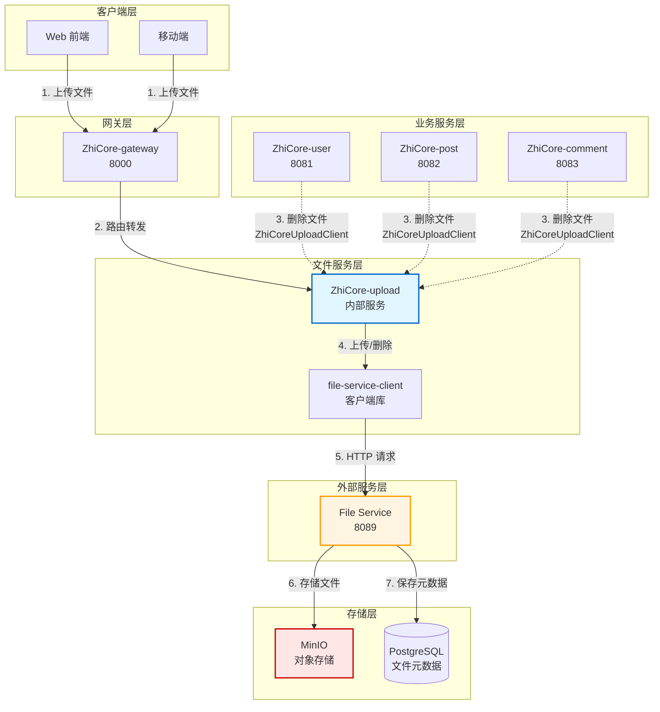
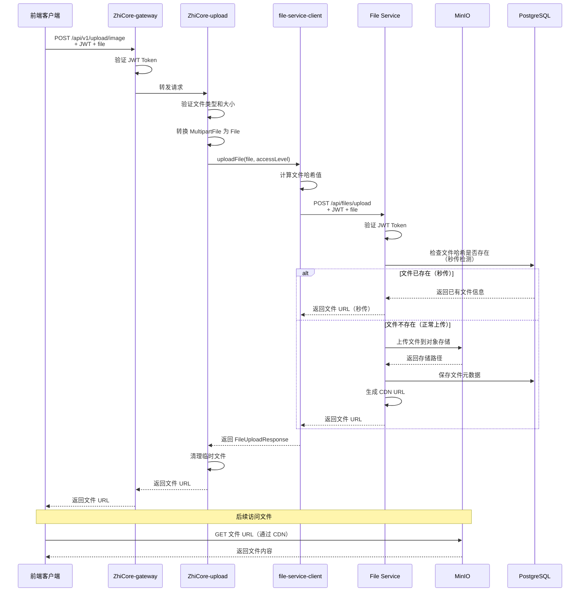
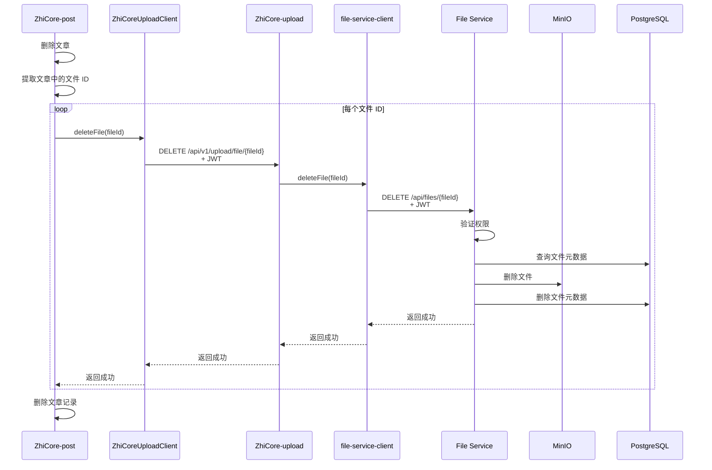

# ZhiCore 文件上传架构文档

## 文档版本

| 版本 | 日期 | 作者 | 说明 |
|------|------|------|------|
| 1.0 | 2026-02-11 | System | 初始版本 - 定义文件上传架构和最佳实践 |

---

## 概述

本文档描述了 ZhiCore 微服务系统中的文件上传架构，包括架构演进历史、服务职责划分、上传和删除流程、支持的文件类型以及最佳实践。

### 核心特点

- **统一入口**: 前端通过 ZhiCore-upload 服务统一上传文件
- **服务解耦**: 后端通过 ZhiCoreUploadClient 调用文件删除接口
- **外部存储**: 底层使用 File Service 进行文件存储和管理
- **类型支持**: 支持图片（JPEG、PNG、GIF、WebP）和音频（MP3、WAV、OGG）
- **性能优化**: 支持秒传、分片上传、CDN 加速

---

## 架构演进历史

### 为什么移除 FileUploadService 接口？

在早期架构中，我们在 `ZhiCore-common` 模块中定义了 `FileUploadService` 接口，各个业务服务（ZhiCore-user、ZhiCore-post、ZhiCore-comment）都实现了这个接口。这种设计存在以下问题：

#### 问题 1: 代码重复

每个业务服务都需要实现相同的文件上传逻辑：

```java
// ZhiCore-user 中的实现
@Service
public class UserFileUploadServiceImpl implements FileUploadService {
    @Override
    public FileUploadResponse uploadImage(MultipartFile file) {
        // 文件验证
        // 调用 file-service-client
        // 返回结果
    }
}

// ZhiCore-post 中的实现
@Service
public class PostFileUploadServiceImpl implements FileUploadService {
    @Override
    public FileUploadResponse uploadImage(MultipartFile file) {
        // 相同的文件验证逻辑
        // 相同的 file-service-client 调用
        // 相同的结果处理
    }
}
```


**结果**: 大量重复代码，维护成本高，修改一处需要同步修改多处。

#### 问题 2: 职责不清

文件上传是一个独立的功能域，不应该分散在各个业务服务中：

- **ZhiCore-user**: 核心职责是用户管理，不应该关心文件上传的实现细节
- **ZhiCore-post**: 核心职责是文章管理，不应该关心文件上传的实现细节
- **ZhiCore-comment**: 核心职责是评论管理，不应该关心文件上传的实现细节

**结果**: 违反单一职责原则，业务服务承担了不属于自己的职责。

#### 问题 3: 难以统一管理

文件上传涉及多个方面的管理：

- 文件类型验证（MIME 类型、文件扩展名）
- 文件大小限制（图片 50MB、音频 100MB）
- 访问级别控制（PUBLIC/PRIVATE）
- 批量上传处理
- 错误处理和日志记录

**结果**: 这些逻辑分散在各个服务中，难以统一管理和升级。

#### 问题 4: 前端调用复杂

前端需要根据不同的业务场景调用不同的服务：

```javascript
// 上传用户头像
await axios.post('/api/user/avatar/upload', formData)

// 上传文章图片
await axios.post('/api/post/image/upload', formData)

// 上传评论图片
await axios.post('/api/comment/image/upload', formData)
```

**结果**: 前端需要维护多个上传接口，增加了复杂度。

### 新架构的优势

通过引入独立的 `ZhiCore-upload` 服务，我们解决了上述所有问题：

#### 优势 1: 代码复用

所有文件上传逻辑集中在 `ZhiCore-upload` 服务中，避免了代码重复：

```java
// ZhiCore-upload 服务中的统一实现
@Service
public class FileUploadServiceImpl implements FileUploadService {
    @Override
    public FileUploadResponse uploadImage(MultipartFile file, AccessLevel accessLevel) {
        // 统一的文件验证
        // 统一的 file-service-client 调用
        // 统一的结果处理
    }
}
```


#### 优势 2: 职责清晰

- **ZhiCore-upload**: 专注于文件上传和管理
- **业务服务**: 专注于业务逻辑，通过 ZhiCoreUploadClient 调用文件删除接口

#### 优势 3: 统一管理

所有文件上传相关的配置和逻辑都在 `ZhiCore-upload` 服务中：

- 文件类型验证规则
- 文件大小限制
- 访问级别控制
- 批量上传处理
- 错误处理和日志记录

#### 优势 4: 前端调用简化

前端只需要调用一个统一的上传接口：

```javascript
// 统一的上传接口
await axios.post('/api/v1/upload/image', formData)
```

---

## 服务职责划分

### ZhiCore-upload 服务

**端口**: 内部服务（通过 Nacos 服务发现调用）

**职责**:
- 文件上传：接收前端上传的文件，调用 File Service 存储
- 文件验证：验证文件类型、大小、格式
- 批量上传：支持批量文件上传
- 文件删除：提供文件删除接口（供后端调用）
- URL 获取：提供文件 URL 获取接口（供后端调用）

**不负责**:
- 业务逻辑处理
- 文件与业务实体的关联关系
- 业务级别的权限控制

### 业务服务（ZhiCore-user、ZhiCore-post、ZhiCore-comment）

**职责**:
- 管理文件 URL 与业务实体的关联关系
- 在业务实体删除时调用 ZhiCoreUploadClient 删除文件
- 业务级别的权限控制（如：只有作者可以删除文章图片）

**不负责**:
- 文件的实际上传和存储
- 文件类型和大小验证
- 文件访问权限控制（由 File Service 负责）

### File Service（外部服务）

**端口**: 8089

**职责**:
- 文件的物理存储（MinIO）
- 文件元数据管理
- 秒传检测
- 分片上传
- CDN URL 生成
- 访问权限控制（PUBLIC/PRIVATE）

**详细文档**: [File Service 集成架构](./file-service-integration.md)

---

## 系统架构图



**架构说明**:
- 🔵 蓝色：ZhiCore-upload 服务（核心文件上传服务）
- 🟠 橙色：File Service（外部文件存储服务）
- 🔴 红色：MinIO（对象存储）
- 实线箭头：前端上传流程
- 虚线箭头：后端删除流程

---

## 前端上传流程

### 流程图



### 流程说明

#### 1. 前端发起上传请求

前端通过 API 网关调用 ZhiCore-upload 服务的上传接口：

```javascript
// 上传图片
const uploadImage = async (file) => {
  const formData = new FormData()
  formData.append('file', file)
  
  try {
    const response = await axios.post('/api/v1/upload/image', formData, {
      headers: {
        'Content-Type': 'multipart/form-data',
        'Authorization': `Bearer ${token}`
      }
    })
    
    return response.data.data // { fileId, url, fileSize, ... }
  } catch (error) {
    console.error('上传失败:', error)
    throw error
  }
}
```


#### 2. ZhiCore-upload 验证文件

ZhiCore-upload 服务接收到文件后，首先进行验证：

```java
@Service
@RequiredArgsConstructor
public class FileValidationService {
    
    // 图片验证
    public void validateImageFile(MultipartFile file) {
        // 1. 检查文件是否为空
        if (file.isEmpty()) {
            throw new FileUploadException(ErrorCodes.FILE_EMPTY, "文件不能为空");
        }
        
        // 2. 检查文件大小（最大 50MB）
        long maxSize = 50 * 1024 * 1024; // 50MB
        if (file.getSize() > maxSize) {
            throw new FileUploadException(ErrorCodes.FILE_TOO_LARGE, 
                "文件大小超过限制: " + maxSize + " 字节");
        }
        
        // 3. 检查文件类型
        String contentType = file.getContentType();
        List<String> allowedTypes = Arrays.asList(
            "image/jpeg", "image/png", "image/gif", "image/webp"
        );
        if (!allowedTypes.contains(contentType)) {
            throw new FileUploadException(ErrorCodes.INVALID_FILE_TYPE, 
                "不支持的文件类型: " + contentType);
        }
    }
}
```

#### 3. 调用 file-service-client 上传

验证通过后，ZhiCore-upload 调用 file-service-client 上传文件：

```java
@Service
@RequiredArgsConstructor
public class FileUploadServiceImpl implements FileUploadService {
    
    private final FileServiceClient fileServiceClient;
    
    @Override
    public FileUploadResponse uploadImage(MultipartFile file, AccessLevel accessLevel) {
        // 1. 验证文件
        fileValidationService.validateImageFile(file);
        
        // 2. 转换 MultipartFile 为 File
        File tempFile = convertMultipartFileToFile(file);
        
        try {
            // 3. 调用 file-service-client 上传
            // 注意：秒传、分片上传等逻辑由 file-service-client 自动处理
            com.platform.fileservice.client.model.FileUploadResponse clientResponse = 
                fileServiceClient.uploadFile(tempFile, accessLevel);
            
            // 4. 转换响应
            return convertToFileUploadResponse(clientResponse, file);
        } finally {
            // 5. 清理临时文件
            deleteTempFile(tempFile);
        }
    }
}
```

#### 4. File Service 处理上传

File Service 接收到文件后：

1. **秒传检测**: 计算文件哈希值，检查是否已存在相同文件
2. **存储文件**: 如果文件不存在，上传到 MinIO
3. **保存元数据**: 保存文件元数据到 PostgreSQL
4. **生成 URL**: 生成文件访问 URL（支持 CDN）

#### 5. 返回结果

最终返回给前端的响应：

```json
{
  "code": 200,
  "message": "success",
  "data": {
    "fileId": "01JGXXX-XXX-XXX-XXX-XXXXXXXXXXXX",
    "url": "https://cdn.example.com/files/01JGXXX-XXX-XXX-XXX-XXXXXXXXXXXX.jpg",
    "fileSize": 1024000,
    "originalName": "avatar.jpg",
    "contentType": "image/jpeg",
    "accessLevel": "PUBLIC",
    "uploadTime": "2026-02-11T10:30:00"
  }
}
```

---

## 后端删除流程

### 流程图



### 流程说明

#### 1. 业务服务提取文件 ID

当删除业务实体时，首先提取关联的文件 ID：

```java
@Service
@RequiredArgsConstructor
public class PostApplicationService {
    
    private final ZhiCoreUploadClient ZhiCoreUploadClient;
    
    @Transactional
    public void deletePost(String postId) {
        // 1. 查询文章
        Post post = postRepository.findById(postId)
            .orElseThrow(() -> new PostNotFoundException(postId));
        
        // 2. 提取文章中的所有文件 ID
        List<String> fileIds = extractFileIds(post);
        
        // 3. 删除文件
        for (String fileId : fileIds) {
            try {
                ZhiCoreUploadClient.deleteFile(fileId);
                log.info("文件删除成功: fileId={}", fileId);
            } catch (Exception e) {
                log.error("文件删除失败: fileId={}, error={}", fileId, e.getMessage());
                // 继续删除其他文件，不中断流程
            }
        }
        
        // 4. 删除文章记录
        postRepository.delete(post);
        log.info("文章删除成功: postId={}", postId);
    }
    
    private List<String> extractFileIds(Post post) {
        List<String> fileIds = new ArrayList<>();
        
        // 提取封面图片 ID
        if (post.getCoverImageUrl() != null) {
            String fileId = extractFileIdFromUrl(post.getCoverImageUrl());
            if (fileId != null) {
                fileIds.add(fileId);
            }
        }
        
        // 提取内容中的图片 ID
        // 假设内容中的图片 URL 格式为: https://cdn.example.com/files/{fileId}.jpg
        // 可以使用正则表达式提取
        
        return fileIds;
    }
}
```


#### 2. 通过 ZhiCoreUploadClient 删除文件

ZhiCoreUploadClient 是一个 Feign Client，定义了删除文件的接口：

```java
/**
 * ZhiCore-upload 服务 Feign 客户端
 * 用于获取文件 URL 和删除文件
 */
@FeignClient(name = "ZhiCore-upload", path = "/api/v1/upload")
public interface ZhiCoreUploadClient {
    
    /**
     * 获取文件访问 URL
     *
     * @param fileId 文件ID（UUIDv7格式）
     * @return 文件访问URL
     */
    @GetMapping("/file/{fileId}/url")
    ApiResponse<String> getFileUrl(@PathVariable("fileId") String fileId);
    
    /**
     * 删除文件
     *
     * @param fileId 文件ID（UUIDv7格式）
     * @return 操作结果
     */
    @DeleteMapping("/file/{fileId}")
    ApiResponse<Void> deleteFile(@PathVariable("fileId") String fileId);
}
```

**使用示例**:

```java
// ZhiCore-user 服务中删除用户头像
@Service
@RequiredArgsConstructor
public class UserApplicationService {
    
    private final ZhiCoreUploadClient ZhiCoreUploadClient;
    
    public void deleteUserAvatar(String userId) {
        User user = userRepository.findById(userId)
            .orElseThrow(() -> new UserNotFoundException(userId));
        
        String avatarUrl = user.getAvatarUrl();
        if (avatarUrl != null) {
            String fileId = extractFileIdFromUrl(avatarUrl);
            ZhiCoreUploadClient.deleteFile(fileId);
        }
        
        user.setAvatarUrl(null);
        userRepository.save(user);
    }
}
```

```java
// ZhiCore-comment 服务中删除评论图片
@Service
@RequiredArgsConstructor
public class CommentApplicationService {
    
    private final ZhiCoreUploadClient ZhiCoreUploadClient;
    
    public void deleteComment(String commentId) {
        Comment comment = commentRepository.findById(commentId)
            .orElseThrow(() -> new CommentNotFoundException(commentId));
        
        // 删除评论图片
        List<String> imageUrls = comment.getImageUrls();
        if (imageUrls != null && !imageUrls.isEmpty()) {
            for (String imageUrl : imageUrls) {
                String fileId = extractFileIdFromUrl(imageUrl);
                ZhiCoreUploadClient.deleteFile(fileId);
            }
        }
        
        // 删除评论音频
        String audioUrl = comment.getAudioUrl();
        if (audioUrl != null) {
            String fileId = extractFileIdFromUrl(audioUrl);
            ZhiCoreUploadClient.deleteFile(fileId);
        }
        
        commentRepository.delete(comment);
    }
}
```

#### 3. ZhiCore-upload 转发删除请求

ZhiCore-upload 服务接收到删除请求后，转发给 file-service-client：

```java
@Service
@RequiredArgsConstructor
public class FileUploadServiceImpl implements FileUploadService {
    
    private final FileServiceClient fileServiceClient;
    
    @Override
    public void deleteFile(String fileId) {
        log.info("开始删除文件: fileId={}", fileId);
        
        try {
            fileServiceClient.deleteFile(fileId);
            log.info("文件删除成功: fileId={}", fileId);
        } catch (FileServiceException e) {
            log.error("文件删除失败: fileId={}, 原因: {}", fileId, e.getMessage(), e);
            throw new FileUploadException(
                ErrorCodes.DELETE_FAILED,
                "文件删除失败: " + e.getMessage(),
                e
            );
        }
    }
}
```

#### 4. File Service 删除文件

File Service 执行实际的删除操作：

1. **验证权限**: 验证 JWT Token，确保有权限删除文件
2. **查询元数据**: 从 PostgreSQL 查询文件元数据
3. **删除文件**: 从 MinIO 删除文件
4. **删除元数据**: 从 PostgreSQL 删除文件元数据
5. **清理缓存**: 清理 Redis 中的文件 URL 缓存

---

## 支持的文件类型

### 图片文件

**支持格式**:
- JPEG (image/jpeg)
- PNG (image/png)
- GIF (image/gif)
- WebP (image/webp)

**大小限制**: 最大 50MB

**上传接口**:
```
POST /api/v1/upload/image
POST /api/v1/upload/image/with-access
POST /api/v1/upload/images/batch
```

**使用场景**:
- 用户头像
- 文章封面图
- 文章内容图片
- 评论图片

**代码示例**:

```java
// 上传图片（默认公开访问）
@PostMapping("/image")
public ApiResponse<FileUploadResponse> uploadImage(
        @RequestParam("file") MultipartFile file) {
    FileUploadResponse response = fileUploadService.uploadImage(file, AccessLevel.PUBLIC);
    return ApiResponse.success(response);
}

// 上传图片（指定访问级别）
@PostMapping("/image/with-access")
public ApiResponse<FileUploadResponse> uploadImageWithAccess(
        @RequestParam("file") MultipartFile file,
        @RequestParam("accessLevel") AccessLevel accessLevel) {
    FileUploadResponse response = fileUploadService.uploadImage(file, accessLevel);
    return ApiResponse.success(response);
}

// 批量上传图片
@PostMapping("/images/batch")
public ApiResponse<List<FileUploadResponse>> uploadImagesBatch(
        @RequestParam("files") List<MultipartFile> files,
        @RequestParam(value = "accessLevel", required = false, defaultValue = "PUBLIC") 
        AccessLevel accessLevel) {
    List<FileUploadResponse> responses = fileUploadService.uploadImagesBatch(files, accessLevel);
    return ApiResponse.success(responses);
}
```

### 音频文件

**支持格式**:
- MP3 (audio/mpeg)
- AAC (audio/aac)
- M4A (audio/mp4)
- WAV (audio/wav)

**大小限制**: 最大 100MB

**上传接口**:
```
POST /api/v1/upload/audio
```

**使用场景**:
- 评论语音
- 文章音频内容

**代码示例**:

```java
// 上传音频（默认公开访问）
@PostMapping("/audio")
public ApiResponse<FileUploadResponse> uploadAudio(
        @RequestParam("file") MultipartFile file) {
    FileUploadResponse response = fileUploadService.uploadAudio(file, AccessLevel.PUBLIC);
    return ApiResponse.success(response);
}
```

### 访问级别

文件上传时可以指定访问级别：

| 访问级别 | 说明 | 使用场景 |
|---------|------|---------|
| PUBLIC | 公开访问，任何人都可以访问 | 用户头像、文章封面、文章图片 |
| PRIVATE | 私有访问，需要签名 URL | 私密文件、付费内容 |

**代码示例**:

```java
// 公开访问
FileUploadResponse response = fileUploadService.uploadImage(file, AccessLevel.PUBLIC);

// 私有访问
FileUploadResponse response = fileUploadService.uploadImage(file, AccessLevel.PRIVATE);
```

---

## API 接口说明

### 上传图片

**接口**: `POST /api/v1/upload/image`

**请求参数**:
- `file`: 图片文件（MultipartFile）

**响应示例**:
```json
{
  "code": 200,
  "message": "success",
  "data": {
    "fileId": "01JGXXX-XXX-XXX-XXX-XXXXXXXXXXXX",
    "url": "https://cdn.example.com/files/01JGXXX-XXX-XXX-XXX-XXXXXXXXXXXX.jpg",
    "fileSize": 1024000,
    "originalName": "avatar.jpg",
    "contentType": "image/jpeg",
    "accessLevel": "PUBLIC",
    "uploadTime": "2026-02-11T10:30:00"
  }
}
```

### 上传音频

**接口**: `POST /api/v1/upload/audio`

**请求参数**:
- `file`: 音频文件（MultipartFile）

**响应示例**:
```json
{
  "code": 200,
  "message": "success",
  "data": {
    "fileId": "01JGYYY-YYY-YYY-YYY-YYYYYYYYYYYY",
    "url": "https://cdn.example.com/files/01JGYYY-YYY-YYY-YYY-YYYYYYYYYYYY.mp3",
    "fileSize": 2048000,
    "originalName": "voice.mp3",
    "contentType": "audio/mpeg",
    "accessLevel": "PUBLIC",
    "uploadTime": "2026-02-11T10:35:00"
  }
}
```

### 批量上传图片

**接口**: `POST /api/v1/upload/images/batch`

**请求参数**:
- `files`: 图片文件列表（List<MultipartFile>）
- `accessLevel`: 访问级别（可选，默认 PUBLIC）

**响应示例**:
```json
{
  "code": 200,
  "message": "success",
  "data": [
    {
      "fileId": "01JGXXX-XXX-XXX-XXX-XXXXXXXXXXXX",
      "url": "https://cdn.example.com/files/01JGXXX-XXX-XXX-XXX-XXXXXXXXXXXX.jpg",
      "fileSize": 1024000,
      "originalName": "image1.jpg",
      "contentType": "image/jpeg",
      "accessLevel": "PUBLIC",
      "uploadTime": "2026-02-11T10:30:00"
    },
    {
      "fileId": "01JGYYY-YYY-YYY-YYY-YYYYYYYYYYYY",
      "url": "https://cdn.example.com/files/01JGYYY-YYY-YYY-YYY-YYYYYYYYYYYY.jpg",
      "fileSize": 2048000,
      "originalName": "image2.jpg",
      "contentType": "image/jpeg",
      "accessLevel": "PUBLIC",
      "uploadTime": "2026-02-11T10:30:01"
    }
  ]
}
```

### 获取文件 URL

**接口**: `GET /api/v1/upload/file/{fileId}/url`

**路径参数**:
- `fileId`: 文件 ID

**响应示例**:
```json
{
  "code": 200,
  "message": "success",
  "data": "https://cdn.example.com/files/01JGXXX-XXX-XXX-XXX-XXXXXXXXXXXX.jpg"
}
```

### 删除文件

**接口**: `DELETE /api/v1/upload/file/{fileId}`

**路径参数**:
- `fileId`: 文件 ID

**响应示例**:
```json
{
  "code": 200,
  "message": "success",
  "data": null
}
```

---

## 最佳实践

### 1. 前端上传

#### 使用统一的上传接口

前端应该统一调用 ZhiCore-upload 服务的上传接口，而不是调用各个业务服务的接口：

```javascript
// ✅ 推荐：统一调用 ZhiCore-upload 服务
const uploadImage = async (file) => {
  const formData = new FormData()
  formData.append('file', file)
  
  const response = await axios.post('/api/v1/upload/image', formData, {
    headers: {
      'Content-Type': 'multipart/form-data',
      'Authorization': `Bearer ${token}`
    }
  })
  
  return response.data.data.url
}

// ❌ 不推荐：调用业务服务的接口
const uploadUserAvatar = async (file) => {
  const formData = new FormData()
  formData.append('file', file)
  
  const response = await axios.post('/api/user/avatar/upload', formData)
  return response.data.data.url
}
```

#### 显示上传进度

```javascript
const uploadImageWithProgress = async (file, onProgress) => {
  const formData = new FormData()
  formData.append('file', file)
  
  const response = await axios.post('/api/v1/upload/image', formData, {
    headers: {
      'Content-Type': 'multipart/form-data',
      'Authorization': `Bearer ${token}`
    },
    onUploadProgress: (progressEvent) => {
      const percentCompleted = Math.round(
        (progressEvent.loaded * 100) / progressEvent.total
      )
      onProgress(percentCompleted)
    }
  })
  
  return response.data.data.url
}
```

#### 批量上传

```javascript
const uploadMultipleImages = async (files) => {
  const formData = new FormData()
  files.forEach(file => {
    formData.append('files', file)
  })
  
  const response = await axios.post('/api/v1/upload/images/batch', formData, {
    headers: {
      'Content-Type': 'multipart/form-data',
      'Authorization': `Bearer ${token}`
    }
  })
  
  return response.data.data.map(item => item.url)
}
```

### 2. 后端删除

#### 使用 ZhiCoreUploadClient

后端删除文件时，应该通过 ZhiCoreUploadClient 调用 ZhiCore-upload 服务：

```java
// ✅ 推荐：使用 ZhiCoreUploadClient
@Service
@RequiredArgsConstructor
public class PostApplicationService {
    
    private final ZhiCoreUploadClient ZhiCoreUploadClient;
    
    public void deletePost(String postId) {
        Post post = postRepository.findById(postId)
            .orElseThrow(() -> new PostNotFoundException(postId));
        
        // 删除文章图片
        List<String> fileIds = extractFileIds(post);
        for (String fileId : fileIds) {
            ZhiCoreUploadClient.deleteFile(fileId);
        }
        
        // 删除文章记录
        postRepository.delete(post);
    }
}

// ❌ 不推荐：直接调用 file-service-client
@Service
@RequiredArgsConstructor
public class PostApplicationService {
    
    private final FileServiceClient fileServiceClient; // 不推荐
    
    public void deletePost(String postId) {
        // ...
        fileServiceClient.deleteFile(fileId); // 不推荐
    }
}
```

#### 异常处理

删除文件时应该捕获异常，避免影响业务流程：

```java
@Service
@RequiredArgsConstructor
public class PostApplicationService {
    
    private final ZhiCoreUploadClient ZhiCoreUploadClient;
    
    public void deletePost(String postId) {
        Post post = postRepository.findById(postId)
            .orElseThrow(() -> new PostNotFoundException(postId));
        
        // 删除文章图片
        List<String> fileIds = extractFileIds(post);
        for (String fileId : fileIds) {
            try {
                ZhiCoreUploadClient.deleteFile(fileId);
                log.info("文件删除成功: fileId={}", fileId);
            } catch (Exception e) {
                // 记录错误，但不中断流程
                log.error("文件删除失败: fileId={}, error={}", fileId, e.getMessage());
                // 可以选择将失败的文件 ID 记录到数据库，后续异步重试
            }
        }
        
        // 删除文章记录
        postRepository.delete(post);
    }
}
```


### 3. 文件 ID 提取

#### 从 URL 提取文件 ID

业务服务存储的是文件 URL，删除时需要从 URL 中提取文件 ID：

```java
@Component
public class FileUrlUtils {
    
    /**
     * 从文件 URL 中提取文件 ID
     * 
     * URL 格式: https://cdn.example.com/files/{fileId}.{ext}
     * 
     * @param url 文件 URL
     * @return 文件 ID，如果提取失败返回 null
     */
    public String extractFileIdFromUrl(String url) {
        if (url == null || url.isEmpty()) {
            return null;
        }
        
        try {
            // 提取文件名（不含扩展名）
            // 例如: https://cdn.example.com/files/01JGXXX-XXX-XXX-XXX-XXXXXXXXXXXX.jpg
            // 提取: 01JGXXX-XXX-XXX-XXX-XXXXXXXXXXXX
            
            String fileName = url.substring(url.lastIndexOf('/') + 1);
            int dotIndex = fileName.lastIndexOf('.');
            if (dotIndex > 0) {
                return fileName.substring(0, dotIndex);
            }
            return fileName;
        } catch (Exception e) {
            log.error("提取文件 ID 失败: url={}, error={}", url, e.getMessage());
            return null;
        }
    }
    
    /**
     * 从内容中提取所有文件 ID
     * 
     * @param content 内容（可能包含多个文件 URL）
     * @return 文件 ID 列表
     */
    public List<String> extractFileIdsFromContent(String content) {
        if (content == null || content.isEmpty()) {
            return Collections.emptyList();
        }
        
        List<String> fileIds = new ArrayList<>();
        
        // 使用正则表达式提取所有文件 URL
        // 例如: https://cdn.example.com/files/{fileId}.{ext}
        Pattern pattern = Pattern.compile(
            "https?://[^/]+/files/([a-zA-Z0-9-]+)\\.[a-zA-Z0-9]+"
        );
        Matcher matcher = pattern.matcher(content);
        
        while (matcher.find()) {
            String fileId = matcher.group(1);
            fileIds.add(fileId);
        }
        
        return fileIds;
    }
}
```

**使用示例**:

```java
@Service
@RequiredArgsConstructor
public class PostApplicationService {
    
    private final FileUrlUtils fileUrlUtils;
    private final ZhiCoreUploadClient ZhiCoreUploadClient;
    
    public void deletePost(String postId) {
        Post post = postRepository.findById(postId)
            .orElseThrow(() -> new PostNotFoundException(postId));
        
        // 提取封面图片 ID
        if (post.getCoverImageUrl() != null) {
            String fileId = fileUrlUtils.extractFileIdFromUrl(post.getCoverImageUrl());
            if (fileId != null) {
                ZhiCoreUploadClient.deleteFile(fileId);
            }
        }
        
        // 提取内容中的所有图片 ID
        if (post.getContent() != null) {
            List<String> fileIds = fileUrlUtils.extractFileIdsFromContent(post.getContent());
            for (String fileId : fileIds) {
                ZhiCoreUploadClient.deleteFile(fileId);
            }
        }
        
        postRepository.delete(post);
    }
}
```

### 4. 文件验证

#### 前端验证

前端应该在上传前进行基本验证，提升用户体验：

```javascript
const validateImageFile = (file) => {
  // 1. 检查文件类型
  const allowedTypes = ['image/jpeg', 'image/png', 'image/gif', 'image/webp']
  if (!allowedTypes.includes(file.type)) {
    throw new Error('不支持的文件类型，请上传 JPEG、PNG、GIF 或 WebP 格式的图片')
  }
  
  // 2. 检查文件大小（50MB）
  const maxSize = 50 * 1024 * 1024
  if (file.size > maxSize) {
    throw new Error('文件大小超过限制，最大支持 50MB')
  }
  
  return true
}

const uploadImage = async (file) => {
  // 前端验证
  validateImageFile(file)
  
  // 上传文件
  const formData = new FormData()
  formData.append('file', file)
  
  const response = await axios.post('/api/v1/upload/image', formData)
  return response.data.data.url
}
```

#### 后端验证

后端必须进行严格验证，确保安全性：

```java
@Service
public class FileValidationService {
    
    public void validateImageFile(MultipartFile file) {
        // 1. 检查文件是否为空
        if (file.isEmpty()) {
            throw new FileUploadException(ErrorCodes.FILE_EMPTY, "文件不能为空");
        }
        
        // 2. 检查文件大小
        long maxSize = 50 * 1024 * 1024; // 50MB
        if (file.getSize() > maxSize) {
            throw new FileUploadException(ErrorCodes.FILE_TOO_LARGE, 
                "文件大小超过限制: " + maxSize + " 字节");
        }
        
        // 3. 检查文件类型（MIME 类型）
        String contentType = file.getContentType();
        List<String> allowedTypes = Arrays.asList(
            "image/jpeg", "image/png", "image/gif", "image/webp"
        );
        if (!allowedTypes.contains(contentType)) {
            throw new FileUploadException(ErrorCodes.INVALID_FILE_TYPE, 
                "不支持的文件类型: " + contentType);
        }
        
        // 4. 检查文件扩展名
        String originalFilename = file.getOriginalFilename();
        if (originalFilename != null) {
            String extension = originalFilename.substring(
                originalFilename.lastIndexOf('.') + 1
            ).toLowerCase();
            List<String> allowedExtensions = Arrays.asList("jpg", "jpeg", "png", "gif", "webp");
            if (!allowedExtensions.contains(extension)) {
                throw new FileUploadException(ErrorCodes.INVALID_FILE_EXTENSION, 
                    "不支持的文件扩展名: " + extension);
            }
        }
    }
}
```


### 5. 性能优化

#### 秒传

File Service 自动支持秒传功能，无需额外配置：

- 上传文件时，File Service 会计算文件哈希值
- 如果文件已存在，直接返回已有文件的 URL
- 节省上传时间和存储空间

#### 分片上传

对于大文件，File Service 自动支持分片上传：

- file-service-client 会自动将大文件分片上传
- 提高上传成功率
- 支持断点续传

#### CDN 加速

公开文件通过 CDN 分发，提升访问速度：

- File Service 自动生成 CDN URL
- 减轻源站压力
- 提升用户体验

#### 缓存策略

File Service 使用 Redis 缓存文件 URL：

- 减少数据库查询
- 提升响应速度
- 缓存时间：1 小时

### 6. 错误处理

#### 常见错误码

| 错误码 | 说明 | 处理方式 |
|-------|------|---------|
| FILE_EMPTY | 文件为空 | 提示用户选择文件 |
| FILE_TOO_LARGE | 文件过大 | 提示用户压缩文件或选择更小的文件 |
| INVALID_FILE_TYPE | 文件类型不支持 | 提示用户选择支持的文件类型 |
| INVALID_FILE_EXTENSION | 文件扩展名不支持 | 提示用户修改文件扩展名 |
| UPLOAD_FAILED | 上传失败 | 提示用户重试或联系管理员 |
| DELETE_FAILED | 删除失败 | 记录日志，后续异步重试 |
| FILE_NOT_FOUND | 文件不存在 | 提示用户文件已被删除 |

#### 错误处理示例

```java
@RestControllerAdvice
public class FileUploadExceptionHandler {
    
    @ExceptionHandler(FileUploadException.class)
    public ApiResponse<Void> handleFileUploadException(FileUploadException e) {
        log.error("文件上传异常: code={}, message={}", e.getCode(), e.getMessage());
        return ApiResponse.error(e.getCode(), e.getMessage());
    }
    
    @ExceptionHandler(MaxUploadSizeExceededException.class)
    public ApiResponse<Void> handleMaxUploadSizeExceededException(
            MaxUploadSizeExceededException e) {
        log.error("文件大小超过限制: {}", e.getMessage());
        return ApiResponse.error(ErrorCodes.FILE_TOO_LARGE, "文件大小超过限制");
    }
}
```

### 7. 日志记录

#### 上传日志

```java
// 上传开始
log.info("开始上传图片: filename={}, size={}, contentType={}", 
    file.getOriginalFilename(), file.getSize(), file.getContentType());

// 上传成功
log.info("图片上传成功: fileId={}, url={}, instantUpload={}", 
    response.getFileId(), response.getUrl(), response.getInstantUpload());

// 上传失败
log.error("文件上传失败: filename={}, error={}", 
    file.getOriginalFilename(), e.getMessage(), e);
```

#### 删除日志

```java
// 删除开始
log.info("开始删除文件: fileId={}", fileId);

// 删除成功
log.info("文件删除成功: fileId={}", fileId);

// 删除失败
log.error("文件删除失败: fileId={}, error={}", fileId, e.getMessage(), e);
```

---

## 安全考虑

### 1. 认证和授权

所有文件上传和删除请求都必须携带有效的 JWT Token：

```java
@RestController
@RequestMapping("/api/v1/upload")
@RequiredArgsConstructor
public class FileUploadController {
    
    @PostMapping("/image")
    public ApiResponse<FileUploadResponse> uploadImage(
            @RequestParam("file") MultipartFile file,
            @RequestHeader("Authorization") String authorization) {
        // JWT Token 由 Spring Security 自动验证
        // 验证通过后才能执行上传逻辑
        FileUploadResponse response = fileUploadService.uploadImage(file, AccessLevel.PUBLIC);
        return ApiResponse.success(response);
    }
}
```

### 2. 文件类型验证

严格验证文件类型，防止上传恶意文件：

```java
public void validateImageFile(MultipartFile file) {
    // 1. 验证 MIME 类型
    String contentType = file.getContentType();
    List<String> allowedTypes = Arrays.asList(
        "image/jpeg", "image/png", "image/gif", "image/webp"
    );
    if (!allowedTypes.contains(contentType)) {
        throw new FileUploadException(ErrorCodes.INVALID_FILE_TYPE, 
            "不支持的文件类型: " + contentType);
    }
    
    // 2. 验证文件扩展名
    String originalFilename = file.getOriginalFilename();
    if (originalFilename != null) {
        String extension = originalFilename.substring(
            originalFilename.lastIndexOf('.') + 1
        ).toLowerCase();
        List<String> allowedExtensions = Arrays.asList("jpg", "jpeg", "png", "gif", "webp");
        if (!allowedExtensions.contains(extension)) {
            throw new FileUploadException(ErrorCodes.INVALID_FILE_EXTENSION, 
                "不支持的文件扩展名: " + extension);
        }
    }
    
    // 3. 验证文件内容（可选）
    // 可以使用 Apache Tika 等库验证文件内容是否与 MIME 类型匹配
}
```

### 3. 文件大小限制

限制文件大小，防止资源耗尽：

```yaml
# application.yml
spring:
  servlet:
    multipart:
      max-file-size: 50MB      # 单个文件最大 50MB
      max-request-size: 100MB  # 整个请求最大 100MB
```

```java
public void validateImageFile(MultipartFile file) {
    long maxSize = 50 * 1024 * 1024; // 50MB
    if (file.getSize() > maxSize) {
        throw new FileUploadException(ErrorCodes.FILE_TOO_LARGE, 
            "文件大小超过限制: " + maxSize + " 字节");
    }
}
```

### 4. 访问权限控制

使用访问级别控制文件访问权限：

- **PUBLIC**: 公开访问，任何人都可以访问
- **PRIVATE**: 私有访问，需要签名 URL

```java
// 公开文件
FileUploadResponse response = fileUploadService.uploadImage(file, AccessLevel.PUBLIC);

// 私有文件
FileUploadResponse response = fileUploadService.uploadImage(file, AccessLevel.PRIVATE);
```

### 5. 防止路径遍历攻击

不要直接使用用户提供的文件名：

```java
// ❌ 不安全：直接使用用户提供的文件名
String filename = file.getOriginalFilename();
File destFile = new File("/uploads/" + filename); // 可能导致路径遍历攻击

// ✅ 安全：使用 File Service 生成的文件 ID
FileUploadResponse response = fileUploadService.uploadImage(file, AccessLevel.PUBLIC);
String fileId = response.getFileId(); // 使用 File Service 生成的安全文件 ID
```

---

## 监控和运维

### 1. 监控指标

| 指标类别 | 具体指标 | 说明 |
|---------|---------|------|
| 可用性 | 服务健康状态 | ZhiCore-upload 是否正常运行 |
| 性能 | 上传响应时间 | P50, P95, P99 |
| 性能 | 删除响应时间 | P50, P95, P99 |
| 业务 | 上传成功率 | 成功上传数 / 总上传数 |
| 业务 | 秒传命中率 | 秒传次数 / 总上传次数 |
| 错误 | 错误率 | 错误请求数 / 总请求数 |
| 错误 | 文件类型错误率 | 文件类型错误数 / 总上传数 |
| 错误 | 文件大小错误率 | 文件大小错误数 / 总上传数 |

### 2. 健康检查

```java
@RestController
@RequestMapping("/actuator")
public class HealthCheckController {
    
    @GetMapping("/health")
    public Map<String, Object> health() {
        Map<String, Object> health = new HashMap<>();
        health.put("status", "UP");
        health.put("service", "ZhiCore-upload");
        health.put("timestamp", LocalDateTime.now());
        return health;
    }
}
```

### 3. 日志聚合

使用 ELK 或其他日志聚合工具收集和分析日志：

- 上传成功日志
- 上传失败日志
- 删除成功日志
- 删除失败日志
- 文件验证失败日志

---

## 常见问题

### Q1: 为什么前端要直接调用 ZhiCore-upload 服务？

**原因**:
1. **统一入口**: 所有文件上传都通过一个服务处理，便于管理和维护
2. **代码复用**: 避免在每个业务服务中重复实现文件上传逻辑
3. **职责清晰**: 文件上传是独立的功能域，应该由专门的服务处理
4. **简化前端**: 前端只需要调用一个上传接口，不需要关心业务服务

### Q2: 为什么后端要通过 ZhiCoreUploadClient 删除文件？

**原因**:
1. **服务解耦**: 业务服务不直接依赖 file-service-client
2. **统一管理**: 所有文件操作都通过 ZhiCore-upload 服务，便于统一管理和监控
3. **降级策略**: 可以在 ZhiCoreUploadClient 中实现降级策略，提高系统可用性
4. **日志记录**: 在 ZhiCore-upload 服务中统一记录文件操作日志

### Q3: 如何处理文件删除失败？

**处理方式**:
1. **记录日志**: 记录删除失败的文件 ID 和错误信息
2. **不中断流程**: 删除文件失败不应该影响业务流程（如删除文章）
3. **异步重试**: 可以将失败的文件 ID 记录到数据库，后续异步重试
4. **定期清理**: 定期清理未关联的孤儿文件

```java
@Service
@RequiredArgsConstructor
public class PostApplicationService {
    
    private final ZhiCoreUploadClient ZhiCoreUploadClient;
    private final FailedFileDeleteRepository failedFileDeleteRepository;
    
    public void deletePost(String postId) {
        Post post = postRepository.findById(postId)
            .orElseThrow(() -> new PostNotFoundException(postId));
        
        // 删除文章图片
        List<String> fileIds = extractFileIds(post);
        for (String fileId : fileIds) {
            try {
                ZhiCoreUploadClient.deleteFile(fileId);
            } catch (Exception e) {
                log.error("文件删除失败: fileId={}, error={}", fileId, e.getMessage());
                // 记录失败的文件 ID，后续异步重试
                failedFileDeleteRepository.save(new FailedFileDelete(fileId, postId));
            }
        }
        
        // 删除文章记录
        postRepository.delete(post);
    }
}
```

### Q4: 如何从文件 URL 中提取文件 ID？

**方法**:

```java
public String extractFileIdFromUrl(String url) {
    if (url == null || url.isEmpty()) {
        return null;
    }
    
    try {
        // URL 格式: https://cdn.example.com/files/{fileId}.{ext}
        // 提取文件名（不含扩展名）
        String fileName = url.substring(url.lastIndexOf('/') + 1);
        int dotIndex = fileName.lastIndexOf('.');
        if (dotIndex > 0) {
            return fileName.substring(0, dotIndex);
        }
        return fileName;
    } catch (Exception e) {
        log.error("提取文件 ID 失败: url={}, error={}", url, e.getMessage());
        return null;
    }
}
```

### Q5: 如何支持新的文件类型？

**步骤**:
1. 在 `FileValidationService` 中添加新的文件类型验证逻辑
2. 在 `FileUploadController` 中添加新的上传接口
3. 更新文档说明支持的文件类型

```java
// 1. 添加视频验证
public void validateVideoFile(MultipartFile file) {
    // 检查文件大小（最大 500MB）
    long maxSize = 500 * 1024 * 1024;
    if (file.getSize() > maxSize) {
        throw new FileUploadException(ErrorCodes.FILE_TOO_LARGE, 
            "文件大小超过限制: " + maxSize + " 字节");
    }
    
    // 检查文件类型
    String contentType = file.getContentType();
    List<String> allowedTypes = Arrays.asList(
        "video/mp4", "video/webm", "video/ogg"
    );
    if (!allowedTypes.contains(contentType)) {
        throw new FileUploadException(ErrorCodes.INVALID_FILE_TYPE, 
            "不支持的文件类型: " + contentType);
    }
}

// 2. 添加上传接口
@PostMapping("/video")
public ApiResponse<FileUploadResponse> uploadVideo(
        @RequestParam("file") MultipartFile file) {
    FileUploadResponse response = fileUploadService.uploadVideo(file, AccessLevel.PUBLIC);
    return ApiResponse.success(response);
}
```

### Q6: 如何实现文件访问权限控制？

**方法**:

使用 File Service 的访问级别功能：

- **PUBLIC**: 公开访问，生成永久 URL
- **PRIVATE**: 私有访问，生成签名 URL（有时效性）

```java
// 公开文件（用户头像、文章图片）
FileUploadResponse response = fileUploadService.uploadImage(file, AccessLevel.PUBLIC);

// 私有文件（付费内容、私密文件）
FileUploadResponse response = fileUploadService.uploadImage(file, AccessLevel.PRIVATE);
```

---

## 相关文档

### 架构文档
- [系统概述](./01-system-overview.md) - 系统整体架构
- [微服务列表和职责](./02-microservices-list.md) - 微服务列表
- [服务间通信](./04-service-communication.md) - 服务间通信模式
- [DDD 分层架构](./05-ddd-layered-architecture.md) - DDD 分层架构设计
- [数据架构](./06-data-architecture.md) - 数据架构设计
- [基础设施](./07-infrastructure.md) - 基础设施配置
- [部署架构](./08-deployment-architecture.md) - 部署架构设计

### 专题文档
- [File Service 集成架构](./file-service-integration.md) - File Service 详细说明
- [ZhiCore-api 模块说明](./ZhiCore-api-module-purpose.md) - ZhiCore-api 模块详解

### 开发规范
- [核心开发策略](../../../.kiro/steering/01-core-policies.md)
- [代码规范](../../../.kiro/steering/02-code-standards.md)
- [常量与配置管理](../../../.kiro/steering/03-constants-config.md)
- [Java 编码标准](../../../.kiro/steering/04-java-standards.md)
- [接口设计规范](../../../.kiro/steering/14-api-design.md)
- [端口分配文档](../../../.kiro/steering/port-allocation.md)

---

## 总结

ZhiCore 文件上传架构通过引入独立的 `ZhiCore-upload` 服务，实现了以下目标：

1. **代码复用**: 避免在每个业务服务中重复实现文件上传逻辑
2. **职责清晰**: 文件上传由专门的服务处理，业务服务专注于业务逻辑
3. **统一管理**: 所有文件上传相关的配置和逻辑都在 ZhiCore-upload 服务中
4. **简化前端**: 前端只需要调用一个统一的上传接口
5. **服务解耦**: 业务服务通过 ZhiCoreUploadClient 调用文件删除接口，不直接依赖 file-service-client

这种架构设计符合微服务的单一职责原则，提高了系统的可维护性和可扩展性。

---

**最后更新**: 2026-02-11  
**维护者**: 架构团队  
**文档状态**: ✅ 已完成
