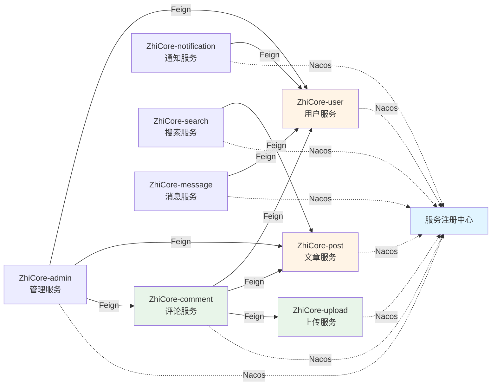
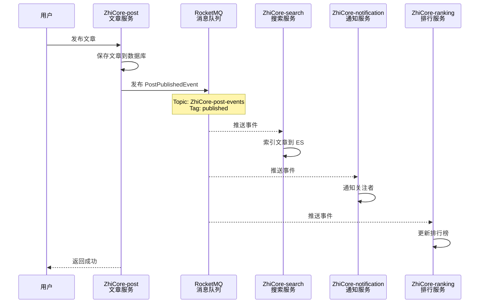

# 服务间通信架构

## 文档版本

| 版本 | 日期 | 作者 | 说明 |
|------|------|------|------|
| 1.0 | 2026-02-11 | ZhiCore Team | 初始版本 - 服务间通信架构文档 |

---

## 概述

ZhiCore 微服务系统采用**同步调用（Feign Client）**和**异步通信（RocketMQ）**相结合的方式实现服务间通信。本文档详细说明了服务间通信的实现方式、最佳实践和注意事项。

### 通信方式对比

| 通信方式 | 使用场景 | 优点 | 缺点 |
|---------|---------|------|------|
| **Feign Client（同步）** | 查询数据、实时响应 | 简单直观、实时响应 | 服务耦合、性能瓶颈 |
| **RocketMQ（异步）** | 事件通知、数据同步 | 解耦、高吞吐、削峰填谷 | 最终一致性、复杂度高 |

---

## 一、Feign Client 同步调用

### 1.1 架构设计

Feign Client 是基于 HTTP 的声明式服务调用客户端，通过 Nacos 实现服务发现和负载均衡。

#### 核心组件

```
┌─────────────────────────────────────────────────────────────┐
│                      ZhiCore-api (共享模块)                      │
│  - Feign Client 接口定义                                     │
│  - DTO 数据传输对象                                          │
│  - 领域事件定义                                              │
└─────────────────────────────────────────────────────────────┘
                            ▲
                            │ 依赖
        ┌───────────────────┼───────────────────┐
        │                   │                   │
┌───────▼────────┐  ┌──────▼───────┐  ┌───────▼────────┐
│  ZhiCore-comment  │  │  ZhiCore-search │  │ZhiCore-notification│
│  调用 User/Post│  │  调用 Post   │  │  调用 User     │
└────────────────┘  └──────────────┘  └────────────────┘
```

### 1.2 ZhiCore-api 模块的作用

`ZhiCore-api` 是一个**共享 API 模块**，用于在微服务之间共享接口定义、DTO 和事件。

#### 模块结构

```
ZhiCore-api/
├── client/                          # Feign 客户端接口
│   ├── UserServiceClient.java      # 用户服务客户端
│   ├── PostServiceClient.java      # 文章服务客户端
│   └── fallback/                    # 降级处理（已废弃，移至各服务）
├── dto/                             # 数据传输对象
│   ├── user/
│   │   ├── UserDTO.java            # 完整用户信息
│   │   └── UserSimpleDTO.java      # 简化用户信息
│   └── post/
│       ├── PostDTO.java            # 文章简要信息
│       └── PostDetailDTO.java      # 文章详情
└── event/                           # 领域事件
    ├── DomainEvent.java            # 事件基类
    ├── user/                        # 用户事件
    ├── post/                        # 文章事件
    └── comment/                     # 评论事件
```

#### 为什么需要 ZhiCore-api？

1. **接口统一**：所有服务使用相同的 Feign 客户端接口，避免重复定义
2. **类型安全**：DTO 在编译期检查，避免运行时类型错误
3. **版本管理**：接口变更在 ZhiCore-api 中统一管理，所有依赖服务同步更新
4. **解耦**：服务只依赖接口，不依赖实现，符合依赖倒置原则


### 1.3 Feign Client 使用方式

#### 步骤 1：在 ZhiCore-api 中定义接口

```java
// ZhiCore-api/src/main/java/com/ZhiCore/api/client/UserServiceClient.java
package com.zhicore.api.client;

import com.zhicore.api.dto.user.UserDTO;
import com.zhicore.api.dto.user.UserSimpleDTO;
import com.zhicore.common.result.ApiResponse;
import org.springframework.cloud.openfeign.FeignClient;
import org.springframework.web.bind.annotation.GetMapping;
import org.springframework.web.bind.annotation.PathVariable;
import org.springframework.web.bind.annotation.RequestParam;

import java.util.List;

/**
 * 用户服务 Feign 客户端
 * 注意：fallbackFactory 应在各服务中通过 @FeignClient 配置指定
 */
@FeignClient(name = "user-service")
public interface UserServiceClient {

    /**
     * 获取用户详情
     */
    @GetMapping("/users/{userId}")
    ApiResponse<UserDTO> getUserById(@PathVariable("userId") Long userId);

    /**
     * 获取用户简要信息
     */
    @GetMapping("/users/{userId}/simple")
    ApiResponse<UserSimpleDTO> getUserSimple(@PathVariable("userId") Long userId);

    /**
     * 批量获取用户简要信息
     */
    @GetMapping("/users/batch/simple")
    ApiResponse<List<UserSimpleDTO>> getUsersSimple(@RequestParam("userIds") List<Long> userIds);
}
```


#### 步骤 2：在调用方服务中使用

```java
// ZhiCore-comment/src/main/java/com/ZhiCore/comment/application/service/CommentApplicationService.java
@Service
@RequiredArgsConstructor
public class CommentApplicationService {
    
    private final UserServiceClient userServiceClient;  // 来自 ZhiCore-api
    private final PostServiceClient postServiceClient;  // 来自 ZhiCore-api
    private final CommentRepository commentRepository;
    
    public CommentVO getComment(String commentId) {
        // 1. 查询评论
        Comment comment = commentRepository.findById(commentId);
        
        // 2. 调用用户服务获取作者信息
        ApiResponse<UserSimpleDTO> userResponse = 
            userServiceClient.getUserSimple(comment.getUserId());
        UserSimpleDTO author = userResponse.getData();
        
        // 3. 调用文章服务获取文章信息
        ApiResponse<PostDTO> postResponse = 
            postServiceClient.getPostSimple(comment.getPostId());
        PostDTO post = postResponse.getData();
        
        // 4. 组装返回
        return CommentVO.builder()
            .commentId(comment.getId())
            .content(comment.getContent())
            .authorName(author.getUserName())
            .authorAvatar(author.getAvatar())
            .postTitle(post.getTitle())
            .build();
    }
}
```

#### 步骤 3：配置包扫描

**重要**：必须在 `@SpringBootApplication` 中扫描 `com.zhicore.api` 包！

```java
@SpringBootApplication(scanBasePackages = {
    "com.ZhiCore.comment",   // 扫描评论服务自己的代码
    "com.zhicore.common",    // 扫描公共模块
    "com.zhicore.api"        // 扫描 API 模块 ← 必须添加！
})
public class CommentApplication {
    public static void main(String[] args) {
        SpringApplication.run(CommentApplication.class, args);
    }
}
```


### 1.4 降级策略（FallbackFactory）

当服务调用失败时（超时、熔断、服务不可用），Feign 会触发降级逻辑，返回默认值或错误信息。

#### 降级工厂基类

```java
// ZhiCore-common/src/main/java/com/ZhiCore/common/sentinel/AbstractFallbackFactory.java
@Slf4j
public abstract class AbstractFallbackFactory<T> implements FallbackFactory<T> {

    private final String serviceName;
    private final Counter fallbackCounter;

    protected AbstractFallbackFactory(String serviceName, MeterRegistry meterRegistry) {
        this.serviceName = serviceName;
        this.fallbackCounter = meterRegistry.counter("feign.fallback.count", 
                "service", serviceName);
    }

    @Override
    public T create(Throwable cause) {
        // 记录降级指标
        fallbackCounter.increment();
        
        // 记录日志
        logFallback(cause);
        
        // 创建降级实现
        return createFallback(cause);
    }

    /**
     * 创建降级实现（子类实现）
     */
    protected abstract T createFallback(Throwable cause);

    /**
     * 创建服务不可用响应
     */
    protected <R> ApiResponse<R> serviceUnavailable() {
        return ApiResponse.fail(ResultCode.SERVICE_UNAVAILABLE, 
                serviceName + "服务暂不可用");
    }
}
```


#### 降级工厂实现示例

```java
// ZhiCore-comment/src/main/java/com/ZhiCore/comment/infrastructure/feign/UserServiceFallbackFactory.java
@Slf4j
@Component
public class UserServiceFallbackFactory extends AbstractFallbackFactory<UserServiceClient> {

    public UserServiceFallbackFactory(MeterRegistry meterRegistry) {
        super("user-service", meterRegistry);
    }

    @Override
    protected UserServiceClient createFallback(Throwable cause) {
        return new UserServiceClient() {
            @Override
            public ApiResponse<UserDTO> getUserById(Long userId) {
                log.warn("用户服务降级: getUserById({}), 原因: {}", userId, cause.getMessage());
                return serviceUnavailable();
            }

            @Override
            public ApiResponse<UserSimpleDTO> getUserSimple(Long userId) {
                log.warn("用户服务降级: getUserSimple({}), 原因: {}", userId, cause.getMessage());
                // 返回默认用户信息
                UserSimpleDTO defaultUser = new UserSimpleDTO();
                defaultUser.setUserId(userId);
                defaultUser.setUserName("用户" + userId);
                defaultUser.setAvatar("/default-avatar.png");
                return ApiResponse.success(defaultUser);
            }

            @Override
            public ApiResponse<List<UserSimpleDTO>> getUsersSimple(List<Long> userIds) {
                log.warn("用户服务降级: getUsersSimple({}), 原因: {}", userIds, cause.getMessage());
                return serviceUnavailable();
            }
        };
    }
}
```

#### 配置降级工厂

```java
// ZhiCore-comment/src/main/java/com/ZhiCore/comment/infrastructure/feign/UserServiceClient.java
@FeignClient(name = "ZhiCore-user", fallbackFactory = UserServiceFallbackFactory.class)
public interface UserServiceClient extends com.zhicore.api.client.UserServiceClient {
    // 继承 ZhiCore-api 中的接口定义
}
```


### 1.5 服务调用链路图



### 1.6 最佳实践

#### ✅ 推荐做法

1. **接口定义在 ZhiCore-api**：所有 Feign Client 接口定义在 ZhiCore-api 模块
2. **降级工厂在各服务**：每个服务根据自己的业务需求实现降级策略
3. **批量查询优化**：使用批量接口减少网络调用次数
4. **超时配置合理**：根据业务场景配置合理的超时时间
5. **监控降级指标**：使用 Prometheus 监控降级次数和原因


#### ❌ 避免做法

1. **循环依赖**：避免服务 A 调用服务 B，服务 B 又调用服务 A
2. **过度调用**：避免在循环中调用远程服务，应使用批量接口
3. **忽略降级**：必须为所有 Feign Client 配置降级策略
4. **硬编码服务名**：使用常量定义服务名，避免硬编码

---

## 二、RocketMQ 异步通信

### 2.1 架构设计

RocketMQ 用于服务间的异步通信，通过发布-订阅模式实现事件驱动架构。

#### 核心组件

```
┌─────────────────────────────────────────────────────────────┐
│                    RocketMQ NameServer                       │
│                    服务注册与路由管理                          │
└─────────────────────────────────────────────────────────────┘
                            ▲
                            │
┌───────────────────────────┼───────────────────────────────────┐
│                    RocketMQ Broker                            │
│                    消息存储与转发                              │
└───────────────────────────────────────────────────────────────┘
        ▲                   │                   ▼
        │                   │                   │
┌───────┴────────┐  ┌──────┴───────┐  ┌───────┴────────┐
│  Producer      │  │  Producer    │  │  Consumer      │
│  ZhiCore-post     │  │  ZhiCore-user   │  │  ZhiCore-search   │
│  发布文章事件   │  │  发布用户事件 │  │  消费文章事件   │
└────────────────┘  └──────────────┘  └────────────────┘
```


### 2.2 Topic 和 Tag 设计

#### Topic 设计原则

- **按业务领域划分**：每个业务领域一个 Topic
- **命名规范**：`ZhiCore-{domain}-events`

#### Tag 设计原则

- **按事件类型划分**：每个事件类型一个 Tag
- **命名规范**：使用动词过去式（如 `published`、`liked`、`deleted`）

#### Topic 和 Tag 定义

```java
// ZhiCore-common/src/main/java/com/ZhiCore/common/mq/TopicConstants.java
public final class TopicConstants {

    // ==================== Topics ====================
    
    /** 文章相关事件 Topic */
    public static final String TOPIC_POST_EVENTS = "ZhiCore-post-events";
    
    /** 用户相关事件 Topic */
    public static final String TOPIC_USER_EVENTS = "ZhiCore-user-events";
    
    /** 评论相关事件 Topic */
    public static final String TOPIC_COMMENT_EVENTS = "ZhiCore-comment-events";
    
    /** 消息相关事件 Topic */
    public static final String TOPIC_MESSAGE_EVENTS = "ZhiCore-message-events";

    // ==================== Tags ====================
    
    /** 文章发布 */
    public static final String TAG_POST_PUBLISHED = "published";
    
    /** 文章点赞 */
    public static final String TAG_POST_LIKED = "liked";
    
    /** 文章删除 */
    public static final String TAG_POST_DELETED = "deleted";
    
    /** 用户关注 */
    public static final String TAG_USER_FOLLOWED = "followed";
    
    /** 评论创建 */
    public static final String TAG_COMMENT_CREATED = "created";
}
```


### 2.3 领域事件定义

#### 事件基类

```java
// ZhiCore-api/src/main/java/com/ZhiCore/api/event/DomainEvent.java
@Getter
public abstract class DomainEvent implements Serializable {

    private static final long serialVersionUID = 1L;

    /** 事件ID */
    private final String eventId;

    /** 事件发生时间 */
    private final LocalDateTime occurredAt;

    protected DomainEvent() {
        this.eventId = UUID.randomUUID().toString().replace("-", "");
        this.occurredAt = LocalDateTime.now();
    }

    /**
     * 获取事件标签（用于 RocketMQ Tag）
     */
    public abstract String getTag();
}
```

#### 具体事件示例

```java
// ZhiCore-api/src/main/java/com/ZhiCore/api/event/post/PostPublishedEvent.java
@Getter
public class PostPublishedEvent extends DomainEvent {

    private static final long serialVersionUID = 1L;
    public static final String TAG = "published";

    private final Long postId;
    private final Long authorId;
    private final String title;
    private final String excerpt;
    private final List<String> tags;

    public PostPublishedEvent(Long postId, Long authorId, String title, 
                              String excerpt, List<String> tags) {
        super();
        this.postId = postId;
        this.authorId = authorId;
        this.title = title;
        this.excerpt = excerpt;
        this.tags = tags;
    }

    @Override
    public String getTag() {
        return TAG;
    }
}
```


### 2.4 事件发布

#### 事件发布器

```java
// ZhiCore-common/src/main/java/com/ZhiCore/common/mq/DomainEventPublisher.java
@Slf4j
@Component
@RequiredArgsConstructor
public class DomainEventPublisher {

    private final RocketMQTemplate rocketMQTemplate;

    /**
     * 发送普通消息（异步）
     */
    public void publish(String topic, String tag, Object event) {
        String destination = topic + ":" + tag;
        Message<String> message = buildMessage(event);

        rocketMQTemplate.asyncSend(destination, message, new SendCallback() {
            @Override
            public void onSuccess(SendResult sendResult) {
                log.debug("Event published: topic={}, tag={}, msgId={}",
                        topic, tag, sendResult.getMsgId());
            }

            @Override
            public void onException(Throwable e) {
                log.error("Failed to publish event: topic={}, tag={}", topic, tag, e);
            }
        });
    }

    /**
     * 发送顺序消息
     * 相同 hashKey 的消息会被发送到同一个队列，保证顺序
     */
    public void publishOrderly(String topic, String tag, Object event, String hashKey) {
        String destination = topic + ":" + tag;
        Message<String> message = buildMessage(event);

        rocketMQTemplate.asyncSendOrderly(destination, message, hashKey, 
            new SendCallback() {
                @Override
                public void onSuccess(SendResult sendResult) {
                    log.debug("Orderly event published: topic={}, tag={}, hashKey={}",
                            topic, tag, hashKey);
                }

                @Override
                public void onException(Throwable e) {
                    log.error("Failed to publish orderly event", e);
                }
            });
    }

    private Message<String> buildMessage(Object event) {
        String payload = JsonUtils.toJson(event);
        return MessageBuilder.withPayload(payload)
                .setHeader("eventType", event.getClass().getSimpleName())
                .build();
    }
}
```


#### 业务服务发布事件

```java
// ZhiCore-post/src/main/java/com/ZhiCore/post/infrastructure/mq/PostEventPublisher.java
@Slf4j
@Component
public class PostEventPublisher {

    private final DomainEventPublisher domainEventPublisher;

    @Autowired(required = false)
    public PostEventPublisher(DomainEventPublisher domainEventPublisher) {
        this.domainEventPublisher = domainEventPublisher;
    }

    /**
     * 发布文章事件
     */
    public void publish(DomainEvent event) {
        if (domainEventPublisher == null) {
            log.debug("Event publisher not available, skipping event");
            return;
        }
        domainEventPublisher.publish(
            TopicConstants.TOPIC_POST_EVENTS, 
            event.getTag(), 
            event
        );
    }
}
```

#### 应用层发布事件

```java
// ZhiCore-post/src/main/java/com/ZhiCore/post/application/service/PostApplicationService.java
@Service
@RequiredArgsConstructor
public class PostApplicationService {

    private final PostRepository postRepository;
    private final PostEventPublisher eventPublisher;

    @Transactional
    public void publishPost(Long postId) {
        // 1. 更新文章状态
        Post post = postRepository.findById(postId);
        post.publish();
        postRepository.save(post);

        // 2. 发布领域事件
        PostPublishedEvent event = new PostPublishedEvent(
            post.getId(),
            post.getAuthorId(),
            post.getTitle(),
            post.getExcerpt(),
            post.getTags()
        );
        eventPublisher.publish(event);
    }
}
```


### 2.5 事件订阅

#### 事件消费者

```java
// ZhiCore-search/src/main/java/com/ZhiCore/search/infrastructure/mq/PostPublishedSearchConsumer.java
@Slf4j
@Component
@RocketMQMessageListener(
    topic = TopicConstants.TOPIC_POST_EVENTS,
    selectorExpression = TopicConstants.TAG_POST_PUBLISHED,
    consumerGroup = "search-post-published-consumer"
)
public class PostPublishedSearchConsumer extends AbstractEventConsumer<PostPublishedEvent> {

    private final PostSearchService searchService;

    public PostPublishedSearchConsumer(StatefulIdempotentHandler idempotentHandler,
                                       PostSearchService searchService) {
        super(idempotentHandler, PostPublishedEvent.class);
        this.searchService = searchService;
    }

    @Override
    protected void doHandle(PostPublishedEvent event) {
        // 将文章索引到 Elasticsearch
        searchService.indexPost(
            event.getPostId(),
            event.getTitle(),
            event.getExcerpt(),
            event.getTags()
        );
        
        log.info("文章已索引到搜索引擎: postId={}", event.getPostId());
    }
}
```

#### 通知服务消费事件

```java
// ZhiCore-notification/src/main/java/com/ZhiCore/notification/infrastructure/mq/PostLikedNotificationConsumer.java
@Slf4j
@Component
@RocketMQMessageListener(
    topic = TopicConstants.TOPIC_POST_EVENTS,
    selectorExpression = TopicConstants.TAG_POST_LIKED,
    consumerGroup = "notification-post-liked-consumer"
)
public class PostLikedNotificationConsumer extends AbstractEventConsumer<PostLikedEvent> {

    private final NotificationApplicationService notificationService;

    public PostLikedNotificationConsumer(StatefulIdempotentHandler idempotentHandler,
                                         NotificationApplicationService notificationService) {
        super(idempotentHandler, PostLikedEvent.class);
        this.notificationService = notificationService;
    }

    @Override
    protected void doHandle(PostLikedEvent event) {
        // 不给自己发通知
        if (event.getAuthorId().equals(event.getUserId())) {
            return;
        }

        // 创建点赞通知
        notificationService.createLikeNotification(
            event.getAuthorId(),
            event.getUserId(),
            "post",
            event.getPostId()
        );
        
        log.info("点赞通知已创建: postId={}, liker={}", 
                event.getPostId(), event.getUserId());
    }
}
```


### 2.6 事件流转图



### 2.7 Consumer Group 设计

#### 命名规范

- **格式**：`{service}-{event}-consumer`
- **示例**：`search-post-published-consumer`、`notification-post-liked-consumer`

#### Consumer Group 列表

| Consumer Group | 订阅 Topic | 订阅 Tag | 服务 | 用途 |
|---------------|-----------|---------|------|------|
| search-post-published-consumer | ZhiCore-post-events | published | ZhiCore-search | 索引新发布的文章 |
| search-post-updated-consumer | ZhiCore-post-events | updated | ZhiCore-search | 更新文章索引 |
| search-post-deleted-consumer | ZhiCore-post-events | deleted | ZhiCore-search | 删除文章索引 |
| notification-post-liked-consumer | ZhiCore-post-events | liked | ZhiCore-notification | 创建点赞通知 |
| notification-comment-created-consumer | ZhiCore-comment-events | created | ZhiCore-notification | 创建评论通知 |
| ranking-post-viewed-consumer | ZhiCore-post-events | viewed | ZhiCore-ranking | 更新浏览排行 |
| ranking-post-liked-consumer | ZhiCore-post-events | liked | ZhiCore-ranking | 更新点赞排行 |


### 2.8 最佳实践

#### ✅ 推荐做法

1. **事件定义在 ZhiCore-api**：所有领域事件定义在 ZhiCore-api 模块，确保生产者和消费者使用相同的事件类
2. **幂等性处理**：消费者必须实现幂等性，避免重复消费导致的数据不一致
3. **异常处理**：消费失败时记录日志，RocketMQ 会自动重试
4. **顺序消息**：需要保证顺序的场景（如用户操作日志）使用顺序消息
5. **延迟消息**：定时任务场景（如定时发布文章）使用延迟消息
6. **监控消费延迟**：使用 RocketMQ Dashboard 监控消费延迟和堆积

#### ❌ 避免做法

1. **同步等待结果**：不要在发布事件后同步等待消费结果
2. **事件过大**：事件应只包含必要信息，避免传输大对象
3. **循环依赖**：避免服务 A 发布事件，服务 B 消费后又发布事件给服务 A
4. **忽略失败**：必须处理消费失败的情况，记录日志或告警

---

## 三、服务通信对比

### 3.1 使用场景对比

| 场景 | 推荐方式 | 原因 |
|------|---------|------|
| 查询用户信息 | Feign Client | 需要实时响应 |
| 查询文章详情 | Feign Client | 需要实时响应 |
| 文章发布通知 | RocketMQ | 异步处理，解耦 |
| 更新搜索索引 | RocketMQ | 异步处理，不影响主流程 |
| 更新排行榜 | RocketMQ | 异步处理，允许延迟 |
| 发送通知 | RocketMQ | 异步处理，批量发送 |
| 删除文件 | Feign Client | 需要确认删除结果 |
| 统计数据同步 | RocketMQ | 异步处理，最终一致性 |


### 3.2 性能对比

| 指标 | Feign Client | RocketMQ |
|------|-------------|----------|
| **响应时间** | 毫秒级（10-100ms） | 秒级（1-5s） |
| **吞吐量** | 中等（1000 QPS） | 高（10000+ TPS） |
| **可靠性** | 依赖服务可用性 | 消息持久化，高可靠 |
| **一致性** | 强一致性 | 最终一致性 |
| **复杂度** | 低 | 中等 |

### 3.3 混合使用示例

```java
@Service
@RequiredArgsConstructor
public class CommentApplicationService {

    private final UserServiceClient userServiceClient;  // Feign Client
    private final PostServiceClient postServiceClient;  // Feign Client
    private final CommentEventPublisher eventPublisher; // RocketMQ

    @Transactional
    public CommentVO createComment(CreateCommentRequest request) {
        // 1. 同步调用：验证用户和文章存在（需要实时响应）
        ApiResponse<UserSimpleDTO> userResponse = 
            userServiceClient.getUserSimple(request.getUserId());
        if (!userResponse.isSuccess()) {
            throw new BusinessException("用户不存在");
        }

        ApiResponse<PostDTO> postResponse = 
            postServiceClient.getPostSimple(request.getPostId());
        if (!postResponse.isSuccess()) {
            throw new BusinessException("文章不存在");
        }

        // 2. 保存评论
        Comment comment = commentRepository.save(
            Comment.create(request.getUserId(), request.getPostId(), request.getContent())
        );

        // 3. 异步发布事件：通知、统计等（不影响主流程）
        CommentCreatedEvent event = new CommentCreatedEvent(
            comment.getId(),
            comment.getUserId(),
            comment.getPostId(),
            postResponse.getData().getAuthorId()
        );
        eventPublisher.publish(event);

        return CommentVO.from(comment, userResponse.getData());
    }
}
```


---

## 四、配置说明

### 4.1 Feign 配置

```yaml
# application.yml
spring:
  cloud:
    nacos:
      discovery:
        server-addr: localhost:8848  # Nacos 服务地址
        namespace: dev               # 命名空间
        group: DEFAULT_GROUP         # 分组

feign:
  client:
    config:
      default:
        connectTimeout: 5000         # 连接超时（毫秒）
        readTimeout: 10000           # 读取超时（毫秒）
        loggerLevel: BASIC           # 日志级别
  sentinel:
    enabled: true                    # 启用 Sentinel 熔断
  compression:
    request:
      enabled: true                  # 启用请求压缩
      mime-types: text/xml,application/xml,application/json
      min-request-size: 2048         # 最小压缩大小
    response:
      enabled: true                  # 启用响应压缩
```

### 4.2 RocketMQ 配置

```yaml
# application.yml
rocketmq:
  name-server: localhost:9876        # NameServer 地址
  producer:
    group: ZhiCore-producer-group       # 生产者组
    send-message-timeout: 3000       # 发送超时（毫秒）
    retry-times-when-send-failed: 2  # 同步发送失败重试次数
    retry-times-when-send-async-failed: 2  # 异步发送失败重试次数
  consumer:
    pull-batch-size: 10              # 每次拉取消息数量
```


---

## 五、监控与运维

### 5.1 Feign 监控指标

| 指标 | 说明 | 告警阈值 |
|------|------|---------|
| `feign.call.count` | 调用次数 | - |
| `feign.call.duration` | 调用耗时 | P99 > 1s |
| `feign.fallback.count` | 降级次数 | > 100/min |
| `feign.error.count` | 错误次数 | > 50/min |

### 5.2 RocketMQ 监控指标

| 指标 | 说明 | 告警阈值 |
|------|------|---------|
| `rocketmq.producer.tps` | 生产者 TPS | - |
| `rocketmq.consumer.tps` | 消费者 TPS | - |
| `rocketmq.consumer.lag` | 消费延迟 | > 1000 条 |
| `rocketmq.consumer.rt` | 消费耗时 | P99 > 5s |

### 5.3 RocketMQ Dashboard

访问地址：`http://localhost:8180`

功能：
- 查看 Topic 列表和消息堆积情况
- 查看 Consumer Group 消费进度
- 查看消息详情和消费轨迹
- 重置消费位点
- 发送测试消息

---

## 六、故障排查

### 6.1 Feign 调用失败

#### 问题现象

```
feign.FeignException: status 503 reading UserServiceClient#getUserSimple
```

#### 排查步骤

1. **检查服务是否注册到 Nacos**
   ```bash
   curl http://localhost:8848/nacos/v1/ns/instance/list?serviceName=ZhiCore-user
   ```

2. **检查服务是否健康**
   ```bash
   curl http://localhost:8081/actuator/health
   ```

3. **检查网络连通性**
   ```bash
   curl http://localhost:8081/users/1/simple
   ```

4. **查看降级日志**
   ```
   grep "用户服务降级" logs/application.log
   ```


### 6.2 RocketMQ 消息堆积

#### 问题现象

RocketMQ Dashboard 显示消费延迟 > 1000 条

#### 排查步骤

1. **检查消费者是否在线**
   - 在 RocketMQ Dashboard 查看 Consumer Group 状态

2. **检查消费者日志**
   ```bash
   grep "消费失败" logs/application.log
   ```

3. **检查消费耗时**
   - 查看 Prometheus 指标 `rocketmq.consumer.rt`

4. **临时解决方案**
   - 增加消费者实例数量
   - 跳过堆积消息（重置消费位点）

### 6.3 事件丢失

#### 问题现象

发布了事件，但消费者没有收到

#### 排查步骤

1. **检查事件是否发送成功**
   ```bash
   grep "Event published" logs/application.log
   ```

2. **检查 Topic 和 Tag 是否正确**
   - 在 RocketMQ Dashboard 查看消息详情

3. **检查消费者订阅配置**
   ```java
   @RocketMQMessageListener(
       topic = TopicConstants.TOPIC_POST_EVENTS,
       selectorExpression = TopicConstants.TAG_POST_PUBLISHED,  // 检查 Tag 是否匹配
       consumerGroup = "search-post-published-consumer"
   )
   ```

4. **检查消费者是否启动**
   ```bash
   curl http://localhost:8086/actuator/health
   ```

---

## 七、相关文档

- [系统概述](./01-system-overview.md) - 系统整体架构
- [微服务列表](./02-microservices-list.md) - 所有微服务职责
- [文件上传架构](./03-file-upload-architecture.md) - 文件上传服务通信
- [常量与配置管理](../../.kiro/steering/development/03-constants-config.md) - Topic/Tag 常量管理
- [基础设施与端口](../../.kiro/steering/port-allocation.md) - RocketMQ 端口配置

---

**最后更新**：2026-02-11  
**维护者**：ZhiCore Team

