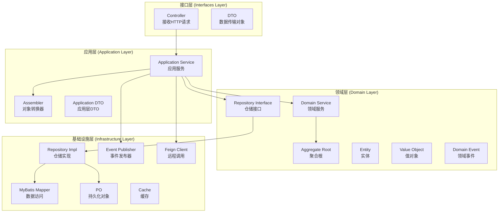
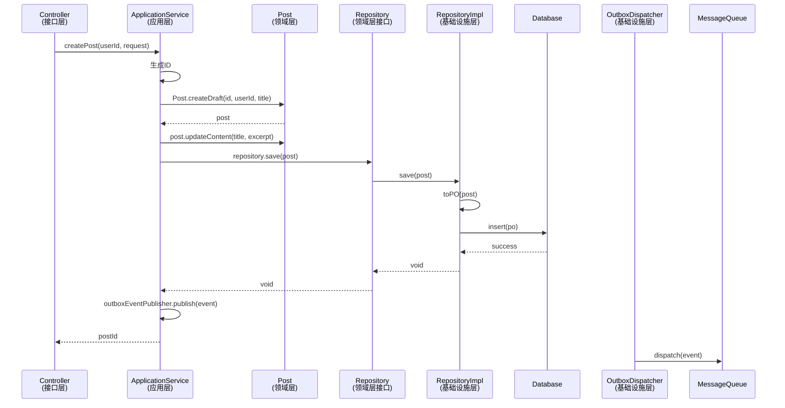
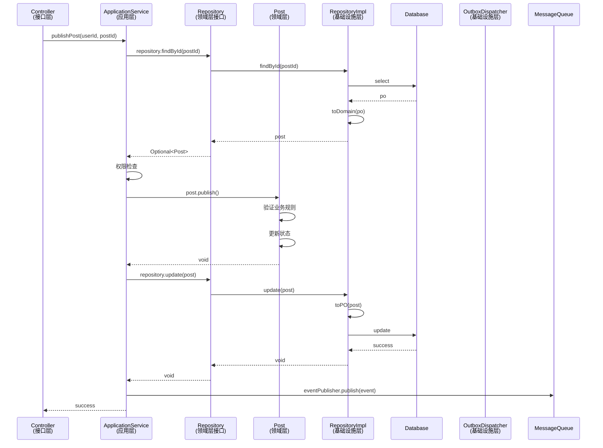

# DDD 分层架构文档

## 文档版本

| 版本 | 日期 | 作者 | 说明 |
|------|------|------|------|
| 1.0 | 2026-02-11 | ZhiCore Team | 初始版本 - DDD 分层架构设计说明 |

---

## 概述

ZhiCore 微服务系统采用 **领域驱动设计（Domain-Driven Design, DDD）** 的分层架构模式，将业务逻辑与技术实现解耦，提高代码的可维护性和可测试性。

### 核心理念

- **充血模型**：领域对象包含业务逻辑，而不是贫血的数据容器
- **领域驱动**：以业务领域为核心，技术实现为领域服务
- **分层隔离**：清晰的层次边界，依赖关系单向向下
- **聚合根**：通过聚合根保证业务一致性
- **仓储模式**：领域层定义接口，基础设施层实现

### 架构优势

1. **业务逻辑集中**：核心业务规则集中在领域层，易于理解和维护
2. **技术无关性**：领域层不依赖具体技术框架，可独立测试
3. **可扩展性**：新增功能只需扩展相应层次，不影响其他层
4. **团队协作**：清晰的分层便于团队分工协作

---

## 四层架构

ZhiCore 微服务采用经典的 DDD 四层架构：



### 依赖关系

```
接口层 (Interfaces)
    ↓ 依赖
应用层 (Application)
    ↓ 依赖
领域层 (Domain)
    ↑ 实现
基础设施层 (Infrastructure)
```

**依赖规则**：
- 接口层依赖应用层
- 应用层依赖领域层
- 基础设施层实现领域层接口（依赖倒置）
- 领域层不依赖任何其他层（纯业务逻辑）

---

## 1. 接口层 (Interfaces Layer)

### 职责

接口层是系统的入口，负责：
- 接收外部请求（HTTP、RPC、消息队列等）
- 参数验证和转换
- 调用应用服务
- 返回响应结果

### 目录结构

```
interfaces/
├── controller/          # REST 控制器
│   ├── PostController.java
│   ├── CommentController.java
│   └── UserController.java
└── dto/                # 接口层 DTO
    ├── request/        # 请求对象
    │   ├── CreatePostRequest.java
    │   └── UpdatePostRequest.java
    └── response/       # 响应对象
        └── PostResponse.java
```

### 代码示例

```java
/**
 * 文章控制器
 * 
 * 职责：
 * 1. 接收 HTTP 请求
 * 2. 参数验证（使用 @Valid）
 * 3. 调用应用服务
 * 4. 返回统一响应格式
 */
@RestController
@RequestMapping("/api/v1/posts")
@RequiredArgsConstructor
public class PostController {

    private final PostApplicationService postApplicationService;

    /**
     * 创建文章
     */
    @PostMapping
    public ApiResponse<Long> createPost(
            @Valid @RequestBody CreatePostRequest request) {
        Long userId = UserContext.getUserId();
        Long postId = postApplicationService.createPost(userId, request);
        return ApiResponse.success(postId);
    }

    /**
     * 发布文章
     */
    @PostMapping("/{postId}/publish")
    public ApiResponse<Void> publishPost(@PathVariable Long postId) {
        Long userId = UserContext.getUserId();
        postApplicationService.publishPost(userId, postId);
        return ApiResponse.success();
    }
}
```

### 设计原则

1. **薄接口层**：只做参数验证和转换，不包含业务逻辑
2. **统一响应**：使用 `ApiResponse` 统一响应格式
3. **参数验证**：使用 Jakarta Validation 进行参数校验
4. **异常处理**：通过全局异常处理器统一处理异常

---

## 2. 应用层 (Application Layer)

### 职责

应用层是业务流程的编排者，负责：
- 编排领域对象完成业务用例
- 事务管理
- 领域事件发布
- 对象转换（DTO ↔ 领域对象）
- 调用外部服务

### 目录结构

```
application/
├── service/            # 应用服务
│   ├── PostApplicationService.java
│   └── CommentApplicationService.java
├── dto/               # 应用层 DTO
│   ├── PostVO.java
│   └── PostBriefVO.java
└── assembler/         # 对象转换器
    └── PostAssembler.java
```

### 代码示例

```java
/**
 * 文章应用服务
 * 
 * 职责：
 * 1. 编排领域对象完成业务用例
 * 2. 管理事务边界
 * 3. 发布领域事件
 * 4. 调用外部服务
 */
@Service
@RequiredArgsConstructor
public class PostApplicationService {

    private final PostRepository postRepository;
    private final PostContentRepository postContentRepository;
    private final OutboxEventPublisher outboxEventPublisher;
    private final IdGeneratorClient idGeneratorClient;
    private final PostQueryService postQueryService;

    /**
     * 创建文章
     * 
     * 业务流程：
     * 1. 生成文章ID（调用ID生成器）
     * 2. 创建文章聚合根
     * 3. 保存文章元数据（PostgreSQL）
     * 4. 保存文章内容（MongoDB）
     * 5. 写入文章创建事件到 Outbox
     */
    @Transactional(rollbackFor = Exception.class)
    public Long createPost(Long userId, CreatePostRequest request) {
        // 1. 生成文章ID
        Long postId = idGeneratorClient.generateId();
        
        // 2. 创建文章聚合根（领域对象）
        Post post = Post.createDraft(postId, userId, request.getTitle());
        post.updateContent(request.getTitle(), request.getExcerpt());
        if (request.getCoverImageId() != null) {
            post.setCoverImage(request.getCoverImageId());
        }
        
        // 3. 保存文章元数据
        postRepository.save(post);
        
        // 4. 保存文章内容
        PostContent content = new PostContent(postId, request.getContent());
        postContentRepository.save(content);
        
        // 5. 写入领域事件，提交后异步投递
        PostCreatedEvent event = new PostCreatedEvent(
            postId.toString(), 
            post.getTitle(), 
            request.getContent(),
            post.getExcerpt(),
            userId.toString(),
            // ... 其他字段
        );
        outboxEventPublisher.publish(event);
        
        return postId;
    }

    /**
     * 发布文章
     * 
     * 业务流程：
     * 1. 查询文章
     * 2. 权限检查
     * 3. 调用领域方法发布
     * 4. 更新文章
     * 5. 写入发布事件到 Outbox
     */
    @Transactional(rollbackFor = Exception.class)
    public void publishPost(Long userId, Long postId) {
        // 1. 查询文章
        Post post = postRepository.findById(postId)
            .orElseThrow(() -> new BusinessException("文章不存在"));
        
        // 2. 权限检查
        if (!post.isOwnedBy(userId)) {
            throw new BusinessException("无权操作此文章");
        }
        
        // 3. 调用领域方法（业务规则在领域层）
        post.publish();
        
        // 4. 更新文章
        postRepository.update(post);
        
        // 5. 写入领域事件，避免事务内直接发 MQ
        PostPublishedEvent event = new PostPublishedEvent(postId, userId);
        outboxEventPublisher.publish(event);
    }

    @Transactional(readOnly = true)
    public PostDetailVO getPostDetail(Long postId) {
        return postQueryService.getPostDetail(postId);
    }
}
```

### 设计原则

1. **事务边界**：应用服务方法是事务边界，读写方法分离，查询优先使用 `readOnly = true`
2. **编排而非实现**：编排领域对象，不实现业务逻辑
3. **领域事件**：应用层负责提交后发布，推荐 Outbox 或 `@TransactionalEventListener(AFTER_COMMIT)`
4. **外部调用**：应用层负责调用外部服务（Feign Client、消息队列等）

---

## 3. 领域层 (Domain Layer)

### 职责

领域层是系统的核心，包含：
- 业务规则和业务逻辑
- 领域模型（聚合根、实体、值对象）
- 领域服务
- 仓储接口
- 领域事件

### 目录结构

```
domain/
├── model/              # 领域模型
│   ├── Post.java       # 聚合根
│   ├── PostStatus.java # 枚举（值对象）
│   └── PostStats.java  # 值对象
├── repository/         # 仓储接口
│   └── PostRepository.java
├── service/           # 领域服务
│   └── TagDomainService.java
├── event/             # 领域事件
│   ├── PostCreatedEvent.java
│   └── PostPublishedEvent.java
└── exception/         # 领域异常
    └── PostException.java
```

### 3.1 聚合根 (Aggregate Root)

聚合根是领域模型的核心，负责维护业务一致性。

#### 设计原则

1. **充血模型**：包含业务逻辑，不是贫血的数据容器
2. **封装性**：私有构造函数 + 工厂方法
3. **不变性保护**：通过方法修改状态，而非直接暴露 setter
4. **业务规则**：所有业务规则在聚合根内部实现
5. **状态机**：使用状态机控制对象生命周期

#### 代码示例

```java
/**
 * 文章聚合根（充血模型）
 * 
 * 设计原则：
 * 1. 私有构造函数 + 工厂方法
 * 2. 领域行为封装业务规则
 * 3. 状态机控制文章生命周期
 */
@Getter
public class Post {

    private final Long id;
    private final Long ownerId;
    private final LocalDateTime createdAt;
    
    private String title;
    private String excerpt;
    private String coverImageId;
    private PostStatus status;
    private LocalDateTime publishedAt;
    private LocalDateTime updatedAt;
    private PostStats stats;

    // ==================== 构造函数 ====================

    /**
     * 私有构造函数（创建新文章）
     */
    private Post(Long id, Long ownerId, String title) {
        Assert.notNull(id, "文章ID不能为空");
        Assert.notNull(ownerId, "作者ID不能为空");
        Assert.hasText(title, "标题不能为空");

        this.id = id;
        this.ownerId = ownerId;
        this.title = title;
        this.status = PostStatus.DRAFT;
        this.createdAt = LocalDateTime.now();
        this.updatedAt = LocalDateTime.now();
        this.stats = PostStats.empty();
    }

    /**
     * 私有构造函数（从持久化恢复）
     * 使用 @JsonCreator 支持 Jackson 反序列化
     */
    @JsonCreator
    private Post(@JsonProperty("id") Long id,
                 @JsonProperty("ownerId") Long ownerId,
                 @JsonProperty("title") String title,
                 // ... 其他字段
                 @JsonProperty("stats") PostStats stats) {
        this.id = id;
        this.ownerId = ownerId;
        this.title = title;
        // ... 其他字段赋值
        this.stats = stats != null ? stats : PostStats.empty();
    }

    // ==================== 工厂方法 ====================

    /**
     * 创建草稿
     */
    public static Post createDraft(Long id, Long ownerId, String title) {
        return new Post(id, ownerId, title);
    }

    /**
     * 从持久化恢复文章
     */
    public static Post reconstitute(Long id, Long ownerId, String title,
                                    String excerpt, String coverImageId, 
                                    PostStatus status, LocalDateTime publishedAt,
                                    LocalDateTime createdAt, LocalDateTime updatedAt,
                                    PostStats stats) {
        return new Post(id, ownerId, title, excerpt, coverImageId, 
                       status, publishedAt, createdAt, updatedAt, stats);
    }

    // ==================== 领域行为 ====================

    /**
     * 更新文章内容
     */
    public void updateContent(String title, String excerpt) {
        ensureEditable();
        
        if (StringUtils.hasText(title)) {
            validateTitle(title);
            this.title = title;
        }
        if (excerpt != null) {
            this.excerpt = excerpt;
        }
        this.updatedAt = LocalDateTime.now();
    }

    /**
     * 发布文章
     */
    public void publish() {
        if (this.status == PostStatus.PUBLISHED) {
            throw new DomainException("文章已经发布，不能重复发布");
        }
        if (this.status == PostStatus.DELETED) {
            throw new DomainException("已删除的文章不能发布");
        }
        validateForPublish();

        this.status = PostStatus.PUBLISHED;
        this.publishedAt = LocalDateTime.now();
        this.updatedAt = LocalDateTime.now();
    }

    /**
     * 撤回文章（取消发布）
     */
    public void unpublish() {
        if (this.status != PostStatus.PUBLISHED) {
            throw new DomainException("只有已发布的文章可以撤回");
        }
        this.status = PostStatus.DRAFT;
        this.publishedAt = null;
        this.updatedAt = LocalDateTime.now();
    }

    // ==================== 查询方法 ====================

    /**
     * 检查是否为指定用户所有
     */
    public boolean isOwnedBy(Long userId) {
        return this.ownerId.equals(userId);
    }

    /**
     * 检查是否已发布
     */
    public boolean isPublished() {
        return this.status == PostStatus.PUBLISHED;
    }

    // ==================== 私有方法 ====================

    /**
     * 确保文章可编辑
     */
    private void ensureEditable() {
        if (this.status == PostStatus.DELETED) {
            throw new DomainException("已删除的文章不能编辑");
        }
    }

    /**
     * 验证标题
     */
    private void validateTitle(String title) {
        if (title.length() > 200) {
            throw new DomainException("文章标题不能超过200字");
        }
    }

    /**
     * 验证发布条件
     */
    private void validateForPublish() {
        if (!StringUtils.hasText(this.title)) {
            throw new DomainException("文章标题不能为空");
        }
    }
}
```

#### 关键特性

1. **私有构造函数**：防止外部直接创建对象，必须通过工厂方法
2. **工厂方法**：`createDraft()` 创建新对象，`reconstitute()` 从持久化恢复
3. **领域行为**：`publish()`, `unpublish()`, `updateContent()` 等方法封装业务规则
4. **状态机**：通过 `PostStatus` 枚举控制文章生命周期
5. **不变性**：`id`, `ownerId`, `createdAt` 使用 `final` 修饰
6. **验证逻辑**：在领域方法中进行业务规则验证

### 3.2 实体 (Entity)

实体是具有唯一标识的领域对象，与聚合根类似，但不是聚合的根。

#### 特征

- 具有唯一标识（ID）
- 生命周期内标识不变
- 可变状态
- 通过 ID 判断相等性

#### 示例

```java
/**
 * 评论实体
 */
@Getter
public class Comment {
    private final Long id;
    private final Long postId;
    private final Long userId;
    private final LocalDateTime createdAt;
    
    private String content;
    private CommentStatus status;
    private LocalDateTime updatedAt;
    
    // 构造函数、工厂方法、领域行为...
}
```

### 3.3 值对象 (Value Object)

值对象是不可变的领域对象，通过属性值判断相等性。

#### 特征

- 不可变（所有字段 `final`）
- 无唯一标识
- 通过值判断相等性
- 可以被替换

#### 代码示例

```java
/**
 * 文章统计值对象（不可变）
 */
@Getter
public final class PostStats {

    private final int likeCount;
    private final int commentCount;
    private final int favoriteCount;
    private final long viewCount;

    /**
     * 构造函数
     * 使用 @JsonCreator 支持 Jackson 反序列化
     */
    @JsonCreator
    public PostStats(@JsonProperty("likeCount") int likeCount,
                     @JsonProperty("commentCount") int commentCount,
                     @JsonProperty("favoriteCount") int favoriteCount,
                     @JsonProperty("viewCount") long viewCount) {
        this.likeCount = Math.max(0, likeCount);
        this.commentCount = Math.max(0, commentCount);
        this.favoriteCount = Math.max(0, favoriteCount);
        this.viewCount = Math.max(0, viewCount);
    }

    /**
     * 创建空统计
     */
    public static PostStats empty() {
        return new PostStats(0, 0, 0, 0);
    }

    /**
     * 增加浏览量（返回新对象）
     */
    public PostStats incrementViews() {
        return new PostStats(likeCount, commentCount, favoriteCount, viewCount + 1);
    }

    /**
     * 增加点赞数（返回新对象）
     */
    public PostStats incrementLikes() {
        return new PostStats(likeCount + 1, commentCount, favoriteCount, viewCount);
    }

    @Override
    public boolean equals(Object o) {
        if (this == o) return true;
        if (o == null || getClass() != o.getClass()) return false;
        PostStats postStats = (PostStats) o;
        return likeCount == postStats.likeCount &&
                commentCount == postStats.commentCount &&
                favoriteCount == postStats.favoriteCount &&
                viewCount == postStats.viewCount;
    }

    @Override
    public int hashCode() {
        return Objects.hash(likeCount, commentCount, favoriteCount, viewCount);
    }
}
```

#### 关键特性

1. **不可变性**：所有字段 `final`，修改操作返回新对象
2. **值相等**：重写 `equals()` 和 `hashCode()`，基于值判断相等
3. **工厂方法**：提供静态工厂方法创建常用实例
4. **防御性编程**：构造函数中进行参数校验

### 3.4 领域服务 (Domain Service)

领域服务用于实现跨聚合的业务逻辑，或不适合放在聚合根中的逻辑。

#### 使用场景

- 跨多个聚合的业务逻辑
- 无状态的业务操作
- 复杂的业务规则计算

#### 代码示例

```java
/**
 * Tag 领域服务接口
 * 
 * 负责 Tag 相关的领域逻辑：
 * 1. Slug 规范化
 * 2. Tag 验证
 * 3. Tag 查找或创建（幂等操作）
 */
public interface TagDomainService {

    /**
     * 规范化标签名称为 slug
     * 
     * 规范化流程：
     * 1. 对原始名称进行 trim
     * 2. 中文转拼音
     * 3. 转换为小写
     * 4. 将空白字符替换为 `-`
     * 5. 过滤非法字符
     * 
     * 示例：
     * - "Spring Boot" → "spring-boot"
     * - "数据库" → "shu-ju-ku"
     */
    String normalizeToSlug(String name);

    /**
     * 验证标签名称合法性
     */
    void validateTagName(String name);

    /**
     * 查找或创建标签（幂等操作）
     */
    Tag findOrCreate(String name);
}
```

### 3.5 仓储接口 (Repository Interface)

仓储接口定义在领域层，实现在基础设施层（依赖倒置）。

#### 设计原则

1. **面向聚合根**：每个聚合根一个仓储
2. **领域语言**：使用领域术语命名方法
3. **返回领域对象**：返回聚合根，而非 PO
4. **集合语义**：仓储像一个内存集合

#### 代码示例

```java
/**
 * 文章仓储接口
 * 
 * 定义在领域层，实现在基础设施层
 */
public interface PostRepository {

    /**
     * 保存文章
     */
    void save(Post post);

    /**
     * 更新文章
     */
    void update(Post post);

    /**
     * 根据ID查询文章
     */
    Optional<Post> findById(Long id);

    /**
     * 批量根据ID查询文章
     */
    Map<Long, Post> findByIds(List<Long> ids);

    /**
     * 根据作者ID查询文章列表（分页）
     */
    List<Post> findByOwnerId(Long ownerId, PostStatus status, int offset, int limit);

    /**
     * 查询已发布文章列表（游标分页）
     */
    List<Post> findPublishedCursor(LocalDateTime cursor, int limit);

    /**
     * 统计作者文章数
     */
    int countByOwnerId(Long ownerId, PostStatus status);

    /**
     * 删除文章
     */
    void delete(Long id);

    /**
     * 检查文章是否存在
     */
    boolean existsById(Long id);
}
```

#### 关键特性

1. **接口定义**：在领域层定义接口，体现业务意图
2. **领域对象**：参数和返回值都是领域对象（Post），而非 PO
3. **业务语义**：方法名体现业务含义，如 `findPublishedCursor`
4. **依赖倒置**：领域层不依赖基础设施层，通过接口解耦

### 3.6 领域事件 (Domain Event)

领域事件表示领域中发生的重要业务事件。

#### 设计原则

1. **不可变**：事件一旦发生不可修改
2. **过去时命名**：使用过去时，如 `PostCreatedEvent`
3. **包含必要信息**：事件包含订阅者需要的所有信息
4. **序列化支持**：实现 `Serializable` 接口

#### 代码示例

```java
/**
 * 文章创建事件
 */
@Getter
public class PostCreatedEvent extends DomainEvent {

    private static final long serialVersionUID = 1L;

    private final String postId;
    private final String title;
    private final String content;
    private final String authorId;
    private final String authorName;
    private final LocalDateTime createdAt;

    public PostCreatedEvent(String postId, String title, String content,
                           String authorId, String authorName, 
                           LocalDateTime createdAt) {
        super();
        this.postId = postId;
        this.title = title;
        this.content = content;
        this.authorId = authorId;
        this.authorName = authorName;
        this.createdAt = createdAt;
    }

    @Override
    public String getTag() {
        return "POST_CREATED";
    }
}
```

---

## 4. 基础设施层 (Infrastructure Layer)

### 职责

基础设施层提供技术实现，支撑上层业务逻辑：
- 实现仓储接口
- 数据库访问（MyBatis）
- 缓存实现（Redis）
- 消息队列（RocketMQ）
- 远程调用（Feign Client）
- 配置管理

### 目录结构

```
infrastructure/
├── repository/         # 仓储实现
│   ├── PostRepositoryImpl.java
│   ├── mapper/        # MyBatis Mapper
│   │   └── PostMapper.java
│   └── po/           # 持久化对象
│       └── PostPO.java
├── cache/            # 缓存实现
│   └── PostCacheService.java
├── feign/            # Feign 客户端
│   └── ZhiCoreUploadClient.java
├── mq/              # 消息队列
│   ├── PostEventPublisher.java
│   └── PostEventListener.java
├── config/          # 配置类
│   └── MyBatisConfig.java
└── mongodb/         # MongoDB 访问
    └── PostContentRepository.java
```

### 4.1 仓储实现

仓储实现负责将领域对象与持久化对象相互转换。

#### 代码示例

```java
/**
 * 文章仓储实现
 * 
 * 职责：
 * 1. 实现领域层定义的仓储接口
 * 2. 领域对象与持久化对象转换
 * 3. 数据库访问
 */
@Repository("postRepositoryImpl")
@RequiredArgsConstructor
public class PostRepositoryImpl implements PostRepository {

    private final PostMapper postMapper;
    private final PostStatsMapper postStatsMapper;

    @Override
    public void save(Post post) {
        // 领域对象 → 持久化对象
        PostPO po = toPO(post);
        postMapper.insert(po);

        // 初始化统计数据
        PostStatsPO statsPO = new PostStatsPO();
        statsPO.setPostId(post.getId());
        statsPO.setLikeCount(0);
        statsPO.setCommentCount(0);
        postStatsMapper.insert(statsPO);
    }

    @Override
    public Optional<Post> findById(Long id) {
        PostPO po = postMapper.selectById(id);
        if (po == null) {
            return Optional.empty();
        }
        PostStatsPO statsPO = postStatsMapper.selectById(id);
        // 持久化对象 → 领域对象
        return Optional.of(toDomain(po, statsPO));
    }

    // ==================== 转换方法 ====================

    /**
     * 领域对象 → 持久化对象
     */
    private PostPO toPO(Post post) {
        PostPO po = new PostPO();
        po.setId(post.getId());
        po.setOwnerId(post.getOwnerId());
        po.setTitle(post.getTitle());
        po.setStatus(post.getStatus().getCode());
        po.setCreatedAt(DateTimeUtils.toOffsetDateTime(post.getCreatedAt()));
        po.setUpdatedAt(DateTimeUtils.toOffsetDateTime(post.getUpdatedAt()));
        return po;
    }

    /**
     * 持久化对象 → 领域对象
     */
    private Post toDomain(PostPO po, PostStatsPO statsPO) {
        PostStats stats = statsPO != null
                ? new PostStats(statsPO.getLikeCount(), statsPO.getCommentCount(),
                        statsPO.getFavoriteCount(), statsPO.getViewCount())
                : PostStats.empty();

        return Post.reconstitute(
                po.getId(),
                po.getOwnerId(),
                po.getTitle(),
                po.getExcerpt(),
                po.getCoverImageId(),
                PostStatus.fromCode(po.getStatus()),
                DateTimeUtils.toLocalDateTime(po.getPublishedAt()),
                DateTimeUtils.toLocalDateTime(po.getCreatedAt()),
                DateTimeUtils.toLocalDateTime(po.getUpdatedAt()),
                stats
        );
    }
}
```

#### 关键特性

1. **对象转换**：`toPO()` 和 `toDomain()` 方法负责对象转换
2. **使用工厂方法**：使用 `Post.reconstitute()` 恢复领域对象
3. **聚合完整性**：同时查询主表和统计表，保证聚合完整
4. **技术细节隔离**：MyBatis、数据库等技术细节不暴露给领域层

### 4.2 持久化对象 (PO)

持久化对象是数据库表的映射，使用 MyBatis-Plus 注解。

#### 代码示例

```java
/**
 * 文章持久化对象
 */
@Data
@TableName("posts")
public class PostPO {

    @TableId(type = IdType.INPUT)
    private Long id;

    @TableField("owner_id")
    private Long ownerId;

    @TableField("title")
    private String title;

    @TableField("excerpt")
    private String excerpt;

    @TableField("cover_image_id")
    private String coverImageId;

    @TableField("status")
    private Integer status;

    @TableField("topic_id")
    private Long topicId;

    @TableField("published_at")
    private OffsetDateTime publishedAt;

    @TableField("created_at")
    private OffsetDateTime createdAt;

    @TableField("updated_at")
    private OffsetDateTime updatedAt;
}
```

### 4.3 事件发布器

事件发布器负责将领域事件安全地交给基础设施层投递。推荐使用 Outbox 持久化后再异步发送，而不是在业务事务中直接 `asyncSend()`。

#### 代码示例

```java
/**
 * Outbox 事件发布器
 *
 * 职责：
 * 1. 在业务事务内落库 Outbox 记录
 * 2. 由独立调度器在事务提交后异步投递 MQ
 */
@Component
@RequiredArgsConstructor
public class OutboxEventPublisher {

    private final OutboxEventRepository outboxEventRepository;
    private final ObjectMapper objectMapper;

    /**
     * 在事务内保存待投递事件
     */
    @Transactional
    public void publish(DomainEvent event) {
        outboxEventRepository.save(OutboxEventEntity.pending(
            event.getEventId(),
            event.getClass().getName(),
            objectMapper.writeValueAsString(event)
        ));
    }
}
```

---

## 5. 层次交互流程

### 5.1 创建文章流程



### 5.2 发布文章流程



---

## 6. 最佳实践

### 6.1 聚合根设计

✅ **推荐做法**

```java
// 1. 使用工厂方法创建对象
Post post = Post.createDraft(id, userId, title);

// 2. 通过领域方法修改状态
post.publish();
post.updateContent(title, excerpt);

// 3. 业务规则在领域对象内部
public void publish() {
    if (this.status == PostStatus.PUBLISHED) {
        throw new DomainException("文章已经发布");
    }
    validateForPublish();
    this.status = PostStatus.PUBLISHED;
}
```

❌ **不推荐做法**

```java
// 1. 直接 new 对象
Post post = new Post();  // ❌ 构造函数应该是私有的

// 2. 直接修改状态
post.setStatus(PostStatus.PUBLISHED);  // ❌ 没有 setter

// 3. 业务规则在应用层
if (post.getStatus() == PostStatus.PUBLISHED) {  // ❌ 业务规则泄漏
    throw new Exception("文章已经发布");
}
post.setStatus(PostStatus.PUBLISHED);
```

### 6.2 值对象设计

✅ **推荐做法**

```java
// 1. 不可变设计
public final class PostStats {
    private final int likeCount;
    private final int commentCount;
    
    // 修改操作返回新对象
    public PostStats incrementLikes() {
        return new PostStats(likeCount + 1, commentCount);
    }
}

// 2. 值相等
@Override
public boolean equals(Object o) {
    if (this == o) return true;
    if (o == null || getClass() != o.getClass()) return false;
    PostStats that = (PostStats) o;
    return likeCount == that.likeCount && commentCount == that.commentCount;
}
```

❌ **不推荐做法**

```java
// 1. 可变设计
public class PostStats {
    private int likeCount;
    
    public void setLikeCount(int count) {  // ❌ 值对象应该不可变
        this.likeCount = count;
    }
}

// 2. 引用相等
@Override
public boolean equals(Object o) {
    return this == o;  // ❌ 应该基于值判断相等
}
```

### 6.3 仓储使用

✅ **推荐做法**

```java
// 1. 返回领域对象
Optional<Post> findById(Long id);

// 2. 使用领域术语
List<Post> findPublishedCursor(LocalDateTime cursor, int limit);

// 3. 面向聚合根
PostRepository  // ✅ 每个聚合根一个仓储
```

❌ **不推荐做法**

```java
// 1. 返回 PO
PostPO findById(Long id);  // ❌ 应该返回领域对象

// 2. 使用技术术语
List<Post> selectByPage(int offset, int limit);  // ❌ 应该使用领域术语

// 3. 细粒度仓储
PostTitleRepository  // ❌ 不应该为聚合的一部分创建仓储
```

### 6.4 应用服务设计

✅ **推荐做法**

```java
@Service
@Transactional
public class PostApplicationService {
    
    // 1. 编排领域对象
    public void publishPost(Long userId, Long postId) {
        Post post = postRepository.findById(postId)
            .orElseThrow(() -> new BusinessException("文章不存在"));
        
        // 权限检查
        if (!post.isOwnedBy(userId)) {
            throw new BusinessException("无权操作");
        }
        
        // 调用领域方法（业务规则在领域层）
        post.publish();
        
        // 持久化
        postRepository.update(post);
        
        // 发布事件
        eventPublisher.publish(topic, tag, event);
    }
}
```

❌ **不推荐做法**

```java
@Service
public class PostApplicationService {
    
    // 1. 在应用层实现业务逻辑
    public void publishPost(Long userId, Long postId) {
        Post post = postRepository.findById(postId).get();
        
        // ❌ 业务规则应该在领域层
        if (post.getStatus() == PostStatus.PUBLISHED) {
            throw new Exception("文章已发布");
        }
        if (post.getTitle() == null || post.getTitle().isEmpty()) {
            throw new Exception("标题不能为空");
        }
        
        // ❌ 直接修改状态
        post.setStatus(PostStatus.PUBLISHED);
        post.setPublishedAt(LocalDateTime.now());
        
        postRepository.update(post);
    }
}
```

### 6.5 领域事件使用

✅ **推荐做法**

```java
// 1. 在应用服务中注册/持久化事件
@Service
public class PostApplicationService {

    @Transactional(rollbackFor = Exception.class)
    public void publishPost(Long userId, Long postId) {
        // 业务操作
        post.publish();
        postRepository.update(post);

        // 保存到 Outbox，提交后异步投递
        PostPublishedEvent event = new PostPublishedEvent(postId, userId);
        outboxEventPublisher.publish(event);
    }
}

// 2. 事件不可变
@Getter
public class PostPublishedEvent extends DomainEvent {
    private final String postId;
    private final String userId;
    
    // 只有构造函数，没有 setter
}
```

❌ **不推荐做法**

```java
// 1. 领域对象直接依赖 MQ/Feign 等基础设施
public class Post {
    public void publish() {
        this.status = PostStatus.PUBLISHED;
        // ❌ 领域层不应该直接持有 MQ 发布器
        eventPublisher.publish(event);
    }
}

// 2. 事件可变
@Data  // ❌ 有 setter
public class PostPublishedEvent {
    private String postId;
    private String userId;
}
```

---

## 7. 常见问题

### Q1: 什么时候使用领域服务？

**A:** 当业务逻辑满足以下条件时使用领域服务：

1. **跨多个聚合**：逻辑涉及多个聚合根
2. **无状态操作**：不需要维护状态的业务操作
3. **复杂计算**：复杂的业务规则计算

**示例**：
- ✅ `TagDomainService.findOrCreate()` - 跨 Tag 聚合的幂等操作
- ✅ `PricingService.calculateDiscount()` - 复杂的价格计算
- ❌ `post.publish()` - 单个聚合内的操作，应该在聚合根中

### Q2: 领域层可以依赖什么？

**A:** 领域层应该保持纯净，只能依赖：

✅ **可以依赖**：
- JDK 标准库
- 领域层内部的其他类
- 少量工具类（如 `Assert`, `StringUtils`）
- Jackson 注解（用于序列化）

❌ **不能依赖**：
- Spring 框架（除了少量注解）
- MyBatis、JPA 等持久化框架
- Redis、消息队列等基础设施
- 其他层的类

### Q3: 如何处理跨聚合的一致性？

**A:** 使用最终一致性：

1. **同步调用**：在同一事务内操作多个聚合（谨慎使用）
2. **领域事件**：通过事件实现最终一致性（推荐）
3. **Saga 模式**：对于复杂的跨服务事务

**示例**：
```java
// 发布文章后，异步更新搜索索引
@Service
@Transactional
public class PostApplicationService {
    
    public void publishPost(Long userId, Long postId) {
        // 1. 更新文章状态
        post.publish();
        postRepository.update(post);
        
        // 2. 保存 Outbox 事件，由调度器异步投递
        PostPublishedEvent event = new PostPublishedEvent(postId);
        outboxEventPublisher.publish(event);
    }
}

// 搜索服务监听事件，更新索引
@Component
public class PostSearchListener {
    
    @RocketMQMessageListener(topic = "POST", consumerGroup = "search")
    public void onPostPublished(PostPublishedEvent event) {
        // 更新搜索索引
        searchService.indexPost(event.getPostId());
    }
}
```

### Q4: 聚合根应该多大？

**A:** 聚合根的大小应该遵循以下原则：

1. **业务一致性边界**：聚合内的对象必须保持一致性
2. **事务边界**：一个事务只修改一个聚合
3. **性能考虑**：聚合不宜过大，避免加载过多数据

**示例**：
- ✅ `Post` 聚合包含 `PostStats`（统计信息）
- ✅ `Order` 聚合包含 `OrderItem`（订单项）
- ❌ `Post` 聚合包含所有 `Comment`（评论应该是独立聚合）

### Q5: 如何测试领域层？

**A:** 领域层应该易于测试，因为它不依赖外部框架：

```java
@Test
public void testPublishPost() {
    // 1. 创建领域对象（无需 Spring 容器）
    Post post = Post.createDraft(1L, 100L, "测试标题");
    
    // 2. 调用领域方法
    post.publish();
    
    // 3. 验证状态
    assertTrue(post.isPublished());
    assertNotNull(post.getPublishedAt());
}

@Test
public void testPublishDeletedPost() {
    Post post = Post.createDraft(1L, 100L, "测试标题");
    post.delete();
    
    // 验证业务规则
    assertThrows(DomainException.class, () -> post.publish());
}
```

---

## 8. 相关文档

- [系统概述](./01-system-overview.md) - 系统整体架构
- [微服务列表](./02-microservices-list.md) - 各服务职责
- [服务间通信](./04-service-communication.md) - Feign Client、消息队列
- [数据架构](./06-data-architecture.md) - 数据库设计、缓存策略
- [代码规范](../../.kiro/steering/02-code-standards.md) - 代码编写规范
- [Java 编码标准](../../.kiro/steering/04-java-standards.md) - Java 编码规范

---

## 9. 总结

DDD 分层架构的核心价值在于：

1. **业务逻辑集中**：核心业务规则在领域层，易于理解和维护
2. **技术无关性**：领域层不依赖技术框架，可独立演进
3. **清晰的边界**：每层职责明确，依赖关系单向
4. **可测试性**：领域层可以独立测试，无需启动容器

通过遵循 DDD 分层架构，我们构建了一个**高内聚、低耦合、易维护、可扩展**的微服务系统。

---

**最后更新**: 2026-02-11  
**维护者**: ZhiCore Team
