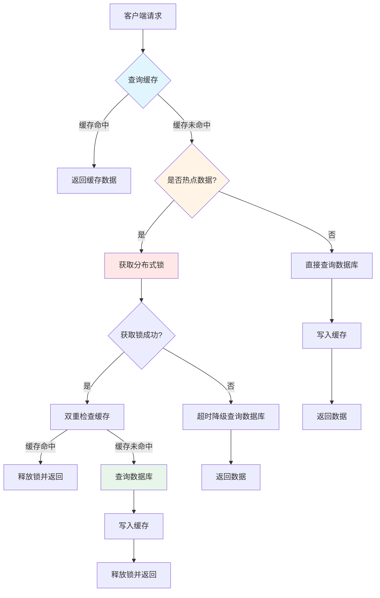
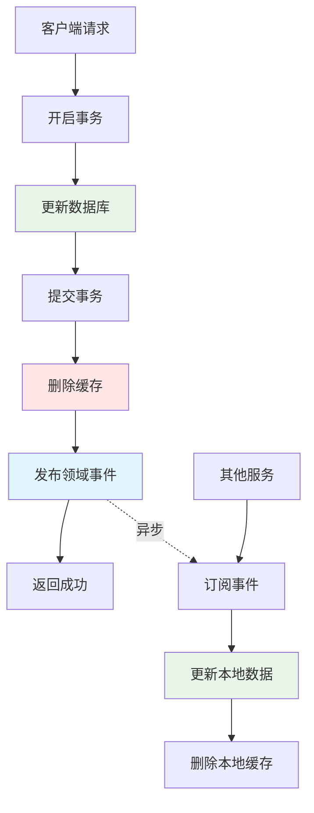
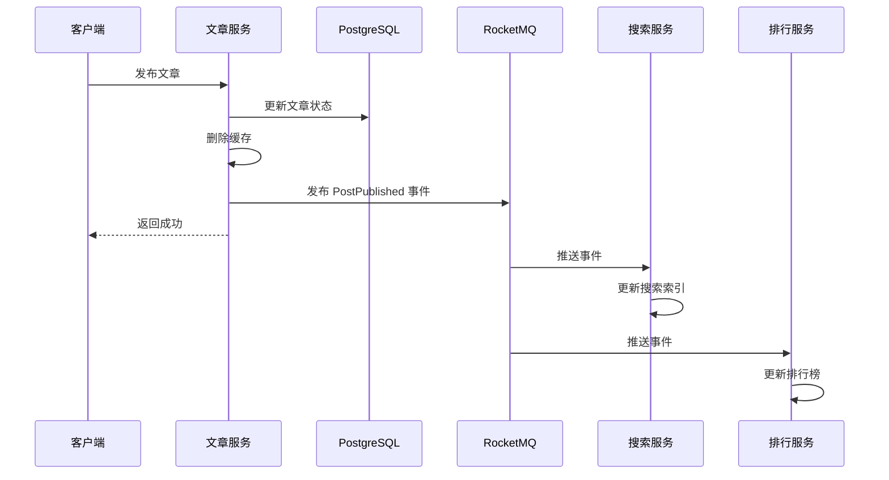

# 数据架构文档

## 文档版本

| 版本 | 日期 | 作者 | 说明 |
|------|------|------|------|
| 1.0 | 2026-02-11 | Blog Team | 初始版本 - 数据库选型、缓存策略、数据一致性 |

---

## 目录

1. [概述](#概述)
2. [数据库架构](#数据库架构)
3. [缓存架构](#缓存架构)
4. [数据一致性保证](#数据一致性保证)
5. [数据流图](#数据流图)
6. [代码示例](#代码示例)
7. [最佳实践](#最佳实践)

---

## 概述

Blog 微服务系统采用 **PostgreSQL** 作为主数据库，**Redis** 作为缓存层，**MongoDB** 用于存储文章内容等非结构化数据。本文档详细说明数据架构设计、缓存策略和数据一致性保证机制。

### 核心设计原则

- **服务自治**：每个微服务拥有独立的数据库
- **数据隔离**：服务间不直接访问其他服务的数据库
- **最终一致性**：通过事件驱动实现跨服务数据同步
- **缓存优先**：高频读取数据优先使用缓存
- **性能优化**：合理使用索引、分页、批量查询

---

## 数据库架构

### 数据库选型

| 数据库类型 | 产品 | 用途 | 端口 |
|-----------|------|------|------|
| **关系型数据库** | PostgreSQL 15 | 业务数据存储 | 5432 |
| **缓存数据库** | Redis 7 | 缓存、分布式锁、计数器 | 6379 |
| **文档数据库** | MongoDB 6 | 文章内容、富文本存储 | 27017 |


### PostgreSQL 数据库分布

系统采用 **服务独立数据库** 模式，每个微服务拥有独立的 PostgreSQL 数据库：

| 服务 | 数据库名 | 主要表 | 说明 |
|------|---------|--------|------|
| **blog-user** | `blog_user` | users, user_follows, user_check_ins | 用户信息、关注关系、签到记录 |
| **blog-post** | `blog_post` | posts, post_stats, post_likes, tags | 文章、统计、点赞、标签 |
| **blog-comment** | `blog_comment` | comments, comment_stats, comment_likes | 评论、统计、点赞 |
| **blog-message** | `blog_message` | conversations, messages | 会话、私信消息 |
| **blog-notification** | `blog_notification` | notifications, global_announcements | 通知、公告 |

**优势**：
- ✅ 服务独立部署和扩展
- ✅ 故障隔离（一个服务的数据库问题不影响其他服务）
- ✅ 技术栈灵活（可为不同服务选择不同数据库）

**挑战**：
- ⚠️ 跨服务查询需要通过 API 或事件
- ⚠️ 分布式事务需要特殊处理（Saga 模式）

### 数据库设计原则

#### 1. 主键策略

根据表的业务性质选择合适的主键策略：

| 表类型 | 主键策略 | 示例 | 说明 |
|--------|---------|------|------|
| **核心业务实体** | 分布式 ID（Snowflake） | `id BIGINT PRIMARY KEY` | 用户、文章、评论等 |
| **日志/流水表** | 自增主键 | `id BIGSERIAL PRIMARY KEY` | 操作日志、审计记录 |
| **关联表** | 联合主键 | `PRIMARY KEY (user_id, post_id)` | 点赞、关注、收藏 |

**分布式 ID 生成**：
- 使用独立的 **ID Generator 服务**（基于 Snowflake 算法）
- 保证全局唯一、趋势递增、高性能

```sql
-- 核心业务实体示例
CREATE TABLE users (
    id BIGINT PRIMARY KEY,              -- 分布式 ID
    username VARCHAR(50) NOT NULL,
    email VARCHAR(255),
    created_at TIMESTAMPTZ NOT NULL DEFAULT CURRENT_TIMESTAMP,
    updated_at TIMESTAMPTZ NOT NULL DEFAULT CURRENT_TIMESTAMP,
    deleted BOOLEAN NOT NULL DEFAULT FALSE
);

-- 关联表示例
CREATE TABLE post_likes (
    post_id BIGINT NOT NULL,
    user_id BIGINT NOT NULL,
    created_at TIMESTAMPTZ NOT NULL DEFAULT CURRENT_TIMESTAMP,
    PRIMARY KEY (post_id, user_id)     -- 联合主键
);
```


#### 2. 必须字段

所有业务表必须包含以下字段：

| 字段 | 类型 | 说明 | 默认值 |
|------|------|------|--------|
| `created_at` | TIMESTAMPTZ | 创建时间（不可变） | CURRENT_TIMESTAMP |
| `updated_at` | TIMESTAMPTZ | 更新时间（每次修改更新） | CURRENT_TIMESTAMP |
| `deleted` | BOOLEAN | 软删除标记（可选） | FALSE |

```sql
CREATE TABLE posts (
    id BIGINT PRIMARY KEY,
    owner_id BIGINT NOT NULL,
    title VARCHAR(200) NOT NULL,
    status SMALLINT NOT NULL DEFAULT 0,
    created_at TIMESTAMPTZ NOT NULL DEFAULT CURRENT_TIMESTAMP,
    updated_at TIMESTAMPTZ NOT NULL DEFAULT CURRENT_TIMESTAMP
);
```

#### 3. 索引设计规范

**索引命名规范**：
- 普通索引：`idx_{table}_{column}`
- 唯一索引：`uk_{table}_{column}`
- 联合索引：`idx_{table}_{column1}_{column2}`

**索引设计原则**：
- ✅ 高区分度字段在前（联合索引）
- ✅ 覆盖常用查询条件
- ✅ 避免过多索引（影响写入性能）
- ✅ 每个索引必须有注释说明用途

```sql
-- 用户查询索引
CREATE INDEX idx_users_username ON users(username);
CREATE INDEX idx_users_email ON users(email);

-- 文章查询索引（联合索引）
CREATE INDEX idx_posts_owner_status_created_at 
ON posts(owner_id, status, created_at DESC);
-- 用途：查询用户的已发布文章列表

-- 评论查询索引
CREATE INDEX idx_comments_post_status 
ON comments(post_id, status);
-- 用途：查询文章的有效评论
```

#### 4. 字段命名规范

- 使用 **下划线分隔** 的小写命名：`user_id`、`created_at`
- 时间字段使用 `_at` 后缀：`created_at`、`published_at`
- 布尔字段使用 `is_` 前缀：`is_active`、`is_read`
- 计数字段使用 `_count` 后缀：`like_count`、`view_count`

```
✅ 正确：user_id, created_at, is_active, like_count
❌ 错误：userId, createTime, active, likes
```

---


## 缓存架构

### Redis 缓存策略

系统采用 **Cache-Aside（旁路缓存）** 模式作为默认缓存策略。

#### Cache-Aside 模式

**读取流程**：
1. 先查缓存
2. 缓存命中 → 直接返回
3. 缓存未命中 → 查数据库 → 写入缓存 → 返回

**写入流程**：
1. 更新数据库
2. 删除缓存（不是更新缓存）

**优势**：
- ✅ 实现简单、灵活
- ✅ 适用于大多数场景
- ✅ 缓存失效时自动回源

```java
// 读取示例
public User getUser(Long userId) {
    // 1. 先查缓存
    User user = cache.get(userId);
    if (user != null) {
        return user;
    }
    
    // 2. 缓存未命中，查数据库
    user = userRepository.findById(userId);
    
    // 3. 写入缓存
    if (user != null) {
        cache.put(userId, user, Duration.ofHours(1));
    }
    return user;
}

// 写入示例
public void updateUser(User user) {
    // 1. 更新数据库
    userRepository.save(user);
    
    // 2. 删除缓存
    cache.delete(user.getId());
}
```

### Redis Key 命名规范

**命名格式**：`{service}:{id}:{entity}:{field}`

**示例**：
- 用户详情：`user:123:detail`
- 文章详情：`post:456:detail`
- 关注数：`user:123:stats:following`
- 评论数：`post:456:stats:comment`

**实现方式**：使用 Java 常量类管理 Redis Key

```java
public final class UserRedisKeys {
    private static final String PREFIX = "user";
    
    // user:{userId}:detail
    public static String userDetail(Long userId) {
        return PREFIX + ":" + userId + ":detail";
    }
    
    // user:{userId}:stats:following
    public static String followingCount(Long userId) {
        return PREFIX + ":" + userId + ":stats:following";
    }
    
    // user:{userId}:lock:detail
    public static String lockDetail(Long userId) {
        return PREFIX + ":lock:detail:" + userId;
    }
}
```


### 缓存 TTL 规范

| 数据类型 | 推荐 TTL | 说明 |
|---------|---------|------|
| **用户信息** | 1-2 小时 | 变更不频繁 |
| **文章详情** | 1-2 小时 | 变更不频繁 |
| **评论详情** | 30-60 分钟 | 中等频率变更 |
| **统计数据** | 5-10 分钟 | 频繁变更，短 TTL |
| **配置数据** | 5-10 分钟 | 需要及时生效 |
| **Token** | 根据业务 | 通常 7 天 |
| **验证码** | 5 分钟 | 安全考虑 |
| **空值缓存** | 60 秒 | 防止缓存穿透 |

**TTL 随机化**：为防止缓存雪崩，实际 TTL 应在基础值上增加 10% 的随机抖动。

```java
// TTL 随机化示例
long baseTtl = 3600; // 1小时
long randomOffset = (long)(Math.random() * baseTtl * 0.1); // 10% 抖动
long actualTtl = baseTtl + randomOffset;

redisTemplate.opsForValue().set(key, value, actualTtl, TimeUnit.SECONDS);
```

### 缓存穿透防护

**问题**：查询不存在的数据，请求穿透到数据库。

**解决方案**：空值缓存

```java
public User getUser(Long userId) {
    // 查缓存（包括空值标记）
    String cached = redis.get("user:" + userId);
    
    // 空值标记，直接返回
    if ("NULL".equals(cached)) {
        return null;
    }
    
    if (cached != null) {
        return deserialize(cached);
    }
    
    // 查数据库
    User user = userRepository.findById(userId);
    
    if (user != null) {
        redis.setex("user:" + userId, 3600, serialize(user));
    } else {
        // 缓存空值，短过期时间（60秒）
        redis.setex("user:" + userId, 60, "NULL");
    }
    
    return user;
}
```

### 缓存击穿防护

**问题**：热点数据过期瞬间，大量请求打到数据库。

**解决方案**：分布式锁 + 双重检查锁（DCL）

```java
public User getUser(Long userId) {
    String key = "user:" + userId;
    String lockKey = "lock:user:" + userId;
    
    // 第一次检查缓存
    User user = cache.get(key);
    if (user != null) {
        return user;
    }
    
    // 获取分布式锁
    RLock lock = redissonClient.getLock(lockKey);
    
    try {
        boolean acquired = lock.tryLock(5, 10, TimeUnit.SECONDS);
        if (!acquired) {
            // 超时降级：直接查询数据库
            return userRepository.findById(userId);
        }
        
        try {
            // 双重检查：获取锁后再次检查缓存
            user = cache.get(key);
            if (user != null) {
                return user;
            }
            
            // 查数据库并写入缓存
            user = userRepository.findById(userId);
            if (user != null) {
                cache.put(key, user, Duration.ofHours(1));
            }
            return user;
        } finally {
            if (lock.isHeldByCurrentThread()) {
                lock.unlock();
            }
        }
    } catch (InterruptedException e) {
        Thread.currentThread().interrupt();
        return userRepository.findById(userId);
    }
}
```


### 缓存雪崩防护

**问题**：大量缓存同时过期，请求全部打到数据库。

**解决方案**：过期时间随机化

```java
public void batchCacheUsers(List<User> users) {
    Random random = new Random();
    int baseExpire = 3600; // 1小时
    
    for (User user : users) {
        // 基础过期时间 + 随机偏移（0-10分钟）
        int expire = baseExpire + random.nextInt(600);
        redis.setex("user:" + user.getId(), expire, serialize(user));
    }
}
```

### 热点数据识别

系统自动识别热点数据并使用分布式锁防护：

```java
// 记录访问频率
hotDataIdentifier.recordAccess("comment", commentId);

// 判断是否为热点数据
boolean isHotData = hotDataIdentifier.isHotData("comment", commentId);

if (isHotData) {
    // 使用分布式锁防止缓存击穿
    return loadCommentWithLock(commentId);
} else {
    // 直接查询数据库
    return loadAndCacheComment(commentId);
}
```

---

## 数据一致性保证

### 单服务内一致性

**事务管理**：使用 Spring `@Transactional` 注解

```java
// 只读事务
@Transactional(readOnly = true)
public User getUser(Long id) {
    return userRepository.findById(id);
}

// 写事务（指定异常回滚）
@Transactional(rollbackFor = Exception.class)
public void createUser(User user) {
    userRepository.save(user);
    // 其他数据库操作
}
```

**注意事项**：
- ⚠️ 事务范围不要过大
- ⚠️ 避免在事务内调用外部 API
- ⚠️ 避免在事务内发送消息队列

### 跨服务数据一致性

**方案1：延迟双删**

适用于缓存与数据库的一致性。

```java
public void updateUser(User user) {
    String key = "user:" + user.getId();
    
    // 1. 删除缓存
    cache.delete(key);
    
    // 2. 更新数据库
    userRepository.save(user);
    
    // 3. 延迟再删一次（异步）
    CompletableFuture.runAsync(() -> {
        try {
            Thread.sleep(500); // 等待主从同步
            cache.delete(key);
        } catch (InterruptedException e) {
            Thread.currentThread().interrupt();
        }
    });
}
```

**方案2：事件驱动（最终一致性）**

通过 RocketMQ 实现跨服务数据同步。

```java
// 发布事件
@Transactional(rollbackFor = Exception.class)
public void publishPost(Post post) {
    // 1. 更新数据库
    post.setStatus(PostStatus.PUBLISHED);
    postRepository.save(post);
    
    // 2. 发布领域事件
    PostPublishedEvent event = new PostPublishedEvent(
        post.getId(), 
        post.getOwnerId(), 
        post.getTitle()
    );
    mqProducer.send(TopicConstants.TOPIC_POST_EVENTS, 
                    TopicConstants.TAG_POST_PUBLISHED, 
                    event);
}

// 消费事件
@RocketMQMessageListener(
    topic = TopicConstants.TOPIC_POST_EVENTS,
    consumerGroup = TopicConstants.GROUP_SEARCH_CONSUMER,
    selectorExpression = TopicConstants.TAG_POST_PUBLISHED
)
public class PostPublishedListener implements RocketMQListener<PostPublishedEvent> {
    
    @Override
    public void onMessage(PostPublishedEvent event) {
        // 更新搜索索引
        searchService.indexPost(event.getPostId());
    }
}
```


---

## 数据流图

### 读取数据流



### 写入数据流



### 跨服务数据同步流



---


## 代码示例

### 示例1：仓储实现（PostgreSQL）

```java
@Repository
@RequiredArgsConstructor
public class PostRepositoryImpl implements PostRepository {

    private final PostMapper postMapper;
    private final PostStatsMapper postStatsMapper;

    @Override
    public void save(Post post) {
        PostPO po = toPO(post);
        postMapper.insert(po);

        // 初始化统计数据
        PostStatsPO statsPO = new PostStatsPO();
        statsPO.setPostId(post.getId());
        statsPO.setLikeCount(0);
        statsPO.setCommentCount(0);
        postStatsMapper.insert(statsPO);
    }

    @Override
    public Optional<Post> findById(Long id) {
        PostPO po = postMapper.selectById(id);
        if (po == null) {
            return Optional.empty();
        }
        PostStatsPO statsPO = postStatsMapper.selectById(id);
        return Optional.of(toDomain(po, statsPO));
    }

    @Override
    public List<Post> findByOwnerIdCursor(Long ownerId, PostStatus status, 
                                          LocalDateTime cursor, int limit) {
        // 游标分页查询（性能优于传统分页）
        List<PostPO> posts = postMapper.findByOwnerIdCursor(
            ownerId, status.getCode(), cursor, limit
        );
        return toDomainList(posts);
    }
}
```

### 示例2：缓存仓储装饰器

```java
@Primary
@Repository
public class CachedCommentRepository implements CommentRepository {

    private final CommentRepository delegate;
    private final RedisTemplate<String, Object> redisTemplate;
    private final RedissonClient redissonClient;
    private final HotDataIdentifier hotDataIdentifier;

    @Override
    public Optional<Comment> findById(Long id) {
        String cacheKey = CommentRedisKeys.detail(id);
        
        // Step 1: 第一次检查缓存
        Object cached = redisTemplate.opsForValue().get(cacheKey);
        if (cached != null) {
            if (CacheConstants.NULL_VALUE.equals(cached)) {
                return Optional.empty(); // 空值缓存
            }
            return Optional.of(objectMapper.convertValue(cached, Comment.class));
        }

        // 记录访问用于热点数据识别
        hotDataIdentifier.recordAccess("comment", id);
        
        // 检查是否为热点数据
        boolean isHotData = hotDataIdentifier.isHotData("comment", id);
        
        if (!isHotData) {
            // 非热点数据：直接查询数据库并缓存
            return loadAndCacheComment(id, cacheKey);
        }

        // 热点数据：使用分布式锁防止缓存击穿
        return loadCommentWithLock(id, cacheKey);
    }

    private Optional<Comment> loadCommentWithLock(Long commentId, String cacheKey) {
        String lockKey = CommentRedisKeys.lockDetail(commentId);
        RLock lock = redissonClient.getLock(lockKey);

        try {
            // Step 2: 尝试获取分布式锁
            boolean acquired = lock.tryLock(5, 10, TimeUnit.SECONDS);
            if (!acquired) {
                // 超时降级：直接查询数据库
                return delegate.findById(commentId);
            }

            try {
                // Step 3: DCL 双重检查
                Object cached = redisTemplate.opsForValue().get(cacheKey);
                if (cached != null) {
                    if (CacheConstants.NULL_VALUE.equals(cached)) {
                        return Optional.empty();
                    }
                    return Optional.of(objectMapper.convertValue(cached, Comment.class));
                }

                // Step 4: 查询数据库
                Optional<Comment> result = delegate.findById(commentId);

                // Step 5: 写入缓存
                if (result.isPresent()) {
                    long ttl = 3600 + (long)(Math.random() * 360); // TTL 随机化
                    redisTemplate.opsForValue().set(cacheKey, result.get(), 
                                                   ttl, TimeUnit.SECONDS);
                } else {
                    // 缓存空值
                    redisTemplate.opsForValue().set(cacheKey, CacheConstants.NULL_VALUE, 
                                                   60, TimeUnit.SECONDS);
                }

                return result;
            } finally {
                if (lock.isHeldByCurrentThread()) {
                    lock.unlock();
                }
            }
        } catch (InterruptedException e) {
            Thread.currentThread().interrupt();
            return delegate.findById(commentId);
        }
    }

    @Override
    public void update(Comment comment) {
        delegate.update(comment);
        // 删除缓存（Cache-Aside 模式）
        redisTemplate.delete(CommentRedisKeys.detail(comment.getId()));
    }
}
```


### 示例3：Redis Key 管理

```java
/**
 * 评论服务 Redis Key 定义
 * 
 * 命名规范：{service}:{id}:{entity}:{field}
 */
public final class CommentRedisKeys {

    private static final String PREFIX = "comment";

    private CommentRedisKeys() {
        // 工具类，禁止实例化
    }

    /**
     * 评论详情缓存
     * Key: comment:{commentId}:detail
     */
    public static String detail(Long commentId) {
        return PREFIX + ":" + commentId + ":detail";
    }

    /**
     * 文章评论数
     * Key: comment:post:{postId}:count
     */
    public static String postCommentCount(Long postId) {
        return PREFIX + ":post:" + postId + ":count";
    }

    /**
     * 评论回复数
     * Key: comment:{commentId}:reply:count
     */
    public static String replyCount(Long commentId) {
        return PREFIX + ":" + commentId + ":reply:count";
    }

    /**
     * 评论详情锁键
     * Key: comment:lock:detail:{commentId}
     */
    public static String lockDetail(Long commentId) {
        return PREFIX + ":lock:detail:" + commentId;
    }
}
```

### 示例4：RocketMQ 常量管理

```java
/**
 * RocketMQ Topic 常量定义
 */
public final class TopicConstants {

    private TopicConstants() {
    }

    // ==================== Topics ====================

    /**
     * 文章相关事件 Topic
     */
    public static final String TOPIC_POST_EVENTS = "blog-post-events";

    /**
     * 用户相关事件 Topic
     */
    public static final String TOPIC_USER_EVENTS = "blog-user-events";

    // ==================== Tags ====================

    /**
     * 文章发布
     */
    public static final String TAG_POST_PUBLISHED = "published";

    /**
     * 文章更新
     */
    public static final String TAG_POST_UPDATED = "updated";

    /**
     * 用户关注
     */
    public static final String TAG_USER_FOLLOWED = "followed";

    // ==================== Consumer Groups ====================

    /**
     * 搜索服务消费者组
     */
    public static final String GROUP_SEARCH_CONSUMER = "search-consumer-group";

    /**
     * 通知服务消费者组
     */
    public static final String GROUP_NOTIFICATION_CONSUMER = "notification-consumer-group";
}
```

---


## 最佳实践

### 数据库最佳实践

#### 1. 禁止 SELECT *

```sql
-- ❌ 错误
SELECT * FROM users WHERE id = 1;

-- ✅ 正确
SELECT id, username, email, created_at FROM users WHERE id = 1;
```

#### 2. 禁止无 WHERE 的 UPDATE/DELETE

```sql
-- ❌ 错误 - 危险操作
UPDATE users SET status = 1;
DELETE FROM users;

-- ✅ 正确 - 必须有 WHERE 条件
UPDATE users SET status = 1 WHERE id = 123;
DELETE FROM users WHERE id = 123 AND deleted = FALSE;
```

#### 3. 使用游标分页代替深分页

```sql
-- ❌ 错误 - 深分页性能差
SELECT * FROM posts 
ORDER BY created_at DESC 
LIMIT 20 OFFSET 10000;

-- ✅ 正确 - 游标分页性能好
SELECT * FROM posts 
WHERE created_at < '2024-01-01 00:00:00'
ORDER BY created_at DESC 
LIMIT 20;
```

#### 4. 避免大表全表扫描

```sql
-- ❌ 错误 - 全表扫描
SELECT * FROM posts ORDER BY created_at DESC LIMIT 10;

-- ✅ 正确 - 使用索引
SELECT * FROM posts 
WHERE owner_id = 123 
ORDER BY created_at DESC 
LIMIT 10;
```

### 缓存最佳实践

#### 1. 合理设置 TTL

```java
// ✅ 正确 - 根据数据特性设置 TTL
public void cacheUser(User user) {
    // 用户信息：1-2 小时
    redisTemplate.opsForValue().set(
        "user:" + user.getId(), 
        user, 
        3600 + random.nextInt(600), // 1小时 + 随机抖动
        TimeUnit.SECONDS
    );
}

public void cacheStats(PostStats stats) {
    // 统计数据：5-10 分钟（频繁变更）
    redisTemplate.opsForValue().set(
        "post:" + stats.getPostId() + ":stats", 
        stats, 
        300 + random.nextInt(300), // 5分钟 + 随机抖动
        TimeUnit.SECONDS
    );
}
```

#### 2. 避免缓存大对象

```java
// ❌ 错误 - 缓存整个文章内容（可能很大）
redisTemplate.opsForValue().set("post:" + postId, post);

// ✅ 正确 - 只缓存必要字段
PostSummary summary = new PostSummary(
    post.getId(), 
    post.getTitle(), 
    post.getExcerpt()
);
redisTemplate.opsForValue().set("post:" + postId + ":summary", summary);
```

#### 3. 批量操作使用 Pipeline

```java
// ✅ 正确 - 使用 Pipeline 批量写入
redisTemplate.executePipelined((RedisCallback<Object>) connection -> {
    for (User user : users) {
        String key = "user:" + user.getId();
        connection.set(key.getBytes(), serialize(user));
        connection.expire(key.getBytes(), 3600);
    }
    return null;
});
```

#### 4. 监控缓存命中率

```java
@Component
public class CacheMetrics {
    
    private final MeterRegistry meterRegistry;
    
    public void recordCacheHit(String cacheName) {
        meterRegistry.counter("cache.hit", "cache", cacheName).increment();
    }
    
    public void recordCacheMiss(String cacheName) {
        meterRegistry.counter("cache.miss", "cache", cacheName).increment();
    }
}
```

### 事务最佳实践

#### 1. 明确指定只读事务

```java
// ✅ 正确 - 明确指定只读事务
@Transactional(readOnly = true)
public User getUser(Long id) {
    return userRepository.findById(id);
}
```

#### 2. 指定异常回滚

```java
// ✅ 正确 - 指定异常回滚
@Transactional(rollbackFor = Exception.class)
public void createUser(User user) {
    userRepository.save(user);
    // 其他操作
}
```

#### 3. 避免事务范围过大

```java
// ❌ 错误 - 事务范围过大
@Transactional
public void processOrder(Order order) {
    orderRepository.save(order);
    paymentService.pay(order);  // 外部 API 调用（可能很慢）
    mqProducer.send(order);     // 消息队列（不应该在事务内）
}

// ✅ 正确 - 事务范围最小化
@Transactional(rollbackFor = Exception.class)
public void saveOrder(Order order) {
    orderRepository.save(order);
}

public void processOrder(Order order) {
    saveOrder(order);           // 事务内：保存订单
    paymentService.pay(order);  // 事务外：支付
    mqProducer.send(order);     // 事务外：发送消息
}
```

---


## 性能优化建议

### 数据库优化

1. **使用连接池**：配置合理的连接池大小（HikariCP）
2. **批量操作**：使用 `batchInsert`、`batchUpdate` 代替循环单条操作
3. **索引优化**：定期分析慢查询，优化索引
4. **分页优化**：使用游标分页代替深分页
5. **读写分离**：高并发场景考虑主从分离

### 缓存优化

1. **缓存预热**：启动时预加载热点数据
2. **缓存分层**：本地缓存（Caffeine）+ 分布式缓存（Redis）
3. **异步刷新**：后台异步刷新即将过期的热点数据
4. **降级策略**：Redis 故障时降级直接查询数据库
5. **监控告警**：监控缓存命中率、内存使用率

### 查询优化

1. **避免 N+1 查询**：使用批量查询或 JOIN
2. **使用覆盖索引**：查询字段包含在索引中
3. **合理使用 LIMIT**：限制返回结果数量
4. **避免全表扫描**：WHERE 条件使用索引字段
5. **使用 EXPLAIN 分析**：定期分析查询计划

---

## 监控指标

### 数据库监控

| 指标 | 说明 | 告警阈值 |
|------|------|---------|
| **连接数** | 当前活跃连接数 | > 80% 最大连接数 |
| **慢查询** | 执行时间 > 1s 的查询 | > 10 次/分钟 |
| **QPS** | 每秒查询数 | 根据业务设定 |
| **响应时间** | 平均查询响应时间 | > 100ms |
| **锁等待** | 锁等待时间 | > 5s |

### 缓存监控

| 指标 | 说明 | 告警阈值 |
|------|------|---------|
| **命中率** | 缓存命中率 | < 80% |
| **内存使用率** | Redis 内存使用率 | > 80% |
| **连接数** | Redis 连接数 | > 80% 最大连接数 |
| **响应时间** | 缓存操作响应时间 | > 10ms |
| **驱逐数** | 缓存驱逐次数 | > 100 次/分钟 |

---

## 相关文档

- [系统概述](./01-system-overview.md) - 系统整体架构
- [微服务列表](./02-microservices-list.md) - 服务职责划分
- [服务间通信](./04-service-communication.md) - Feign Client、RocketMQ
- [DDD 分层架构](./05-ddd-layered-architecture.md) - 领域驱动设计
- [基础设施](./07-infrastructure.md) - Nacos、Redis、PostgreSQL 配置
- [部署架构](./08-deployment-architecture.md) - Docker 部署方式

### 规范文档

- [数据库规范](../../.kiro/steering/development/15-database.md) - 表设计、索引、SQL 规范
- [缓存规范](../../.kiro/steering/development/16-cache.md) - 缓存策略、穿透防护
- [常量与配置管理](../../.kiro/steering/development/03-constants-config.md) - Redis Key、RocketMQ 常量

---

## 总结

Blog 微服务系统的数据架构遵循以下核心原则：

1. **服务自治**：每个服务拥有独立的数据库，通过 API 和事件通信
2. **缓存优先**：使用 Cache-Aside 模式，合理设置 TTL，防护缓存穿透/击穿/雪崩
3. **最终一致性**：通过 RocketMQ 实现跨服务数据同步
4. **性能优化**：使用索引、游标分页、批量查询、热点数据识别
5. **监控告警**：监控数据库和缓存关键指标，及时发现问题

通过合理的数据架构设计和缓存策略，系统能够支撑高并发访问，同时保证数据一致性和可靠性。

---

**最后更新**：2026-02-11  
**维护者**：Blog Team  
**文档状态**：已完成
