# File Service 数据流文档

## 概述

本文档详细描述了文件在 ZhiCore-microservice 系统中的完整数据流，包括上传、访问、删除等操作的详细流程。

## 核心数据流

### 1. 文件上传流程

#### 1.1 用户头像上传

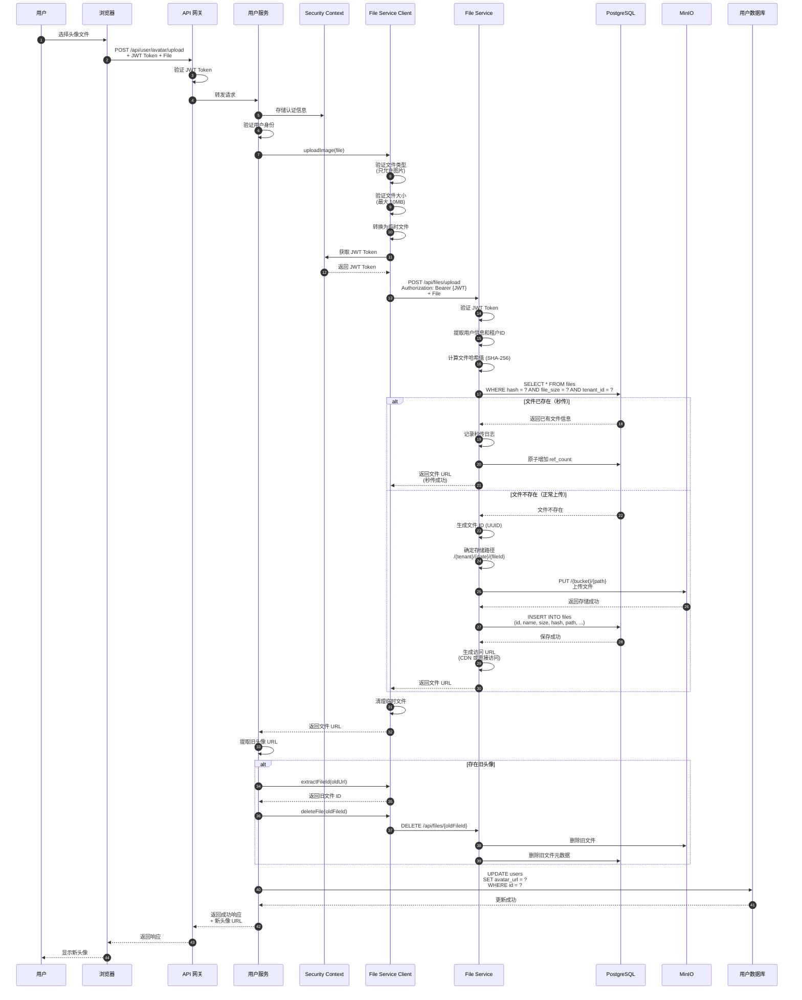

#### 1.2 文章封面图上传

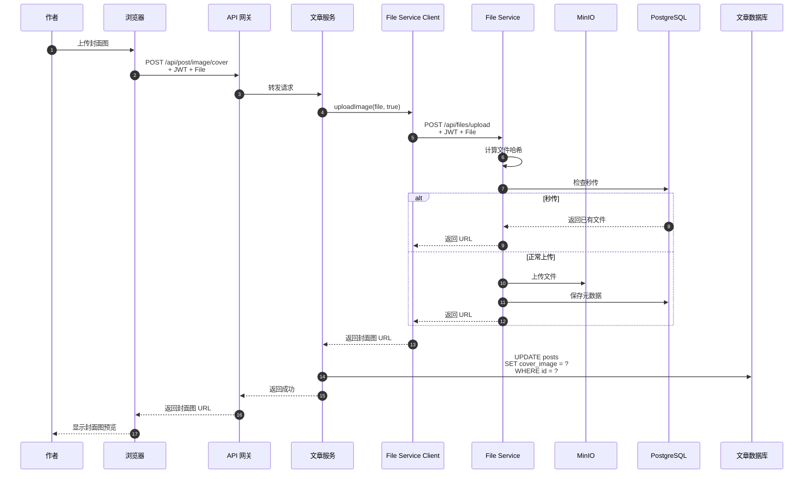

#### 1.3 文章内容图片上传

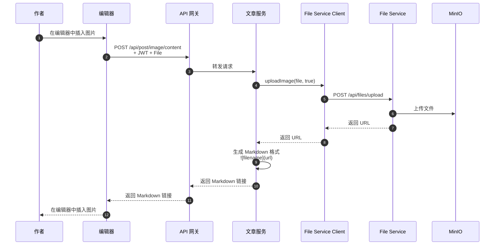

### 2. 文件访问流程

#### 2.1 通过 CDN 访问公共文件

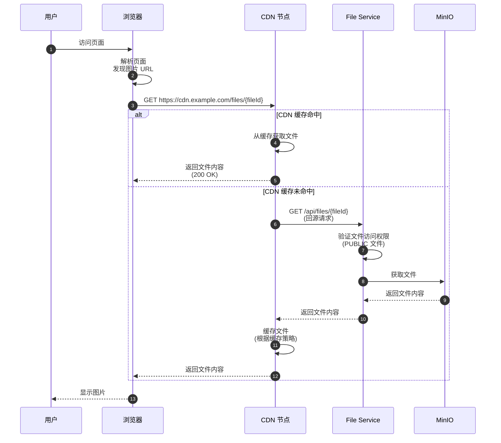

#### 2.2 直接访问私有文件

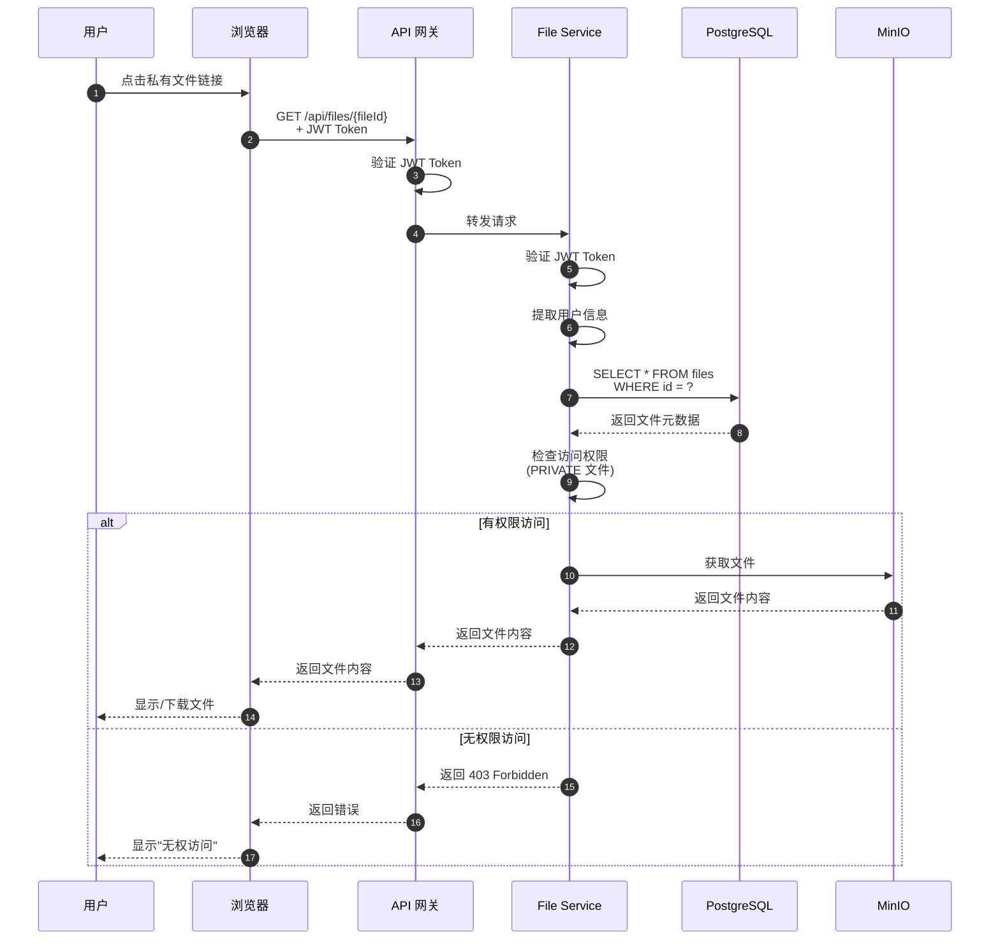

### 3. 文件删除流程

#### 3.1 删除用户头像

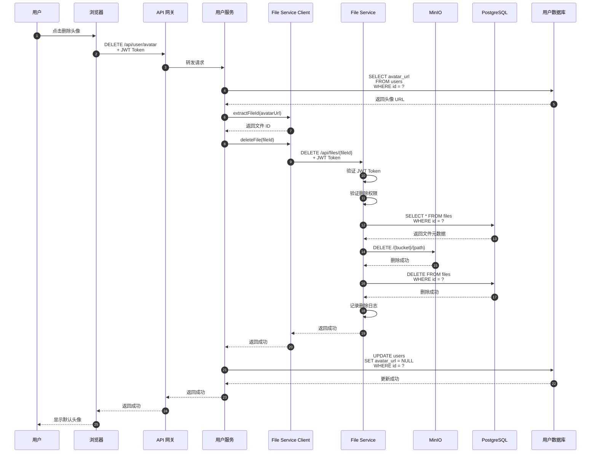

#### 3.2 删除文章及关联图片

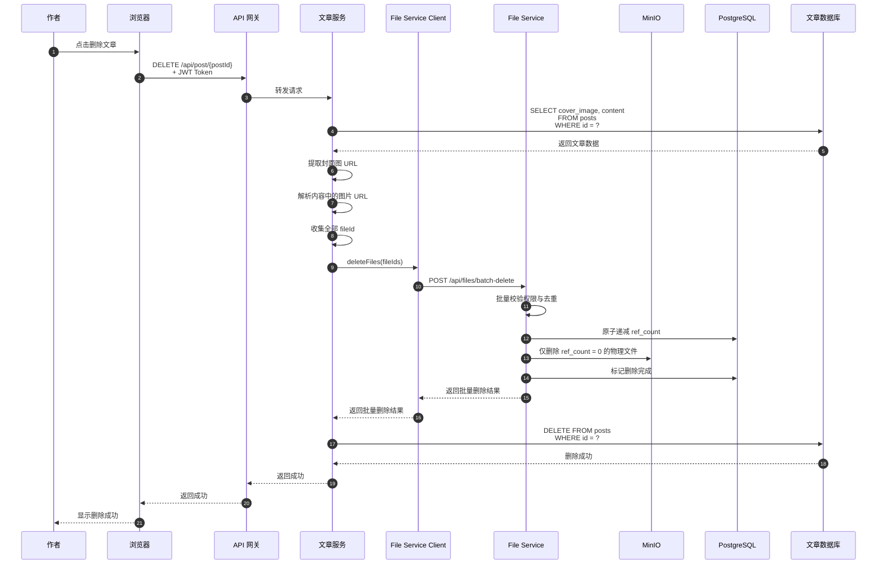

### 4. 大文件分片上传流程

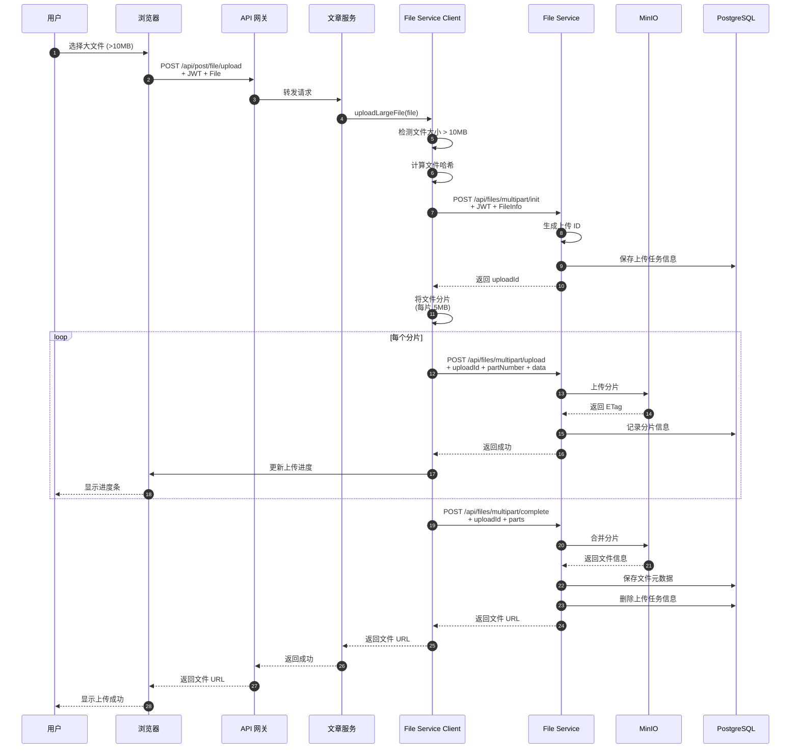

### 5. 秒传流程

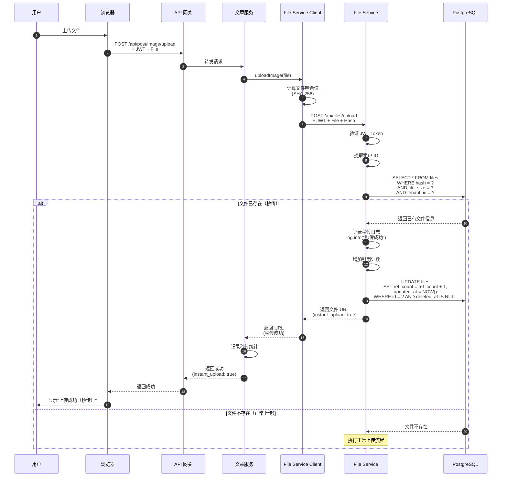

## 数据存储

### 1. 文件元数据（PostgreSQL）

```sql
-- files 表结构
CREATE TABLE files (
    id VARCHAR(36) PRIMARY KEY,
    tenant_id VARCHAR(50) NOT NULL,
    original_name VARCHAR(255) NOT NULL,
    file_size BIGINT NOT NULL,
    content_type VARCHAR(100) NOT NULL,
    hash VARCHAR(64) NOT NULL,
    storage_path VARCHAR(500) NOT NULL,
    access_level VARCHAR(20) NOT NULL,
    ref_count INTEGER DEFAULT 1,
    created_by VARCHAR(36),
    created_at TIMESTAMP NOT NULL,
    updated_at TIMESTAMP NOT NULL,
    deleted_at TIMESTAMP,
    
    UNIQUE KEY uk_tenant_hash_size (tenant_id, hash, file_size),
    INDEX idx_hash (hash),
    INDEX idx_tenant_id (tenant_id),
    INDEX idx_created_by (created_by),
    INDEX idx_created_at (created_at)
);
```

### 2. 文件内容（MinIO）

```
MinIO 存储结构:
ZhiCore-files/
├── ZhiCore/                    # 租户 ID
│   ├── 2024/               # 年份
│   │   ├── 01/            # 月份
│   │   │   ├── 23/       # 日期
│   │   │   │   ├── {uuid1}.jpg
│   │   │   │   ├── {uuid2}.png
│   │   │   │   └── {uuid3}.pdf
│   │   │   └── 24/
│   │   └── 02/
│   └── 2025/
└── other-tenant/
```

### 3. 业务数据（业务数据库）

```sql
-- users 表
CREATE TABLE users (
    id BIGINT PRIMARY KEY,
    username VARCHAR(50) NOT NULL,
    avatar_url VARCHAR(500),  -- 存储文件 URL
    ...
);

-- posts 表
CREATE TABLE posts (
    id BIGINT PRIMARY KEY,
    title VARCHAR(200) NOT NULL,
    content TEXT NOT NULL,      -- 包含图片 URL
    cover_image VARCHAR(500),   -- 存储封面图 URL
    ...
);
```

## 数据一致性

### 1. 文件上传失败回滚

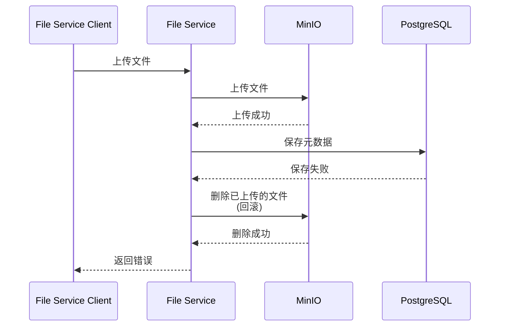

### 2. 业务操作失败清理

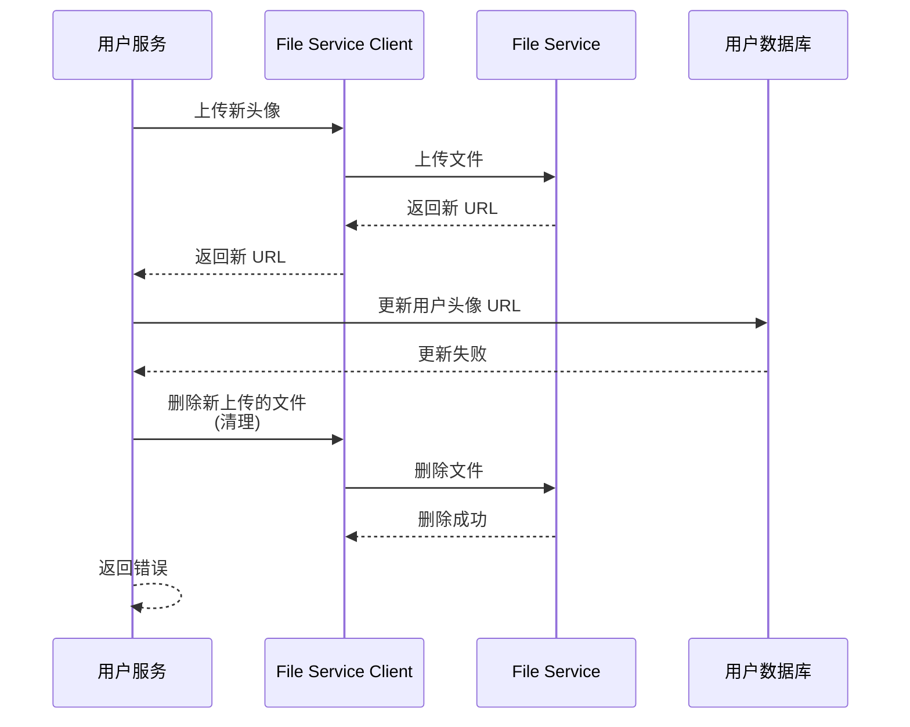

### 3. 孤儿文件清理

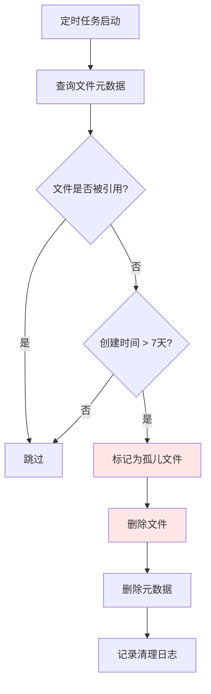

## 性能优化

### 1. 秒传优化

- **哈希计算**: 使用 SHA-256 计算文件哈希
- **联合判重**: 使用 `tenant_id + hash + file_size` 做秒传命中判断
- **数据库索引**: 在 `(tenant_id, hash, file_size)` 上建立唯一索引
- **租户隔离**: 只在同一租户内检查秒传

### 2. CDN 缓存

- **缓存策略**: 根据文件类型设置不同的缓存时间
- **回源优化**: 使用 CDN 回源减少源站压力
- **缓存预热**: 热门文件提前加载到 CDN

### 3. 分片上传

- **分片大小**: 每片 5MB
- **并发上传**: 支持多个分片并发上传
- **断点续传**: 支持上传失败后继续上传

## 监控指标

### 1. 上传指标

- 上传成功率
- 上传响应时间（P50, P95, P99）
- 秒传命中率
- 分片上传成功率

### 2. 访问指标

- 文件访问次数
- CDN 命中率
- 访问响应时间
- 错误率

### 3. 存储指标

- 存储空间使用率
- 文件数量
- 孤儿文件数量
- 引用计数分布

## 总结

本文档详细描述了文件在 ZhiCore-microservice 系统中的完整数据流，包括：

1. **文件上传流程**: 用户头像、文章封面图、文章内容图片的上传
2. **文件访问流程**: 通过 CDN 访问公共文件、直接访问私有文件
3. **文件删除流程**: 删除用户头像、删除文章及关联图片
4. **大文件处理**: 分片上传流程
5. **性能优化**: 秒传流程
6. **数据存储**: 文件元数据、文件内容、业务数据的存储结构
7. **数据一致性**: 失败回滚、清理机制、孤儿文件处理
8. **性能优化**: 秒传、CDN 缓存、分片上传
9. **监控指标**: 上传、访问、存储相关指标

通过清晰的数据流设计，确保文件在系统中的安全、高效流转。
