# File Service 集成架构文档

## 概述

本文档描述了 File Service 在 ZhiCore-microservice 系统中的集成架构，包括服务定位、职责划分、交互关系和数据流。

## 服务定位

### File Service 的角色

File Service 是一个独立的文件管理微服务，负责统一处理博客系统中的所有文件操作。它在系统架构中扮演以下角色：

1. **文件存储抽象层**: 为上层业务服务提供统一的文件存储接口，屏蔽底层存储实现细节
2. **文件生命周期管理**: 管理文件的上传、下载、删除、访问控制等完整生命周期
3. **性能优化中心**: 提供秒传、分片上传、CDN 加速等性能优化功能
4. **安全控制点**: 统一处理文件访问权限、租户隔离、配额管理等安全需求

### 为什么需要独立的 File Service

1. **服务解耦**: 将文件管理逻辑从业务服务中分离，降低耦合度
2. **复用性**: 多个业务服务（user、post、comment）可以共享同一个文件服务
3. **可扩展性**: 文件服务可以独立扩展，不影响业务服务
4. **技术选型灵活**: 可以独立选择最适合文件存储的技术栈
5. **统一管理**: 集中管理文件元数据、访问控制、配额限制等

## 系统架构

### 整体架构图

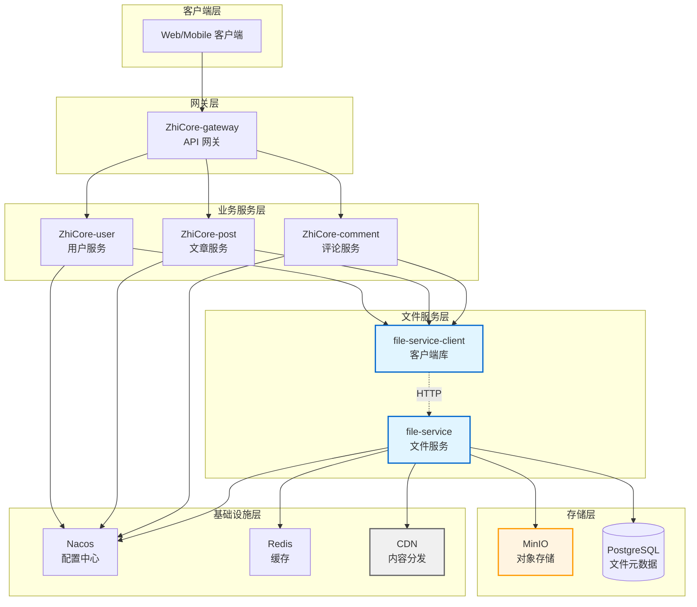

### 服务职责划分

#### 业务服务（ZhiCore-user, ZhiCore-post, ZhiCore-comment）

**职责**:
- 处理业务逻辑
- 调用 File Service Client 上传/删除文件
- 管理文件 URL 与业务实体的关联关系
- 在业务实体删除时清理关联文件

**不负责**:
- 文件的实际存储
- 文件访问权限控制
- 文件元数据管理
- CDN 配置和管理

#### File Service

**职责**:
- 文件上传、下载、删除
- 文件元数据管理（文件名、大小、类型、哈希值等）
- 访问权限控制（PUBLIC/PRIVATE）
- 租户隔离
- 配额管理
- 秒传检测
- 分片上传协调
- CDN URL 生成

**不负责**:
- 业务逻辑处理
- 用户认证（由业务服务通过 JWT 传递）
- 业务实体与文件的关联关系

#### MinIO

**职责**:
- 文件的物理存储
- 对象存储 API
- 数据持久化

**不负责**:
- 文件元数据管理
- 访问权限控制
- 业务逻辑

## 服务交互

### 文件上传流程

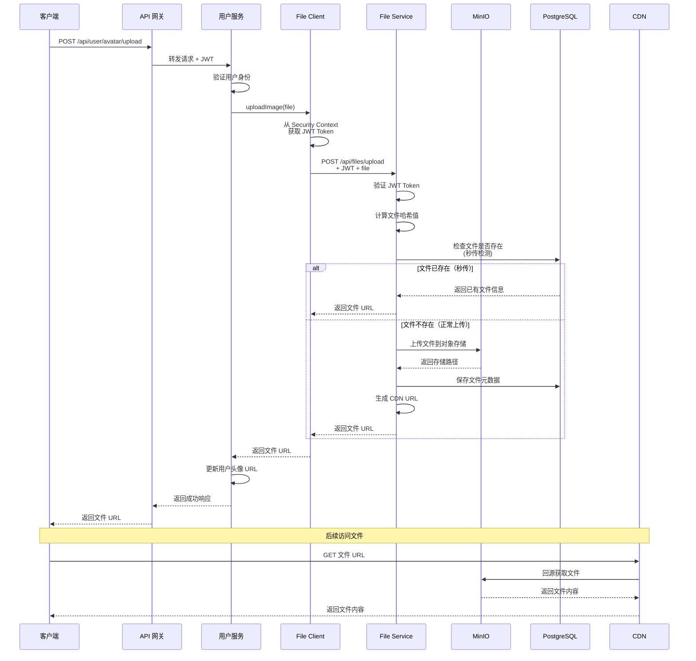

### 文件删除流程

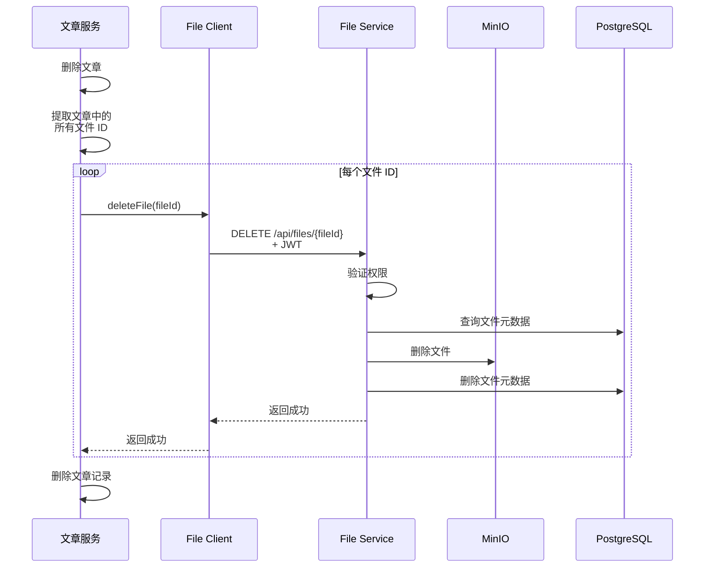

### 认证集成流程

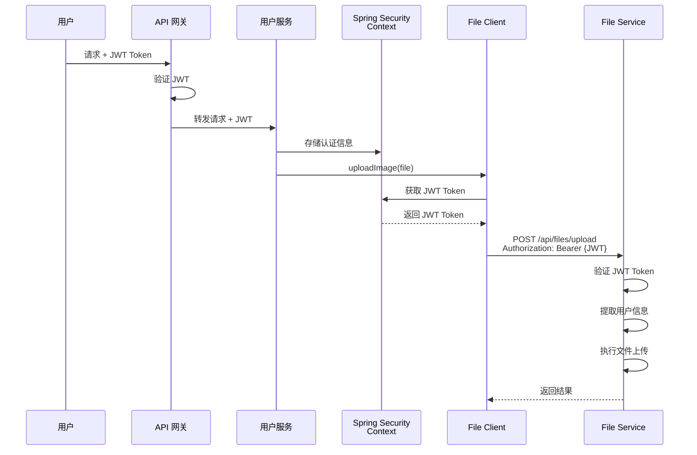

## 数据流

### 文件上传数据流

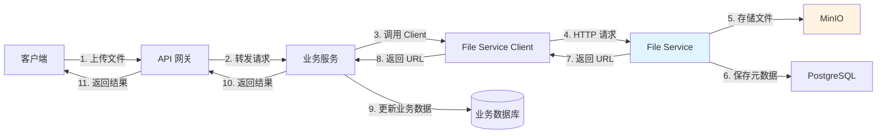

### 文件访问数据流

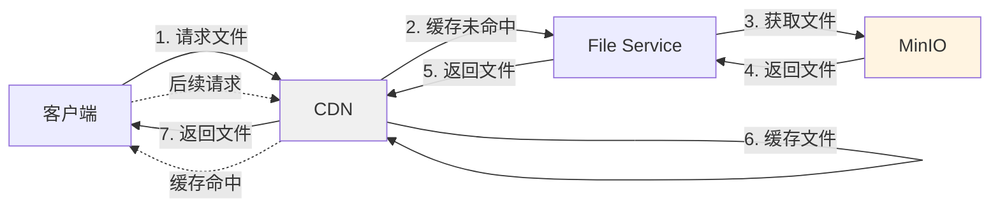

## 服务边界

### File Service 的服务边界

**内部职责**（File Service 负责）:
- 文件的物理存储和检索
- 文件元数据的 CRUD 操作
- 文件哈希计算和秒传检测
- 分片上传的协调和管理
- 访问级别控制（PUBLIC/PRIVATE）
- 租户隔离
- 配额管理和限流
- CDN URL 生成
- 文件访问日志记录

**外部职责**（业务服务负责）:
- 业务实体与文件的关联关系
- 业务级别的权限控制（如：只有作者可以删除文章图片）
- 文件的业务语义（如：这是头像还是封面图）
- 业务实体删除时触发文件清理
- 文件 URL 的持久化存储

### 数据所有权

| 数据类型 | 所有者 | 存储位置 | 说明 |
|---------|--------|---------|------|
| 文件内容 | File Service | MinIO | 二进制文件数据 |
| 文件元数据 | File Service | File Service DB | 文件名、大小、哈希、创建时间等 |
| 文件 URL | 业务服务 | 业务服务 DB | 用户头像 URL、文章封面 URL 等 |
| 业务关联 | 业务服务 | 业务服务 DB | 哪个用户的头像、哪篇文章的封面 |

## 配置管理

### 配置层次

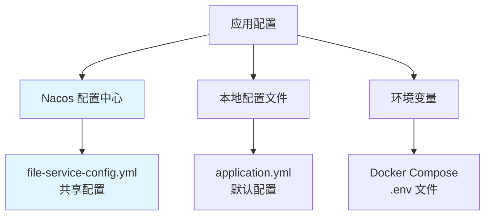

### 配置优先级

1. **环境变量** (最高优先级)
   - Docker 部署时使用
   - 适合敏感信息（密码、密钥）

2. **Nacos 配置中心**
   - 生产环境配置
   - 支持动态刷新
   - 多环境配置管理

3. **本地配置文件** (最低优先级)
   - 开发环境默认配置
   - 配置模板和示例

## 扩展性设计

### 水平扩展

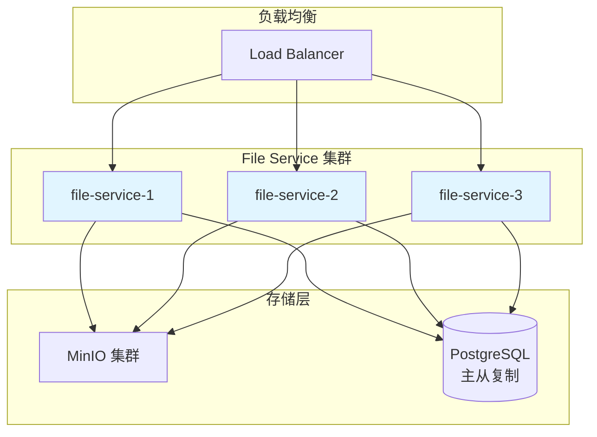

### 存储扩展

- **MinIO 集群**: 支持分布式部署，提供高可用和高性能
- **CDN 加速**: 公共文件通过 CDN 分发，减轻源站压力
- **缓存策略**: 文件元数据缓存在 Redis，减少数据库查询

## 安全设计

### 认证和授权

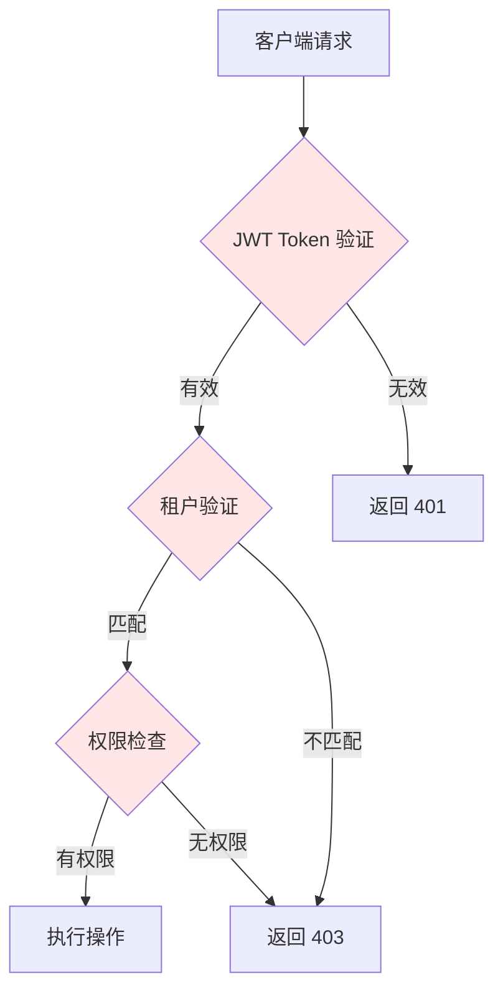

### 安全措施

1. **认证**: 所有请求必须携带有效的 JWT Token
2. **租户隔离**: 通过 tenant-id 隔离不同租户的数据
3. **访问控制**: PUBLIC 文件公开访问，PRIVATE 文件需要权限验证
4. **配额限制**: 限制单个租户的存储空间和上传频率
5. **文件类型验证**: 只允许上传指定类型的文件
6. **文件大小限制**: 限制单个文件的最大大小

## 监控和运维

### 监控指标

| 指标类别 | 具体指标 | 说明 |
|---------|---------|------|
| 可用性 | 服务健康状态 | File Service 是否正常运行 |
| 性能 | 上传响应时间 | P50, P95, P99 |
| 性能 | 下载响应时间 | P50, P95, P99 |
| 业务 | 上传成功率 | 成功上传数 / 总上传数 |
| 业务 | 秒传命中率 | 秒传次数 / 总上传次数 |
| 资源 | MinIO 存储使用率 | 已用空间 / 总空间 |
| 资源 | CDN 命中率 | CDN 命中次数 / 总请求次数 |
| 错误 | 错误率 | 错误请求数 / 总请求数 |

### 日志记录

```java
// 上传成功日志
log.info("文件上传成功: fileId={}, fileName={}, size={}, userId={}, tenantId={}", 
    fileId, fileName, fileSize, userId, tenantId);

// 上传失败日志
log.error("文件上传失败: fileName={}, userId={}, error={}", 
    fileName, userId, errorMessage, exception);

// 秒传日志
log.info("秒传成功: fileHash={}, userId={}, savedTime={}ms", 
    fileHash, userId, savedTime);

// 删除日志
log.info("文件删除: fileId={}, userId={}, tenantId={}", 
    fileId, userId, tenantId);
```

## 故障处理

### 降级策略

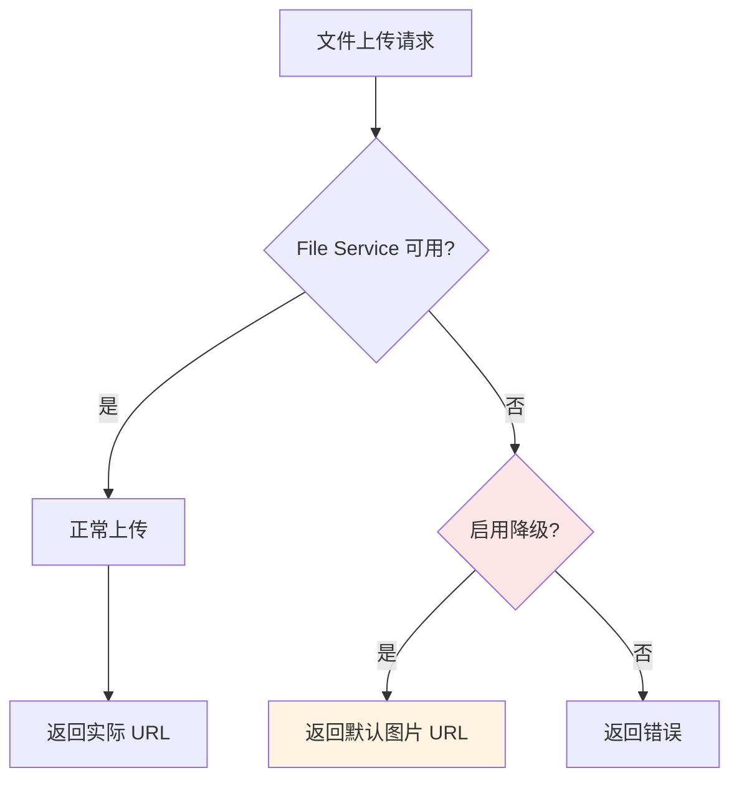

### 熔断机制

使用 Resilience4j 实现熔断：

```yaml
resilience4j:
  circuitbreaker:
    instances:
      fileService:
        failure-rate-threshold: 50
        wait-duration-in-open-state: 10s
        sliding-window-size: 10
```

## 迁移策略

### 从旧存储迁移到 File Service

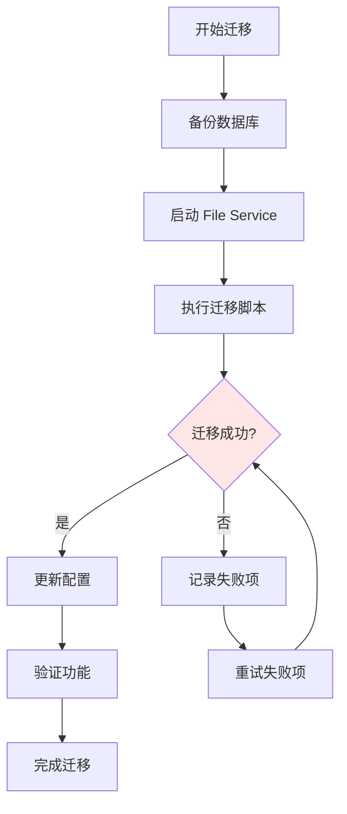

## 最佳实践

### 业务服务集成

1. **使用 Starter**: 通过 `file-service-spring-boot-starter` 简化集成
2. **统一封装**: 在 `ZhiCore-common` 中创建 `FileUploadService` 统一接口
3. **异常处理**: 捕获并转换 File Service 异常为业务异常
4. **资源清理**: 业务实体删除时记得清理关联文件
5. **URL 存储**: 只存储文件 URL，不存储文件 ID

### 文件管理

1. **访问级别**: 用户头像和文章图片使用 PUBLIC，私密文件使用 PRIVATE
2. **文件命名**: 使用有意义的文件名，便于调试和审计
3. **大小限制**: 根据业务需求设置合理的文件大小限制
4. **类型限制**: 只允许上传必要的文件类型
5. **清理策略**: 定期清理未关联的孤儿文件

### 性能优化

1. **秒传**: 利用秒传功能减少重复上传
2. **分片上传**: 大文件使用分片上传提高成功率
3. **CDN 加速**: 公共文件通过 CDN 分发
4. **缓存**: 文件元数据缓存在 Redis
5. **异步处理**: 文件删除等非关键操作可以异步执行

## 总结

File Service 作为独立的文件管理微服务，为 ZhiCore-microservice 系统提供了统一、高效、安全的文件管理能力。通过清晰的服务边界划分、完善的认证授权机制、灵活的扩展性设计，File Service 能够很好地支撑博客系统的文件管理需求，并为未来的功能扩展提供了坚实的基础。
