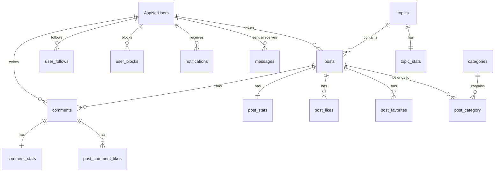

# 数据库设计文档

## 概述

本文档描述博客系统的数据库设计，包括所有数据表的结构、字段说明和关系。

## 技术栈

- **数据库**: PostgreSQL
- **ORM**: Entity Framework Core 9
- **命名约定**: snake_case（通过 EFCore.NamingConventions）
- **ID 生成**: 雪花算法（Snowflake ID）

## 数据表分类

### 用户相关（User Context）
- [AspNetUsers - 用户表](./user/users.md)
- [AspNetRoles - 角色表](./user/roles.md)
- [AspNetUserRoles - 用户角色关联表](./user/user-roles.md)
- [user_follows - 用户关注表](./user/user-follows.md)
- [user_follow_stats - 用户关注统计表](./user/user-follow-stats.md)
- [user_blocks - 用户拉黑表](./user/user-blocks.md)
- [user_check_ins - 用户签到表](./user/user-check-ins.md)
- [user_check_in_stats - 用户签到统计表](./user/user-check-in-stats.md)
- [user_check_in_bitmaps - 用户签到位图表](./user/user-check-in-bitmaps.md)
- [user_action_histories - 用户操作历史表](./user/user-action-histories.md)

### 文章相关（Post Context）
- [posts - 文章表](./post/posts.md)
- [post_stats - 文章统计表](./post/post-stats.md)
- [post_likes - 文章点赞表](./post/post-likes.md)
- [post_favorites - 文章收藏表](./post/post-favorites.md)
- [post_category - 文章分类关联表](./post/post-category.md)
- [categories - 分类表](./post/categories.md)

### 评论相关（Comment Context）
- [comments - 评论表](./comment/comments.md)
- [comment_stats - 评论统计表](./comment/comment-stats.md)
- [post_comment_likes - 评论点赞表](./comment/comment-likes.md)

### 话题相关（Content Context）
- [topics - 话题表](./content/topics.md)
- [topic_stats - 话题统计表](./content/topic-stats.md)
- [reports - 举报表](./content/reports.md)
- [feedbacks - 反馈表](./content/feedbacks.md)

### 社交相关（Social Context）
- [messages - 私信消息表](./social/messages.md)
- [conversations - 会话表](./social/conversations.md)
- [notifications - 通知表](./social/notifications.md)
- [global_announcements - 全局公告表](./social/global-announcements.md)
- [assistant_messages - 小助手消息表](./social/assistant-messages.md)

### 其他
- [todos - 待办事项表](./other/todos.md)
- [year_summary - 年度总结表](./other/year-summary.md)
- [month_summary - 月度总结表](./other/month-summary.md)
- [year_visibility - 年度可见性表](./other/year-visibility.md)
- [verification_codes - 验证码表](./other/verification-codes.md)

## ER 图



## 设计原则

### 1. 逻辑外键
- 不使用数据库级别的外键约束
- 通过应用层维护数据一致性
- 便于分库分表和数据迁移

### 2. 软删除
- 大部分表使用 `deleted` 字段进行逻辑删除
- 保留数据用于审计和恢复

### 3. 统计分离
- 将频繁更新的统计数据分离到独立表
- 减少主表的写入压力
- 例如：`post_stats`、`comment_stats`、`topic_stats`

### 4. 时间字段
- 使用 `DateTimeOffset` 类型存储时间
- 支持时区信息
- 统一使用 UTC 时间

### 5. ID 生成
- 使用雪花算法生成分布式唯一 ID
- 支持高并发场景
- ID 包含时间信息，便于排序

## 索引策略

### 常用索引模式
1. **主键索引**: 所有表的主键自动创建索引
2. **外键索引**: 关联字段创建索引（如 `user_id`、`post_id`）
3. **唯一索引**: 业务唯一约束（如用户名、邮箱）
4. **复合索引**: 常用查询条件组合（如 `(user_id, create_time)`）

### 示例
```sql
-- 文章点赞表的复合唯一索引
CREATE UNIQUE INDEX IX_PostLike_PostId_UserId ON post_likes (post_id, user_id);

-- 用户关注表的索引
CREATE INDEX IX_UserFollow_FollowerId ON user_follows (follower_id);
CREATE INDEX IX_UserFollow_FollowingId ON user_follows (following_id);
```
