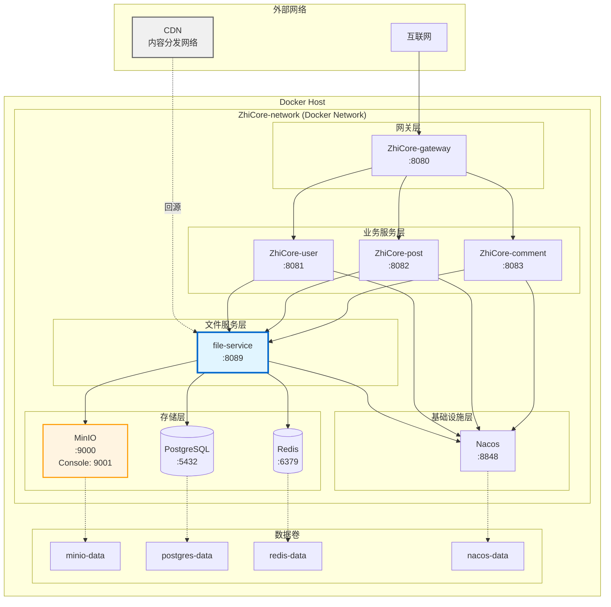
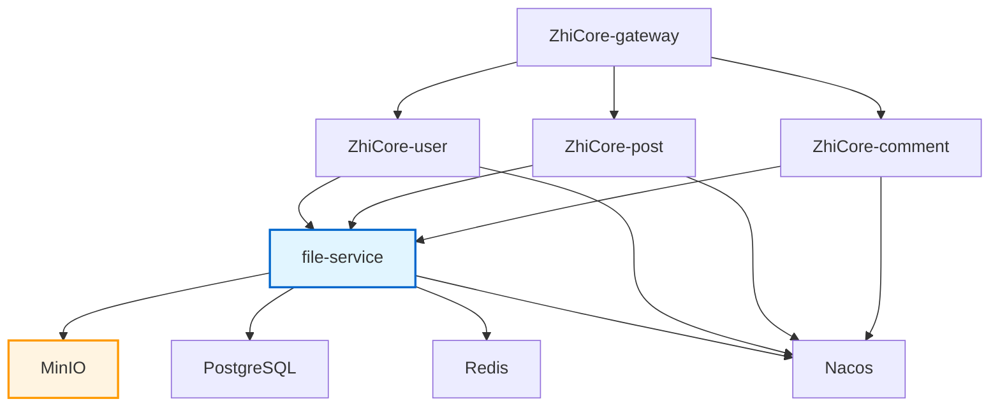
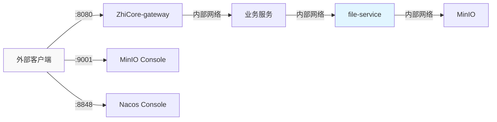
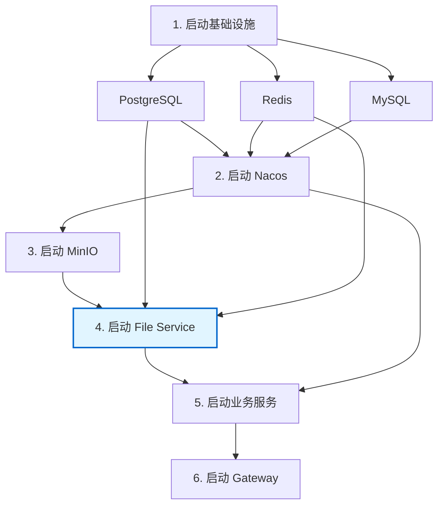
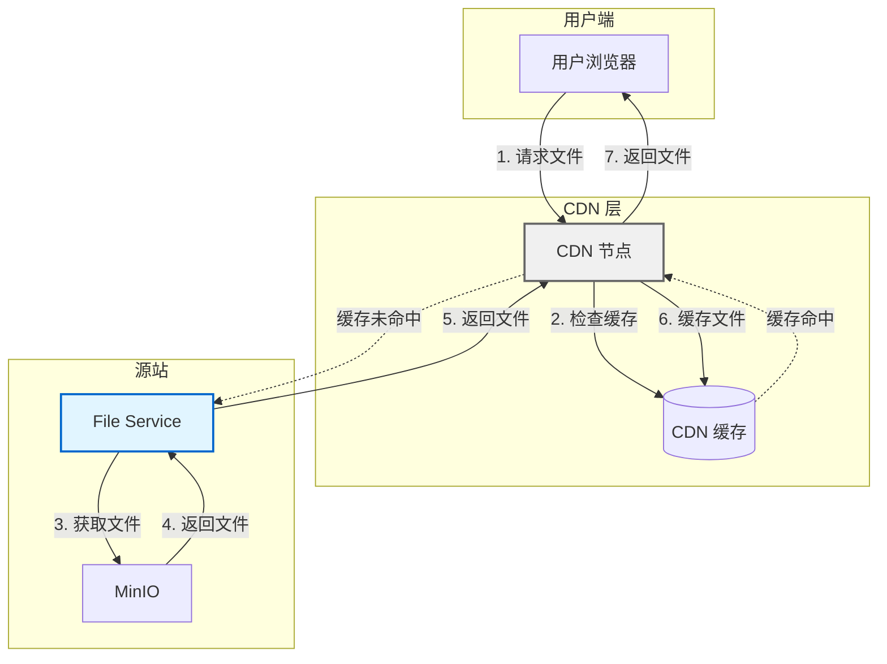

# File Service 部署架构文档

## 概述

本文档描述了 File Service 在 ZhiCore-microservice 系统中的部署架构，包括 Docker 容器部署、网络配置、端口分配、健康检查和 CDN 集成。

## 部署架构图

### 完整部署架构



### 服务依赖关系



## Docker Compose 配置

### 完整配置文件

```yaml
version: '3.8'

services:
  # ==================== 基础设施服务 ====================
  
  # PostgreSQL 数据库
  postgres:
    image: postgres:15-alpine
    container_name: ZhiCore-postgres
    ports:
      - "5432:5432"
    environment:
      POSTGRES_USER: ${POSTGRES_USER:-postgres}
      POSTGRES_PASSWORD: ${POSTGRES_PASSWORD:-postgres}
      POSTGRES_DB: ZhiCore
    volumes:
      - postgres-data:/var/lib/postgresql/data
      - ./docker/postgres-init:/docker-entrypoint-initdb.d
    networks:
      - ZhiCore-network
    healthcheck:
      test: ["CMD-SHELL", "pg_isready -U postgres"]
      interval: 10s
      timeout: 5s
      retries: 5
    restart: unless-stopped

  # Redis 缓存
  redis:
    image: redis:7-alpine
    container_name: ZhiCore-redis
    ports:
      - "6379:6379"
    volumes:
      - redis-data:/data
      - ./docker/redis/redis.conf:/usr/local/etc/redis/redis.conf
    command: redis-server /usr/local/etc/redis/redis.conf
    networks:
      - ZhiCore-network
    healthcheck:
      test: ["CMD", "redis-cli", "ping"]
      interval: 10s
      timeout: 5s
      retries: 5
    restart: unless-stopped

  # Nacos 配置中心
  nacos:
    image: nacos/nacos-server:v2.2.3
    container_name: ZhiCore-nacos
    ports:
      - "8848:8848"
      - "9848:9848"
    environment:
      MODE: standalone
      SPRING_DATASOURCE_PLATFORM: mysql
      MYSQL_SERVICE_HOST: mysql
      MYSQL_SERVICE_PORT: 3306
      MYSQL_SERVICE_DB_NAME: nacos
      MYSQL_SERVICE_USER: ${MYSQL_USER:-root}
      MYSQL_SERVICE_PASSWORD: ${MYSQL_PASSWORD:-root}
    volumes:
      - nacos-data:/home/nacos/data
    networks:
      - ZhiCore-network
    healthcheck:
      test: ["CMD", "curl", "-f", "http://localhost:8848/nacos/"]
      interval: 30s
      timeout: 10s
      retries: 5
    restart: unless-stopped
    depends_on:
      - mysql

  # ==================== 文件服务层 ====================
  
  # MinIO 对象存储
  minio:
    image: minio/minio:latest
    container_name: ZhiCore-minio
    ports:
      - "9000:9000"    # API 端口
      - "9001:9001"    # Console 端口
    environment:
      MINIO_ROOT_USER: ${MINIO_ROOT_USER:-minioadmin}
      MINIO_ROOT_PASSWORD: ${MINIO_ROOT_PASSWORD:-minioadmin123}
      MINIO_DOMAIN: ${MINIO_DOMAIN:-localhost}
    volumes:
      - minio-data:/data
    command: server /data --console-address ":9001"
    networks:
      - ZhiCore-network
    healthcheck:
      test: ["CMD", "curl", "-f", "http://localhost:9000/minio/health/live"]
      interval: 30s
      timeout: 10s
      retries: 3
    restart: unless-stopped

  # File Service
  file-service:
    image: file-service:latest
    container_name: ZhiCore-file-service
    ports:
      - "8089:8089"
    environment:
      # Spring 配置
      SPRING_PROFILES_ACTIVE: ${SPRING_PROFILES_ACTIVE:-prod}
      SERVER_PORT: 8089
      
      # 数据库配置
      SPRING_DATASOURCE_URL: jdbc:postgresql://postgres:5432/file_service
      SPRING_DATASOURCE_USERNAME: ${POSTGRES_USER:-postgres}
      SPRING_DATASOURCE_PASSWORD: ${POSTGRES_PASSWORD:-postgres}
      
      # Redis 配置
      SPRING_REDIS_HOST: redis
      SPRING_REDIS_PORT: 6379
      SPRING_REDIS_PASSWORD: ${REDIS_PASSWORD:-}
      
      # MinIO 配置
      MINIO_ENDPOINT: http://minio:9000
      MINIO_ACCESS_KEY: ${MINIO_ROOT_USER:-minioadmin}
      MINIO_SECRET_KEY: ${MINIO_ROOT_PASSWORD:-minioadmin123}
      MINIO_BUCKET_NAME: ${MINIO_BUCKET_NAME:-ZhiCore-files}
      
      # JWT 配置
      JWT_SECRET: ${JWT_SECRET:-your-secret-key-change-in-production}
      JWT_EXPIRATION: ${JWT_EXPIRATION:-86400000}
      
      # CDN 配置
      CDN_DOMAIN: ${CDN_DOMAIN:-}
      CDN_ENABLED: ${CDN_ENABLED:-false}
      
      # 应用配置
      FILE_MAX_SIZE: ${FILE_MAX_SIZE:-10485760}
      FILE_ALLOWED_TYPES: ${FILE_ALLOWED_TYPES:-image/jpeg,image/png,image/gif,image/webp}
    volumes:
      - ./logs/file-service:/app/logs
    networks:
      - ZhiCore-network
    depends_on:
      postgres:
        condition: service_healthy
      redis:
        condition: service_healthy
      minio:
        condition: service_healthy
    healthcheck:
      test: ["CMD", "curl", "-f", "http://localhost:8089/actuator/health"]
      interval: 30s
      timeout: 10s
      retries: 5
      start_period: 60s
    restart: unless-stopped

  # ==================== 业务服务层 ====================
  
  # 用户服务
  ZhiCore-user:
    image: ZhiCore-user:latest
    container_name: ZhiCore-user
    ports:
      - "8081:8081"
    environment:
      SPRING_PROFILES_ACTIVE: ${SPRING_PROFILES_ACTIVE:-prod}
      NACOS_SERVER_ADDR: nacos:8848
      FILE_SERVICE_URL: http://file-service:8089
      FILE_SERVICE_TENANT_ID: ZhiCore
      FILE_SERVICE_CDN_DOMAIN: ${CDN_DOMAIN:-}
    networks:
      - ZhiCore-network
    depends_on:
      nacos:
        condition: service_healthy
      file-service:
        condition: service_healthy
    restart: unless-stopped

  # 文章服务
  ZhiCore-post:
    image: ZhiCore-post:latest
    container_name: ZhiCore-post
    ports:
      - "8082:8082"
    environment:
      SPRING_PROFILES_ACTIVE: ${SPRING_PROFILES_ACTIVE:-prod}
      NACOS_SERVER_ADDR: nacos:8848
      FILE_SERVICE_URL: http://file-service:8089
      FILE_SERVICE_TENANT_ID: ZhiCore
      FILE_SERVICE_CDN_DOMAIN: ${CDN_DOMAIN:-}
    networks:
      - ZhiCore-network
    depends_on:
      nacos:
        condition: service_healthy
      file-service:
        condition: service_healthy
    restart: unless-stopped

  # 评论服务
  ZhiCore-comment:
    image: ZhiCore-comment:latest
    container_name: ZhiCore-comment
    ports:
      - "8083:8083"
    environment:
      SPRING_PROFILES_ACTIVE: ${SPRING_PROFILES_ACTIVE:-prod}
      NACOS_SERVER_ADDR: nacos:8848
      FILE_SERVICE_URL: http://file-service:8089
      FILE_SERVICE_TENANT_ID: ZhiCore
      FILE_SERVICE_CDN_DOMAIN: ${CDN_DOMAIN:-}
    networks:
      - ZhiCore-network
    depends_on:
      nacos:
        condition: service_healthy
      file-service:
        condition: service_healthy
    restart: unless-stopped

  # ==================== 网关层 ====================
  
  # API 网关
  ZhiCore-gateway:
    image: ZhiCore-gateway:latest
    container_name: ZhiCore-gateway
    ports:
      - "8080:8080"
    environment:
      SPRING_PROFILES_ACTIVE: ${SPRING_PROFILES_ACTIVE:-prod}
      NACOS_SERVER_ADDR: nacos:8848
    networks:
      - ZhiCore-network
    depends_on:
      - nacos
      - ZhiCore-user
      - ZhiCore-post
      - ZhiCore-comment
    restart: unless-stopped

# ==================== 网络配置 ====================
networks:
  ZhiCore-network:
    driver: bridge
    ipam:
      config:
        - subnet: 172.20.0.0/16

# ==================== 数据卷配置 ====================
volumes:
  postgres-data:
    driver: local
  redis-data:
    driver: local
  nacos-data:
    driver: local
  minio-data:
    driver: local
```

### 环境变量配置 (.env)

```bash
# ==================== 基础配置 ====================
SPRING_PROFILES_ACTIVE=prod

# ==================== 数据库配置 ====================
POSTGRES_USER=postgres
POSTGRES_PASSWORD=your-secure-password
MYSQL_USER=root
MYSQL_PASSWORD=your-secure-password

# ==================== Redis 配置 ====================
REDIS_PASSWORD=your-redis-password

# ==================== MinIO 配置 ====================
MINIO_ROOT_USER=minioadmin
MINIO_ROOT_PASSWORD=your-secure-minio-password
MINIO_BUCKET_NAME=ZhiCore-files
MINIO_DOMAIN=files.yourdomain.com

# ==================== File Service 配置 ====================
FILE_SERVICE_URL=http://file-service:8089
FILE_SERVICE_TENANT_ID=ZhiCore
FILE_MAX_SIZE=10485760
FILE_ALLOWED_TYPES=image/jpeg,image/png,image/gif,image/webp

# ==================== JWT 配置 ====================
JWT_SECRET=your-jwt-secret-key-change-in-production
JWT_EXPIRATION=86400000

# ==================== CDN 配置 ====================
CDN_DOMAIN=https://cdn.yourdomain.com
CDN_ENABLED=true
```

## 端口分配

| 服务 | 容器端口 | 主机端口 | 协议 | 说明 |
|-----|---------|---------|------|------|
| ZhiCore-gateway | 8080 | 8080 | HTTP | API 网关 |
| ZhiCore-user | 8081 | 8081 | HTTP | 用户服务 |
| ZhiCore-post | 8082 | 8082 | HTTP | 文章服务 |
| ZhiCore-comment | 8083 | 8083 | HTTP | 评论服务 |
| file-service | 8089 | 8089 | HTTP | 文件服务 |
| MinIO API | 9000 | 9000 | HTTP | 对象存储 API |
| MinIO Console | 9001 | 9001 | HTTP | MinIO 管理控制台 |
| PostgreSQL | 5432 | 5432 | TCP | 数据库 |
| Redis | 6379 | 6379 | TCP | 缓存 |
| Nacos | 8848 | 8848 | HTTP | 配置中心 |
| Nacos gRPC | 9848 | 9848 | gRPC | Nacos 内部通信 |

## 网络配置

### Docker 网络

```yaml
networks:
  ZhiCore-network:
    driver: bridge
    ipam:
      config:
        - subnet: 172.20.0.0/16
```

### 服务间通信

所有服务都在同一个 Docker 网络 `ZhiCore-network` 中，可以通过服务名进行通信：

- 业务服务访问 File Service: `http://file-service:8089`
- File Service 访问 MinIO: `http://minio:9000`
- File Service 访问 PostgreSQL: `jdbc:postgresql://postgres:5432/file_service`
- File Service 访问 Redis: `redis:6379`

### 外部访问



## 健康检查配置

### File Service 健康检查

```yaml
healthcheck:
  test: ["CMD", "curl", "-f", "http://localhost:8089/actuator/health"]
  interval: 30s
  timeout: 10s
  retries: 5
  start_period: 60s
```

### MinIO 健康检查

```yaml
healthcheck:
  test: ["CMD", "curl", "-f", "http://localhost:9000/minio/health/live"]
  interval: 30s
  timeout: 10s
  retries: 3
```

### PostgreSQL 健康检查

```yaml
healthcheck:
  test: ["CMD-SHELL", "pg_isready -U postgres"]
  interval: 10s
  timeout: 5s
  retries: 5
```

### Redis 健康检查

```yaml
healthcheck:
  test: ["CMD", "redis-cli", "ping"]
  interval: 10s
  timeout: 5s
  retries: 5
```

## 启动顺序



### 启动脚本

```bash
#!/bin/bash
# start-with-file-service.sh

set -e

echo "========================================="
echo "启动 ZhiCore 微服务系统（包含 File Service）"
echo "========================================="

# 1. 启动基础设施服务
echo ""
echo "[1/6] 启动基础设施服务..."
docker-compose up -d postgres redis mysql

# 等待数据库就绪
echo "等待数据库启动..."
sleep 15

# 2. 启动 Nacos
echo ""
echo "[2/6] 启动 Nacos 配置中心..."
docker-compose up -d nacos

# 等待 Nacos 就绪
echo "等待 Nacos 启动..."
sleep 20

# 3. 启动 MinIO
echo ""
echo "[3/6] 启动 MinIO 对象存储..."
docker-compose up -d minio

# 等待 MinIO 就绪
echo "等待 MinIO 启动..."
sleep 10

# 4. 启动 File Service
echo ""
echo "[4/6] 启动 File Service..."
docker-compose up -d file-service

# 等待 File Service 就绪
echo "等待 File Service 启动..."
sleep 15

# 5. 启动业务服务
echo ""
echo "[5/6] 启动业务服务..."
docker-compose up -d ZhiCore-user ZhiCore-post ZhiCore-comment

# 等待业务服务就绪
echo "等待业务服务启动..."
sleep 10

# 6. 启动 Gateway
echo ""
echo "[6/6] 启动 API Gateway..."
docker-compose up -d ZhiCore-gateway

echo ""
echo "========================================="
echo "所有服务已启动！"
echo "========================================="
echo ""
echo "服务访问地址："
echo "  - API Gateway:     http://localhost:8080"
echo "  - File Service:    http://localhost:8089"
echo "  - MinIO Console:   http://localhost:9001"
echo "  - Nacos Console:   http://localhost:8848/nacos"
echo ""
echo "MinIO 登录信息："
echo "  - Username: ${MINIO_ROOT_USER:-minioadmin}"
echo "  - Password: ${MINIO_ROOT_PASSWORD:-minioadmin123}"
echo ""
echo "检查服务状态："
echo "  docker-compose ps"
echo ""
echo "查看服务日志："
echo "  docker-compose logs -f file-service"
echo ""
```

### 停止脚本

```bash
#!/bin/bash
# stop-all-services.sh

echo "停止所有服务..."

# 按相反顺序停止服务
docker-compose stop ZhiCore-gateway
docker-compose stop ZhiCore-user ZhiCore-post ZhiCore-comment
docker-compose stop file-service
docker-compose stop minio
docker-compose stop nacos
docker-compose stop postgres redis mysql

echo "所有服务已停止！"
```

## CDN 集成

### CDN 架构



### CDN 配置

#### 1. 配置 CDN 域名

在 `.env` 文件中配置：

```bash
CDN_DOMAIN=https://cdn.yourdomain.com
CDN_ENABLED=true
```

#### 2. CDN 回源配置

在 CDN 提供商控制台配置：

- **回源地址**: `http://your-server-ip:8089`
- **回源 Host**: `files.yourdomain.com`
- **缓存规则**: 
  - 图片文件 (jpg, png, gif, webp): 缓存 30 天
  - 其他文件: 缓存 7 天

#### 3. File Service 返回 CDN URL

```java
public String generateFileUrl(String fileId) {
    String baseUrl = cdnEnabled ? cdnDomain : customDomain;
    return baseUrl + "/files/" + fileId;
}
```

### CDN 缓存策略

| 文件类型 | 缓存时间 | 说明 |
|---------|---------|------|
| 图片 (jpg, png, gif, webp) | 30 天 | 用户头像、文章图片 |
| 文档 (pdf, doc) | 7 天 | 文档文件 |
| 视频 (mp4, avi) | 15 天 | 视频文件 |
| 其他 | 1 天 | 默认缓存时间 |

## 数据持久化

### 数据卷配置

```yaml
volumes:
  # PostgreSQL 数据
  postgres-data:
    driver: local
    
  # Redis 数据
  redis-data:
    driver: local
    
  # Nacos 数据
  nacos-data:
    driver: local
    
  # MinIO 数据（文件存储）
  minio-data:
    driver: local
```

### 数据备份

#### MinIO 数据备份

```bash
#!/bin/bash
# backup-minio.sh

BACKUP_DIR="/backup/minio/$(date +%Y%m%d)"
mkdir -p $BACKUP_DIR

# 使用 mc (MinIO Client) 备份
mc mirror minio/ZhiCore-files $BACKUP_DIR

echo "MinIO 数据备份完成: $BACKUP_DIR"
```

#### PostgreSQL 数据备份

```bash
#!/bin/bash
# backup-postgres.sh

BACKUP_FILE="/backup/postgres/file_service_$(date +%Y%m%d_%H%M%S).sql"

docker exec ZhiCore-postgres pg_dump -U postgres file_service > $BACKUP_FILE

echo "PostgreSQL 数据备份完成: $BACKUP_FILE"
```

## 监控和日志

### 日志收集

```yaml
file-service:
  volumes:
    - ./logs/file-service:/app/logs
  logging:
    driver: "json-file"
    options:
      max-size: "10m"
      max-file: "3"
```

### 日志目录结构

```
logs/
├── file-service/
│   ├── application.log
│   ├── error.log
│   └── access.log
├── ZhiCore-user/
│   └── application.log
├── ZhiCore-post/
│   └── application.log
└── ZhiCore-comment/
    └── application.log
```

### 监控端点

| 服务 | 健康检查端点 | 指标端点 |
|-----|------------|---------|
| file-service | http://localhost:8089/actuator/health | http://localhost:8089/actuator/metrics |
| ZhiCore-user | http://localhost:8081/actuator/health | http://localhost:8081/actuator/metrics |
| ZhiCore-post | http://localhost:8082/actuator/health | http://localhost:8082/actuator/metrics |

## 安全配置

### 网络隔离

```yaml
networks:
  ZhiCore-network:
    driver: bridge
    internal: false  # 允许外部访问
  
  internal-network:
    driver: bridge
    internal: true   # 内部网络，不允许外部访问
```

### 敏感信息管理

1. **使用环境变量**: 所有敏感信息通过环境变量传递
2. **不提交 .env 文件**: 在 .gitignore 中排除 .env
3. **使用 Docker Secrets**: 生产环境使用 Docker Swarm Secrets

```yaml
secrets:
  postgres_password:
    external: true
  minio_password:
    external: true

services:
  postgres:
    secrets:
      - postgres_password
    environment:
      POSTGRES_PASSWORD_FILE: /run/secrets/postgres_password
```

## 扩展部署

### 水平扩展 File Service

```yaml
file-service:
  deploy:
    replicas: 3
    update_config:
      parallelism: 1
      delay: 10s
    restart_policy:
      condition: on-failure
```

### 负载均衡

```yaml
nginx:
  image: nginx:alpine
  ports:
    - "80:80"
  volumes:
    - ./nginx.conf:/etc/nginx/nginx.conf
  depends_on:
    - file-service
```

nginx.conf:

```nginx
upstream file-service {
    server file-service-1:8089;
    server file-service-2:8089;
    server file-service-3:8089;
}

server {
    listen 80;
    
    location /api/files/ {
        proxy_pass http://file-service;
        proxy_set_header Host $host;
        proxy_set_header X-Real-IP $remote_addr;
    }
}
```

## 故障恢复

### 自动重启策略

```yaml
restart: unless-stopped
```

### 健康检查失败处理

当健康检查失败时，Docker 会自动重启容器：

```yaml
healthcheck:
  test: ["CMD", "curl", "-f", "http://localhost:8089/actuator/health"]
  interval: 30s
  timeout: 10s
  retries: 5
  start_period: 60s
```

### 数据恢复

```bash
#!/bin/bash
# restore-data.sh

# 恢复 PostgreSQL
docker exec -i ZhiCore-postgres psql -U postgres file_service < backup.sql

# 恢复 MinIO
mc mirror /backup/minio/20240123 minio/ZhiCore-files
```

## 性能优化

### 资源限制

```yaml
file-service:
  deploy:
    resources:
      limits:
        cpus: '2'
        memory: 2G
      reservations:
        cpus: '1'
        memory: 1G
```

### MinIO 性能优化

```yaml
minio:
  environment:
    MINIO_CACHE: "on"
    MINIO_CACHE_DRIVES: "/cache"
    MINIO_CACHE_QUOTA: 80
  volumes:
    - minio-cache:/cache
```

## 总结

本文档详细描述了 File Service 在 ZhiCore-microservice 系统中的部署架构，包括：

1. **完整的 Docker Compose 配置**: 包含所有服务的配置和依赖关系
2. **清晰的端口分配**: 避免端口冲突
3. **健康检查机制**: 确保服务可用性
4. **启动顺序控制**: 保证服务按正确顺序启动
5. **CDN 集成方案**: 提供文件加速访问
6. **数据持久化**: 保证数据安全
7. **监控和日志**: 便于运维管理
8. **安全配置**: 保护敏感信息
9. **扩展方案**: 支持水平扩展

通过这套部署架构，可以快速、可靠地部署 File Service 及相关服务，为博客系统提供稳定的文件管理能力。
