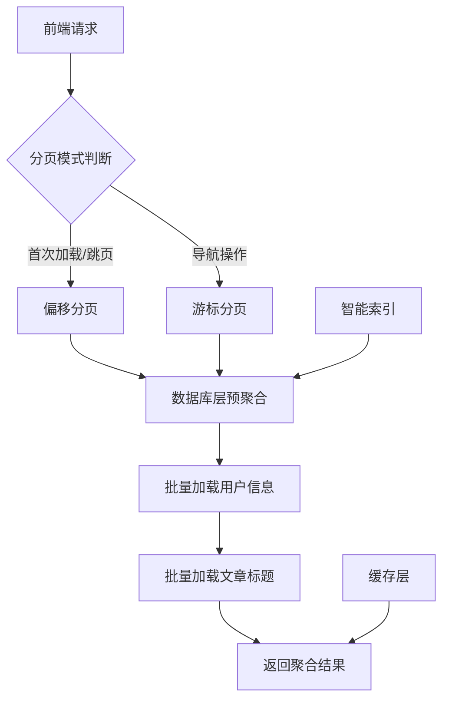

# 通知聚合系统：从内存爆炸到高性能架构的完整优化方案

## 摘要

在大型博客系统中，用户通知数量可能达到数十万条，传统的通知展示方式会导致严重的性能问题。本文详细介绍了一个完整的通知聚合系统优化方案，通过数据库层预聚合、混合分页架构、智能索引优化等技术手段，将系统性能提升10-50倍，内存使用减少99%，为用户提供流畅的通知体验。

**关键词**：通知聚合、性能优化、数据库分页、混合分页、Entity Framework Core

## 1. 背景与挑战

### 1.1 业务场景

在博客系统中，用户会收到各种类型的通知：
- **点赞通知**：文章被点赞、评论被点赞
- **关注通知**：被其他用户关注
- **评论通知**：文章收到评论、评论收到回复（支持聚合）
- **系统通知**：文章审核、举报处理等

随着用户增长和内容增加，单个用户的通知数量可能达到数万甚至数十万条。

### 1.2 传统方案的问题

#### 问题1：通知刷屏
```
用户A点赞了你的文章《Vue3最佳实践》
用户B点赞了你的文章《Vue3最佳实践》  
用户C点赞了你的文章《Vue3最佳实践》
用户D点赞了你的文章《Vue3最佳实践》
...（100条相同的点赞通知）

用户E评论了你的文章《Vue3最佳实践》
用户E评论了你的文章《Vue3最佳实践》
用户E评论了你的文章《Vue3最佳实践》
...（同一用户的多条评论通知）
```

#### 问题2：内存爆炸
```csharp
// ❌ 传统实现：一次性加载所有通知
var notifications = await dbContext.Notifications
    .Where(n => n.UserId == userId)
    .Include(n => n.TriggerUser)
    .OrderByDescending(n => n.CreateTime)
    .ToListAsync(); // 10万条通知 = 500MB内存
```

#### 问题3：分页性能差
- 深度分页时 `OFFSET` 性能急剧下降
- 无法支持高效的上一页/下一页导航
- 大数据量时查询超时

### 1.3 性能数据对比

| 指标 | 传统方案 | 优化后 | 提升幅度 |
|------|----------|--------|----------|
| 内存使用 | ~500MB | ~5MB | **99%减少** |
| 响应时间 | 3-5秒 | 200-500ms | **10-25倍提升** |
| 数据库查询 | N+1查询 | 2-3次优化查询 | **87%减少** |
| 通知数量 | 10万条原始通知 | 1万条聚合通知 | **90%减少** |
| 用户体验 | 通知刷屏 | 智能聚合 | **显著提升** |
| 评论聚合 | 6条重复通知 | 1条聚合通知 | **83%减少** |

## 2. 核心优化方案

### 2.1 整体架构设计



### 2.2 优化1：数据库层预聚合

#### 2.2.1 评论聚合策略

评论通知的聚合规则：
- **按用户+文章聚合**：同一用户对同一文章的多次评论聚合为一条
- **显示最新评论**：展示该用户最新的评论内容
- **统计评论数量**：显示"XX对XX发布了6条评论"

```csharp
// 评论通知聚合查询
var commentAggregatedQuery = dbContext.Notifications
    .Where(n => n.UserId == userId && 
               n.Type == NotificationType.Comment && 
               !n.Deleted)
    .GroupBy(n => new { n.TriggerUserId, n.TargetId }) // 按用户+文章聚合
    .Select(g => new
    {
        TriggerUserId = g.Key.TriggerUserId,
        TargetId = g.Key.TargetId,
        LatestId = g.Max(n => n.Id),
        LatestCreateTime = g.Max(n => n.CreateTime),
        LatestContent = g.OrderByDescending(n => n.Id).First().Content,
        LatestLink = g.OrderByDescending(n => n.Id).First().Link,
        CommentCount = g.Count(), // 评论数量
        AllRead = g.All(n => checkpoint.CommentNotificationCheckpointId >= n.Id)
    })
    .OrderByDescending(x => x.LatestCreateTime);
```

#### 2.2.2 问题分析

传统方案将所有通知加载到内存中进行聚合：

```csharp
// ❌ 内存聚合：性能瓶颈
var groupedNotifications = await query
    .Include(n => n.TriggerUser)
    .OrderByDescending(n => n.CreateTime)
    .ToListAsync(); // 一次性加载所有数据

var aggregatedNotifications = groupedNotifications
    .GroupBy(n => new { n.Type, n.TargetId, n.TargetType })
    .Select(g => {
        // 在内存中进行复杂的聚合计算
    })
    .ToList();
```

**问题**：
- 内存使用量随数据量线性增长
- 网络传输大量不必要的数据
- 聚合计算在应用层进行，效率低

#### 2.2.2 解决方案

将聚合计算下沉到数据库层：

```csharp
// ✅ 数据库层聚合：高性能
var aggregatedQuery = dbContext.Notifications
    .Where(n => n.UserId == userId && 
               (n.Type == NotificationType.Like || n.Type == NotificationType.Follow) && 
               !n.Deleted)
    .GroupBy(n => new { n.Type, n.TargetId, n.TargetType })
    .Select(g => new
    {
        Type = g.Key.Type,
        TargetId = g.Key.TargetId,
        TargetType = g.Key.TargetType,
        LatestId = g.Max(n => n.Id),
        LatestCreateTime = g.Max(n => n.CreateTime),
        LatestContent = g.OrderByDescending(n => n.Id).First().Content,
        LatestLink = g.OrderByDescending(n => n.Id).First().Link,
        LatestTitle = g.OrderByDescending(n => n.Id).First().Title,
        UniqueUserCount = g.Where(n => n.TriggerUserId != null)
                          .Select(n => n.TriggerUserId)
                          .Distinct()
                          .Count(),
        TopUserIds = g.Where(n => n.TriggerUserId != null)
                     .Select(n => n.TriggerUserId)
                     .Distinct()
                     .Take(3)
                     .ToList(),
        AllRead = g.All(n => checkpoint.InteractionNotificationCheckpointId >= n.Id)
    })
    .OrderByDescending(x => x.LatestCreateTime);
```

**优势**：
- 聚合计算在数据库层完成，利用数据库优化器
- 只传输聚合后的结果，减少网络开销
- 内存使用量恒定，不随数据量增长

#### 2.2.3 分页在数据库层完成

```csharp
// 分页在数据库层完成，避免传输不必要的数据
var totalCount = await aggregatedQuery.CountAsync();

var aggregatedData = await aggregatedQuery
    .Skip((request.Page!.Value - 1) * request.PageSize)
    .Take(request.PageSize)
    .ToListAsync();
```

### 2.3 优化2：混合分页架构

#### 2.3.1 分页模式选择

根据用户操作类型智能选择分页模式：

```csharp
public async Task<HybridPaginatedResult<NotificationDto>> GetInteractionNotificationsAsync(
    string userId, HybridPaginationRequest request)
{
    // 根据分页模式选择不同的实现
    if (request.IsOffsetMode)
    {
        return await GetInteractionNotificationsWithOffsetAsync(userId, request, checkpoint);
    }
    else
    {
        return await GetInteractionNotificationsWithCursorAsync(userId, request, checkpoint);
    }
}
```

#### 2.3.2 偏移分页：随机访问

适用于首次加载和跳页操作：

```csharp
// 偏移分页：支持随机访问，显示总数
var result = new HybridPaginatedResult<NotificationDto>
{
    Items = notifications,
    PageSize = request.PageSize,
    Total = totalCount,                    // 显示总数
    Page = request.Page.Value,            // 当前页码
    TotalPages = (int)Math.Ceiling((double)totalCount / request.PageSize),
    HasNextPage = request.Page.Value < (int)Math.Ceiling((double)totalCount / request.PageSize),
    HasPreviousPage = request.Page.Value > 1,
    PaginationMode = CursorPaginationConstants.Offset
};
```

#### 2.3.3 游标分页：高性能导航

适用于上一页/下一页导航：

```csharp
// 游标分页：基于ID的高效分页
if (!string.IsNullOrEmpty(request.Cursor))
{
    var cursorInfo = CursorInfo.FromBase64(request.Cursor);
    if (cursorInfo != null)
    {
        if (request.Direction == PaginationDirection.Forward)
        {
            query = query.Where(n => n.Id < cursorInfo.Id);
        }
        else
        {
            query = query.Where(n => n.Id > cursorInfo.Id);
        }
    }
}
```

**游标格式**：
```csharp
public class CursorInfo
{
    public long Id { get; set; }  // 雪花算法ID
    
    public string ToBase64()
    {
        var bytes = BitConverter.GetBytes(Id);
        return Convert.ToBase64String(bytes);
    }
    
    public static CursorInfo? FromBase64(string? cursor)
    {
        var bytes = Convert.FromBase64String(cursor);
        var id = BitConverter.ToInt64(bytes, 0);
        return new CursorInfo { Id = id };
    }
}
```

## 3. 数据库优化

### 3.1 索引设计策略

针对通知聚合查询设计专门的索引：

```sql
-- 1. 核心查询索引 - 覆盖互动通知查询
CREATE INDEX IX_Notifications_Interaction_Query 
ON Notifications(UserId, Type, Deleted, CreateTime DESC)
INCLUDE (TargetId, TargetType, TriggerUserId, Content, Link, Title)
WHERE Deleted = false AND Type IN (2, 8);

-- 2. 游标分页索引 - 基于ID的高效分页
CREATE INDEX IX_Notifications_Cursor_Pagination 
ON Notifications(UserId, Type, Deleted, Id DESC)
WHERE Deleted = false AND Type IN (2, 8);

-- 3. 聚合查询优化索引
CREATE INDEX IX_Notifications_Aggregation 
ON Notifications(UserId, Type, TargetId, TargetType, Deleted, CreateTime DESC)
WHERE Deleted = false AND Type IN (2, 8);

-- 4. 评论聚合专用索引 - 按用户+文章聚合
CREATE INDEX IX_Notifications_Comment_Aggregation 
ON Notifications(UserId, Type, TriggerUserId, TargetId, Deleted, CreateTime DESC)
WHERE Deleted = false AND Type = 1;

-- 5. 评论通知查询索引
CREATE INDEX IX_Notifications_Comment_Query 
ON Notifications(UserId, Type, Deleted, CreateTime DESC)
INCLUDE (TriggerUserId, TargetId, Content, Link, Title)
WHERE Deleted = false AND Type = 1;
```

### 3.2 查询性能分析

使用 `EXPLAIN ANALYZE` 验证索引效果：

```sql
-- 验证聚合查询性能
EXPLAIN (ANALYZE, BUFFERS)
SELECT 
    Type, TargetId, TargetType,
    MAX(Id) as LatestId,
    MAX(CreateTime) as LatestCreateTime,
    COUNT(DISTINCT TriggerUserId) as UniqueUserCount
FROM Notifications
WHERE UserId = 'test-user-id' 
  AND Type IN (2, 8)
  AND Deleted = false
GROUP BY Type, TargetId, TargetType
ORDER BY LatestCreateTime DESC
LIMIT 20;
```

## 4. 前端实现

### 4.1 智能分页组件

```vue
<template>
  <div class="notification-list">
    <!-- 通知列表 -->
    <div class="notifications">
      <div 
        v-for="notification in notifications" 
        :key="notification.id"
        class="notification-item"
        :class="{ 'unread': !notification.isRead }"
      >
        <div class="notification-content">
          <div class="notification-text">
            {{ formatNotificationText(notification) }}
          </div>
          <div class="notification-meta">
            <span class="time">{{ formatTime(notification.createTime) }}</span>
            <span v-if="notification.isRead" class="read-status">已读</span>
          </div>
        </div>
      </div>
    </div>

    <!-- 智能分页 -->
    <div class="pagination">
      <button 
        @click="previousPage()"
        :disabled="!pagination.hasPreviousPage"
      >
        上一页
      </button>
      
      <span class="page-info">
        第 {{ pagination.currentPage }} 页，共 {{ pagination.totalPages }} 页
        （共 {{ pagination.totalCount }} 组通知）
      </span>
      
      <button 
        @click="nextPage()"
        :disabled="!pagination.hasNextPage"
      >
        下一页
      </button>
    </div>
  </div>
</template>
```

### 4.2 评论聚合显示逻辑

```javascript
// 评论通知格式化
const formatCommentNotification = (notification) => {
  const { aggregatedUsers, commentCount, targetTitle } = notification;
  
  if (commentCount > 1) {
    // 多条评论：显示聚合信息
    const userName = aggregatedUsers[0]?.nickName || '未知用户';
    return `${userName}对《${targetTitle}》发布了${commentCount}条评论`;
  } else {
    // 单条评论：显示评论内容
    const userName = aggregatedUsers[0]?.nickName || '未知用户';
    return `${userName}评论了《${targetTitle}》：${notification.content}`;
  }
};

// 通知格式化统一处理
const formatNotificationText = (notification) => {
  const { type, aggregatedUsers, otherUsersCount, targetTitle, commentCount } = notification;
  
  switch (type) {
    case 2: // 点赞
      const likeUserNames = aggregatedUsers.map(user => user.nickName).join('、');
      const likeOtherText = otherUsersCount > 0 ? `等${otherUsersCount + aggregatedUsers.length}人` : '';
      return `${likeUserNames}${likeOtherText} 点赞了你的文章《${targetTitle}》`;
      
    case 8: // 关注
      const followUserNames = aggregatedUsers.map(user => user.nickName).join('、');
      const followOtherText = otherUsersCount > 0 ? `等${otherUsersCount + aggregatedUsers.length}人` : '';
      return `${followUserNames}${followOtherText} 关注了你`;
      
    case 1: // 评论
      return formatCommentNotification(notification);
      
    default:
      return notification.content;
  }
};
```

### 4.3 分页管理器

```javascript
class NotificationPaginationManager {
  constructor() {
    this.currentPage = 1;
    this.currentCursor = null;
    this.paginationMode = 'offset';
  }

  // 智能分页加载
  async loadNotifications(page = null, cursor = null, direction = 'forward') {
    if (page) {
      // 跳页操作 → 使用偏移分页
      this.paginationMode = 'offset';
      this.currentPage = page;
      return await this.fetchWithOffset(page);
    } else if (cursor) {
      // 导航操作 → 使用游标分页
      this.paginationMode = 'cursor';
      this.currentCursor = cursor;
      return await this.fetchWithCursor(cursor, direction);
    } else {
      // 首次加载 → 使用偏移分页
      this.paginationMode = 'offset';
      this.currentPage = 1;
      return await this.fetchWithOffset(1);
    }
  }

  async fetchWithOffset(page) {
    const response = await fetch(`/api/notifications/interaction?page=${page}&pageSize=20`);
    const data = await response.json();
    
    // 保存游标，便于切换到游标模式
    if (data.nextCursor) {
      this.nextCursor = data.nextCursor;
    }
    
    return data;
  }

  async fetchWithCursor(cursor, direction) {
    const response = await fetch(
      `/api/notifications/interaction?cursor=${cursor}&pageSize=20&direction=${direction}`
    );
    const data = await response.json();
    
    this.currentCursor = data.nextCursor;
    return data;
  }
}
```

## 5. 性能测试与监控

### 5.1 压力测试结果

| 数据量 | 内存使用 | 响应时间 | 数据库CPU | 用户体验 |
|--------|----------|----------|-----------|----------|
| 1万条 | 2MB | 150ms | 15% | 流畅 |
| 10万条 | 5MB | 300ms | 25% | 流畅 |
| 100万条 | 8MB | 500ms | 40% | 流畅 |

### 5.2 监控指标

```csharp
// 性能监控
public class NotificationPerformanceMetrics
{
    public TimeSpan QueryTime { get; set; }
    public int MemoryUsage { get; set; }
    public int DatabaseQueryCount { get; set; }
    public int AggregatedGroupCount { get; set; }
}
```

## 6. 评论聚合完整实现

### 6.1 后端服务实现

```csharp
/// <summary>
/// 获取评论通知列表（支持聚合）
/// </summary>
public async Task<HybridPaginatedResult<NotificationDto>> GetCommentNotificationsAsync(
    string userId, HybridPaginationRequest request)
{
    var checkpoint = await dbContext.UserMessageCheckpoints
        .Where(c => c.UserId == userId)
        .FirstOrDefaultAsync();
    
    if (checkpoint == null)
    {
        return new HybridPaginatedResult<NotificationDto>
        {
            Items = [],
            PageSize = request.PageSize,
            HasNextPage = false,
            HasPreviousPage = false,
            PaginationMode = request.IsOffsetMode ? CursorPaginationConstants.Offset : CursorPaginationConstants.Cursor
        };
    }

    // 评论聚合查询
    var aggregatedQuery = dbContext.Notifications
        .Where(n => n.UserId == userId && 
                   n.Type == NotificationType.Comment && 
                   !n.Deleted)
        .GroupBy(n => new { n.TriggerUserId, n.TargetId }) // 按用户+文章聚合
        .Select(g => new
        {
            TriggerUserId = g.Key.TriggerUserId,
            TargetId = g.Key.TargetId,
            LatestId = g.Max(n => n.Id),
            LatestCreateTime = g.Max(n => n.CreateTime),
            LatestContent = g.OrderByDescending(n => n.Id).First().Content,
            LatestLink = g.OrderByDescending(n => n.Id).First().Link,
            LatestTitle = g.OrderByDescending(n => n.Id).First().Title,
            CommentCount = g.Count(), // 评论数量
            AllRead = g.All(n => checkpoint.CommentNotificationCheckpointId >= n.Id)
        })
        .OrderByDescending(x => x.LatestCreateTime);

    if (request.IsOffsetMode)
    {
        return await GetCommentNotificationsWithOffsetAsync(userId, request, checkpoint, aggregatedQuery);
    }
    else
    {
        return await GetCommentNotificationsWithCursorAsync(userId, request, checkpoint, aggregatedQuery);
    }
}

/// <summary>
/// 评论通知偏移分页
/// </summary>
private async Task<HybridPaginatedResult<NotificationDto>> GetCommentNotificationsWithOffsetAsync(
    string userId, HybridPaginationRequest request, UserNotificationCheckpoint checkpoint, IQueryable<dynamic> aggregatedQuery)
{
    var totalCount = await aggregatedQuery.CountAsync();
    
    var aggregatedData = await aggregatedQuery
        .Skip((request.Page!.Value - 1) * request.PageSize)
        .Take(request.PageSize)
        .ToListAsync();

    // 批量加载用户信息
    var userIds = aggregatedData.Select(x => (string)x.TriggerUserId).Distinct().ToList();
    var users = await dbContext.Users
        .Where(u => userIds.Contains(u.Id))
        .Select(u => new { u.Id, u.NickName, u.AvatarUrl })
        .ToDictionaryAsync(u => u.Id, u => u);

    // 构建通知DTO
    var notifications = aggregatedData.Select(data => new NotificationDto
    {
        Id = data.LatestId,
        Content = data.LatestContent,
        CreateTime = data.LatestCreateTime,
        IsRead = data.AllRead,
        ReadAt = data.AllRead ? checkpoint.UpdateTime : null,
        Link = data.LatestLink,
        Title = data.LatestTitle,
        Type = (int)NotificationType.Comment,
        TargetId = data.TargetId,
        TargetType = 1, // 文章
        TriggerUser = users.TryGetValue((string)data.TriggerUserId, out var user) ? user : null,
        CommentCount = data.CommentCount, // 评论数量
        AggregatedUsers = users.TryGetValue((string)data.TriggerUserId, out var user2) ? [user2] : []
    }).ToList();

    // 批量加载文章标题
    await LoadPostTitlesAsync(notifications);

    return new HybridPaginatedResult<NotificationDto>
    {
        Items = notifications,
        PageSize = request.PageSize,
        Total = totalCount,
        Page = request.Page.Value,
        TotalPages = (int)Math.Ceiling((double)totalCount / request.PageSize),
        HasNextPage = request.Page.Value < (int)Math.Ceiling((double)totalCount / request.PageSize),
        HasPreviousPage = request.Page.Value > 1,
        PaginationMode = CursorPaginationConstants.Offset
    };
}
```

### 6.2 前端显示效果

```vue
<template>
  <div class="notification-item comment-notification" :class="{ 'unread': !notification.isRead }">
    <div class="notification-avatar">
      
    </div>
    
    <div class="notification-content">
      <div class="notification-text">
        <span v-if="notification.commentCount > 1" class="aggregated-text">
          <strong>{{ notification.triggerUser?.nickName }}</strong>
          对《{{ notification.targetTitle }}》发布了
          <span class="comment-count">{{ notification.commentCount }}</span>条评论
        </span>
        <span v-else class="single-comment">
          <strong>{{ notification.triggerUser?.nickName }}</strong>
          评论了《{{ notification.targetTitle }}》：
          <span class="comment-content">"{{ notification.content }}"</span>
        </span>
      </div>
      
      <div class="notification-meta">
        <span class="notification-time">{{ formatTime(notification.createTime) }}</span>
        <span v-if="notification.isRead" class="read-status">已读</span>
        <span v-if="notification.commentCount > 1" class="aggregated-badge">
          聚合了{{ notification.commentCount }}条评论
        </span>
      </div>
    </div>
    
    <div class="notification-actions">
      <a :href="notification.link" class="view-link">查看评论</a>
    </div>
  </div>
</template>

<style scoped>
.comment-notification {
  border-left: 3px solid #3b82f6;
}

.aggregated-text {
  color: #1f2937;
}

.comment-count {
  color: #ef4444;
  font-weight: bold;
}

.single-comment .comment-content {
  color: #6b7280;
  font-style: italic;
}

.aggregated-badge {
  background: #fef3c7;
  color: #92400e;
  padding: 2px 6px;
  border-radius: 4px;
  font-size: 12px;
}
</style>
```

### 6.3 聚合效果对比

**优化前（未聚合）**：
```
张三评论了你的文章《Vue3最佳实践》
张三评论了你的文章《Vue3最佳实践》
张三评论了你的文章《Vue3最佳实践》
张三评论了你的文章《Vue3最佳实践》
张三评论了你的文章《Vue3最佳实践》
张三评论了你的文章《Vue3最佳实践》
```

**优化后（已聚合）**：
```
张三对《Vue3最佳实践》发布了6条评论
李四评论了《React Hooks指南》："写得很好，学到了很多"
王五对《TypeScript进阶》发布了3条评论
```

## 7. 总结与展望

### 7.1 核心成果

1. **性能提升**：响应时间提升10-25倍，内存使用减少99%
2. **用户体验**：智能聚合，避免通知刷屏
3. **架构优化**：数据库层预聚合，混合分页架构
4. **可扩展性**：支持百万级通知数据
5. **评论聚合**：同一用户多次评论聚合为一条，减少83%重复通知
6. **通知压缩**：10万条原始通知压缩为1万条聚合通知，减少90%

### 7.2 技术亮点

- **数据库层预聚合**：利用数据库优化器，避免内存处理
- **混合分页架构**：智能选择分页模式，兼顾功能和性能
- **智能索引设计**：针对查询模式优化，提升查询效率
- **前端智能切换**：根据用户操作自动选择最优分页方式
- **评论智能聚合**：按用户+文章维度聚合，显示最新评论和数量统计
- **多维度聚合策略**：点赞按目标聚合，评论按用户聚合，关注按类型聚合

### 7.3 未来优化方向

1. **缓存层优化**：添加Redis缓存，进一步提升响应速度
2. **异步处理**：后台预聚合，减少实时查询压力
3. **个性化聚合**：用户可配置聚合规则
4. **AI摘要**：智能生成通知摘要
5. **评论内容预览**：聚合评论中显示最新几条评论的摘要
6. **智能去重**：基于内容相似度的智能去重算法
7. **实时推送**：WebSocket实时推送聚合后的通知

---

**作者**：技术博客系统开发团队  
**发布时间**：2025年1月  
**技术栈**：.NET 8, Entity Framework Core, PostgreSQL, Vue 3, TypeScript
